#📘 HANDWRITTEN-STYLE STUDY NOTES**

**Introduction to Management**

*BSIT — 4th Semester*
*Complete • Simplified • Exam-Focused*

**What's inside:**

✔ All 8 stages of the course, fully explained
✔ Simple definitions for every key term
✔ Diagrams for the most important models & processes
✔ Real-life & Pakistani examples for every concept
✔ Memory tricks to help you recall fast
✔ Exam traps highlighted so you don't lose marks
✔ Past paper references marked with ⭐

*Note: Words that may be hard are explained in [brackets] right where they appear.*

## **Complete Table of Contents**

### **STAGE 1 — Managing & The Manager's Job**

> [1.1 — What is Management? 8](#what-is-management)
>
> [1.2 — Management Process (4 Functions — POLC) 9](#management-process-4-functions-polc)
>
> [1.3 — Kinds of Managers 10](#kinds-of-managers)
>
> [1.4 — Mintzberg's 10 Managerial Roles 11](#mintzbergs-10-managerial-roles)
>
> [1.5 — Managerial Skills (Katz's Model) 13](#managerial-skills-katzs-model)
>
> [1.6 — Omnipotent vs Symbolic View](#omnipotent-vs-symbolic-view)⭐ [14](#omnipotent-vs-symbolic-view)
>
> [1.7 — Nature of Managerial Work 16](#nature-of-managerial-work)
>
> [1.8 — Workforce Diversity](#workforce-diversity)⭐ [17](#workforce-diversity)
>
> [**STAGE 2 — Ethical & Social Environment 19**](#section)
>
> [2.1 — What is Ethics & Why it Matters in Business 19](#what-is-ethics-why-it-matters-in-business)
>
> [2.2 — Individual Ethics in Organizations 21](#individual-ethics-in-organizations)
>
> [2.3 — Emerging Ethical Issues](#emerging-ethical-issues)⭐ [23](#emerging-ethical-issues)
>
> [2.4 — Social Responsibility & Organizations 27](#social-responsibility-organizations)
>
> [**STAGE 3 — Environment & Culture of Management 30**](#section-4)
>
> [3.1 — Why Environment Matters for Managers 30](#why-environment-matters-for-managers)
>
> [3.2 — External Environment 31](#external-environment)
>
> [3.3 — Internal Environment 32](#internal-environment)
>
> [3.4 — Organization-Environment Relationship 33](#organization-environment-relationship)
>
> [3.5 — Organizational Culture](#organizational-culture-1)⭐ [35](#organizational-culture-1)
>
> [3.6 — Scientific Management Concept](#scientific-management-concept)⭐ [37](#scientific-management-concept)
>
> [3.7 — Going Global: How Companies Expand Internationally](#going-global-how-companies-expand-internationally)⭐ [38](#going-global-how-companies-expand-internationally)
>
> [**STAGE 4 — Planning & Decision Making 41**](#section-7)
>
> [4.1 — What is Planning & Why Managers Plan 41](#what-is-planning-why-managers-plan)
>
> [4.2 — Benefits of Planning](#benefits-of-planning)⭐ [41](#benefits-of-planning)
>
> [4.3 — Organizational Goals & Types 42](#organizational-goals-types)
>
> [4.4 — Levels of Planning 43](#levels-of-planning)
>
> [4.5 — Levels of Strategy 43](#levels-of-strategy)
>
> [4.6 — What is Decision Making? 46](#what-is-decision-making)
>
> [4.7 — Decision Making Process (Steps)](#decision-making-process-steps)⭐ [47](#decision-making-process-steps)
>
> [4.8 — Types of Decisions 47](#types-of-decisions)
>
> [4.9 — Classical vs Administrative Model + Rational Perspective](#classical-vs-administrative-model-rational-perspective)⭐ [48](#classical-vs-administrative-model-rational-perspective)
>
> [4.10 — Behavioral Aspects 50](#behavioral-aspects)
>
> [4.11 — Group Decision Making Techniques 52](#group-decision-making-techniques)
>
> [**STAGE 5 — The Organizing Process 56**](#section-11)
>
> [5.1 — What is Organizing & Why it Matters 56](#what-is-organizing-why-it-matters)
>
> [5.2 — Job Characteristics Model 56](#job-characteristics-model)
>
> [5.3 — Job Description vs Job Specification](#job-description-vs-job-specification)⭐ [60](#job-description-vs-job-specification)
>
> [5.4 — Grouping Jobs (Departmentalization) 60](#grouping-jobs-departmentalization)
>
> [5.5 — Establishing Reporting Relationships 64](#establishing-reporting-relationships)
>
> [5.6 — Centralization vs Decentralization](#centralization-vs-decentralization)⭐ [65](#centralization-vs-decentralization)
>
> [5.7 — Distributing Authority & Delegation 66](#distributing-authority-delegation)
>
> [5.8 — Coordinating Activities 70](#coordinating-activities)
>
> [Organic vs Mechanistic Structure (OPTIONAL BUT INFORMATIVE) 71](#organic-vs-mechanistic-structure-optional-but-informative)
>
> [**STAGE 6 — Leadership & Influence 76**](#section-16)
>
> [6.1 — What is Leadership? (vs Management) 76](#what-is-leadership-vs-management)
>
> [6.2 — Key Characteristics of a Leader](#key-characteristics-of-a-leader)⭐ [77](#key-characteristics-of-a-leader)
>
> [6.3 — Trait Approach to Leadership 77](#trait-approach-to-leadership)
>
> [6.4 — Behavioral Approaches to Leadership 78](#behavioral-approaches-to-leadership)
>
> [6.5 — Situational/Contingency Approaches 80](#situationalcontingency-approaches)
>
> [6.6 — Transformational vs Transactional Leadership 82](#transformational-vs-transactional-leadership)
>
> [6.7 — Political Behavior in Organizations 83](#political-behavior-in-organizations)
>
> [6.8 — How a Manager Ensures Good Management Practices](#how-a-manager-ensures-good-management-practices)⭐ [84](#how-a-manager-ensures-good-management-practices)
>
> [**STAGE 7 — Managing Change & Innovation 87**](#stage-7-managing-change-innovation)
>
> [7.1 — Why Change Happens in Organizations 87](#why-change-happens-in-organizations)
>
> [7.2 — Forces for Change](#forces-for-change)⭐ [87](#forces-for-change)
>
> [7.3 — Steps in the Change Process 89](#steps-in-the-change-process)
>
> [7.4 — Resistance to Change — Why People Resist 91](#resistance-to-change-why-people-resist)
>
> [7.5 — Overcoming Resistance to Change 92](#overcoming-resistance-to-change)
>
> [7.6 — The Innovation Process 94](#the-innovation-process)
>
> [**STAGE 8 — The Controlling Process 97**](#section-17)
>
> [8.1 — What is Control & Its Purpose 97](#what-is-control-its-purpose)
>
> [8.2 — Steps in the Control Process 98](#steps-in-the-control-process)
>
> [8.3 — Types of Control 100](#types-of-control)
>
> [8.3B — Operational, Structural, and Strategic Control 101](#b-operational-structural-and-strategic-control)
>
> [8.4 — Total Quality Management (TQM)](#total-quality-management-tqm)⭐ [103](#total-quality-management-tqm)
>
> [8.5 — Managing Productivity 104](#managing-productivity)
>
> [8.6 — Performance Appraisal](#performance-appraisal)⭐ [105](#performance-appraisal)

**⭐ = directly appeared in your past papers**

# **STAGE 1 — Managing & The Manager's Job**

## **1.1 — What is Management?**

**The Core Idea:** Every organization has resources — people, money, machines, time. These resources are useless without someone who directs, coordinates, and uses them properly to achieve goals. That process is called **Management.**

**Definition (Griffin):**

> *"Management is a set of activities directed at an organization's resources with the aim of achieving organizational goals in an efficient and effective manner."*

**Two Most Important Words:**

|               |                                                    |                                            |
|---------------|----------------------------------------------------|--------------------------------------------|
| **Word**      | **Meaning**                                        | **Example**                                |
| **Efficient** | Doing things RIGHT — minimum waste, maximum output | Delivering pizza using least fuel possible |
| **Effective** | Doing the RIGHT things — achieving correct goals   | Delivering pizza to the correct customer   |

⚠️ **Critical Exam Trap:** You can be efficient WITHOUT being effective.

> A factory producing 1000 units daily with zero waste (efficient) but making a product nobody wants (not effective) = FAILURE.
>
> **Effectiveness comes first — then efficiency.**

**4 Types of Resources:**

- **Human** — people, employees

- **Financial** — money, budget

- **Physical** — machines, buildings, equipment

- **Information** — data, reports, market research

**Simple Logic:**

Resources → Management Activities → Goals Achieved

**Why Management Exists:** Resources are always limited. Goals must still be achieved. Someone must coordinate the two. That someone = manager. That process = management.

**Keywords for Exam:** Efficiently, Effectively, Organizational goals, Coordination, Resources, Activities

## **1.2 — Management Process (4 Functions — POLC)**

**The Core Idea:** Management is not one single action — it is a **continuous process** of 4 connected functions that every manager performs at every level in every organization.

**Memory Trick:** **"Please Or Leave Carefully"** → P-O-L-C

|                 |                                                            |                                                       |
|-----------------|------------------------------------------------------------|-------------------------------------------------------|
| **Function**    | **What it Means**                                          | **Real Example**                                      |
| **Planning**    | Deciding WHAT to do, HOW to do it, and WHEN                | McDonald's planning to open 10 new branches in Punjab |
| **Organizing**  | Arranging people and resources to execute the plan         | Assigning managers, hiring staff, setting up kitchens |
| **Leading**     | Motivating, communicating, and directing people to perform | Store manager encouraging team during busy hours      |
| **Controlling** | Measuring actual results vs planned goals — fixing gaps    | Checking if monthly sales targets were achieved       |

**The Cycle:**

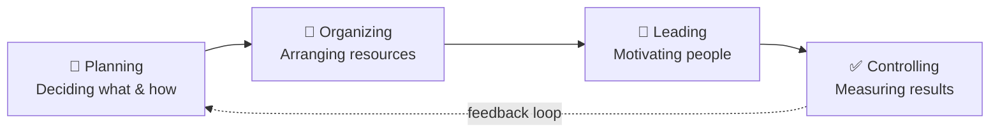

*Diagram: The POLC management cycle — planning, organizing, leading, controlling, feeding back into planning.*

Controlling feeds back into Planning. It never stops — it's a **continuous cycle.**

**Critical Points:**

- These 4 functions happen **simultaneously** [at the same time] — not one after another

- Every manager at every level performs all 4 — just with different intensity

- Some books use **"Directing"** instead of Leading — both mean the same thing

**⚠️ Exam Traps:**

- Leading ≠ just giving orders → includes motivation, communication, inspiration

- Controlling ≠ punishment → it means measuring and correcting

- POLC is a **cycle** not a straight line

**Past Paper:** *"List down functions of management"* — Fall 2024 ✅

## **1.3 — Kinds of Managers**

**The Core Idea:** Not all managers do the same job. Organizations need different types of managers at different levels — each thinking differently, doing different work, and requiring different skills.

### **Classification A — By Level (3 Levels)**

**Memory Trick:** **"The Management Family"** → TMF

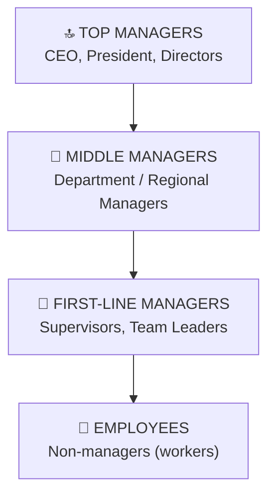

**Detailed Comparison:**

|                   |                            |                                   |                                |
|-------------------|----------------------------|-----------------------------------|--------------------------------|
|                   | **Top Managers**           | **Middle Managers**               | **First-Line Managers**        |
| **Who**           | CEO, President, VP         | Department Head, Regional Manager | Supervisor, Team Leader        |
| **Focus**         | Entire organization        | Department/Division               | Team/Unit                      |
| **Decision type** | Strategic (big, long-term) | Tactical (medium plans)           | Operational (daily tasks)      |
| **Time horizon**  | Years                      | Months                            | Days/Weeks                     |
| **Key role**      | Set direction & vision     | Bridge top & first-line           | Manage daily work              |
| **Example**       | Elon Musk at Tesla         | Punjab Regional Manager at Daraz  | Shift Supervisor at McDonald's |

**⚠️ Critical Exam Trap:**

- Middle managers manage **OTHER MANAGERS** — not workers

- First-line managers manage **WORKERS** directly

- Top managers think LONG-TERM \| First-line think SHORT-TERM

### **Classification B — By Area (Functional Managers)**

|                    |                                      |
|--------------------|--------------------------------------|
| **Type**           | **What They Manage**                 |
| Marketing Manager  | Advertising, sales, brand            |
| Finance Manager    | Budget, accounts, investments        |
| HR Manager         | Hiring, training, employee relations |
| Operations Manager | Production, quality, supply          |
| IT Manager         | Technology, systems, data            |

**General Manager** = manages ALL departments together (not specialized in one area)

**Past Paper:** *"Explain in detail kinds of managers with examples"* — Fall 2025 ✅

## **1.4 — Mintzberg's 10 Managerial Roles**

**The Core Idea:** Henry Mintzberg studied real managers and discovered they don't just "plan and organize" — they play **10 specific roles** constantly throughout the day, switching between them based on what each situation demands.

> **Role** = a specific behavior pattern expected from a manager in a given situation.

**3 Categories + 10 Roles:**

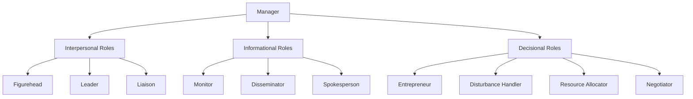

*Diagram: Mintzberg's 10 managerial roles grouped into 3 categories.*

**Memory Tricks:**

- Interpersonal = **FLL** → *"Friendly Leaders Like people"*

- Informational = **MDS** → *"Managers Deliver Statements"*

- Decisional = **EDRN** → *"Every Decision Requires Negotiation"*

### **Category 1 — Interpersonal Roles**

*(About people and relationships)*

|                |                                                                       |                                                       |
|----------------|-----------------------------------------------------------------------|-------------------------------------------------------|
| **Role**       | **What Manager Does**                                                 | **Example**                                           |
| **Figurehead** | Performs ceremonial/symbolic duties as representative of organization | CEO cutting ribbon at new office opening              |
| **Leader**     | Motivates, guides, hires, trains, evaluates employees                 | Manager coaching underperforming employee             |
| **Liaison**    | Builds relationships OUTSIDE own team/department                      | Marketing manager meeting external advertising agency |

### **Category 2 — Informational Roles**

*(About handling information)*

|                  |                                                              |                                                            |
|------------------|--------------------------------------------------------------|------------------------------------------------------------|
| **Role**         | **What Manager Does**                                        | **Example**                                                |
| **Monitor**      | Constantly scans for useful information from environment     | Reading competitor news, market reports, employee feedback |
| **Disseminator** | Shares important information INSIDE the organization         | Forwarding new policy to team members                      |
| **Spokesperson** | Represents and speaks on behalf of organization to OUTSIDERS | CEO speaking to journalists at press conference            |

### **Category 3 — Decisional Roles**

*(About making decisions)*

|                         |                                                          |                                              |
|-------------------------|----------------------------------------------------------|----------------------------------------------|
| **Role**                | **What Manager Does**                                    | **Example**                                  |
| **Entrepreneur**        | Initiates change and innovation, seeks new opportunities | Proposing new digital payment system         |
| **Disturbance Handler** | Deals with unexpected problems and crises                | Handling sudden machine breakdown in factory |
| **Resource Allocator**  | Decides who gets budget, people, time, equipment         | Splitting annual budget among 5 projects     |
| **Negotiator**          | Represents organization in formal negotiations           | HR manager negotiating salary with new hires |

**⚠️ Biggest Exam Traps:**

- **Disseminator** (INSIDE org) ≠ **Spokesperson** (OUTSIDE org)

- **Liaison** (builds relationships) ≠ **Negotiator** (formal deal-making)

- **Figurehead** (ceremonial) ≠ **Leader** (motivating/guiding)

- Managers switch between ALL 10 roles throughout ONE day

**Past Paper:** *"Explain basic managerial skills"* — Fall 2025 (connected topic) ✅

## **1.5 — Managerial Skills (Katz's Model)**

**The Core Idea:** Robert Katz identified that managers need 3 core skills to perform well. The most important insight is that the **importance of each skill CHANGES depending on management level.** This explains why a brilliant engineer doesn't automatically become a great manager.

**Memory Trick:** **THC** → *"Top managers Have Concepts, First-line managers Have Tools"*

### **3 Core Skills:**

**① Technical Skills**

- Knowledge of specific tools, methods, and processes of a particular field

- Learned through education and hands-on experience

- Most important at FIRST-LINE level

> Example: A software manager who understands coding. An accounts manager who reads financial statements.

**② Human / Interpersonal Skills**

- Ability to communicate, motivate, lead, and work with people

- Understanding emotions, handling conflicts, building trust

- **Equally important at ALL levels — never less critical**

> Example: Manager who listens to employee problems and resolves team conflicts effectively.

**③ Conceptual Skills**

- Ability to see the big picture — understand how all parts of the organization connect

- Think abstractly, plan long-term, understand how one decision affects everything else

- Most important at TOP level

> Example: CEO of Amazon deciding to enter healthcare market after seeing how it connects to existing logistics and technology capabilities.

### **How Skills Change By Level:**

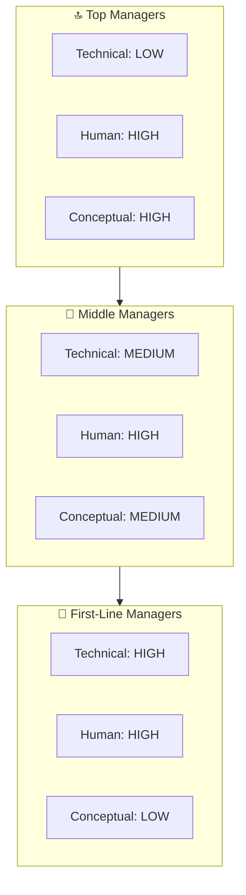

*Diagram: How Technical, Human, and Conceptual skills change across management levels.*

**The Key Pattern:**

- Technical → **decreases** as you go up

- Conceptual → **increases** as you go up

- Human → **stays equally important** at all levels

**⚠️ Exam Traps:**

- Human skills = constant at ALL levels — never write "less important at top level"

- Most people get promoted because of technical skills but FAIL because they lack human and conceptual skills

- Conceptual skill ≠ just being intelligent — it specifically means seeing the big picture and connections

**Past Paper:** *"Explain basic managerial skills"* — Fall 2025 ✅

## **1.6 — Omnipotent vs Symbolic View**

**The Core Idea:** How much does a manager ACTUALLY control organizational success or failure? Two completely opposite views exist — and the truth lies somewhere in the middle.

**Memory Trick:** *"Omni = Owner of all outcomes \| Symbolic = just a Symbol"*

### **Two Views Compared:**

|                         |                                                  |                                          |
|-------------------------|--------------------------------------------------|------------------------------------------|
|                         | **Omnipotent View**                              | **Symbolic View**                        |
| **Core belief**         | Manager is FULLY responsible for success/failure | Manager has LIMITED real control         |
| **Manager's power**     | Very HIGH — can overcome anything                | Very LOW — just a symbol                 |
| **What drives results** | Manager's decisions and actions                  | External forces + organizational culture |
| **When org succeeds**   | Manager gets full credit                         | Favorable conditions get credit          |
| **When org fails**      | Manager gets full blame                          | Unfavorable forces get blame             |
| **Also called**         | Rational view                                    | External constraint view                 |

### **Omnipotent View — Explained:**

Managers are directly responsible for everything. Good management = success. Bad management = failure. This is why CEOs get fired when companies perform badly — boards believe managers make the difference.

> **Example:** When Volkswagen's emission scandal happened → CEO was immediately fired. Board held him fully responsible → Omnipotent thinking.

### **Symbolic View — Explained:**

Manager's actual influence is limited because real performance is shaped by forces OUTSIDE their control:

- Economy, government policies, competition, technology changes, industry trends

- Manager simply **symbolizes** leadership — gives people someone to praise or blame

> **Example:** During COVID-19, thousands of brilliant managers watched their businesses collapse. Not because of bad management — but because an uncontrollable external force destroyed demand overnight → Symbolic view.

### **The Reality — Middle Ground:**

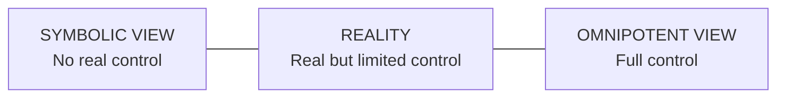

Managers have **real but limited** influence. They operate within constraints they cannot change — but within those constraints, their decisions genuinely matter.

⚠️ **Exam Trap:**

- Symbolic ≠ zero control → managers still matter, just not completely

- Omnipotent ≠ always correct → external forces are real and powerful

- Always mention the middle-ground reality in exam answers

**Past Paper:** *"Omnipotent Vs Symbolic view"* — Fall 2024 ✅

## **1.7 — Nature of Managerial Work**

**The Core Idea:** Most people imagine managers sitting calmly, carefully planning strategies. The reality is completely different. Research by Mintzberg and Kotter shows managerial work is fast, messy, fragmented, and largely verbal.

**Memory Trick: "Fast Vehicles Find Very Narrow Roads"** → FVFVNR

### **6 Key Characteristics:**

**① Fast-Paced and Relentless:** Managers rarely get long uninterrupted periods to think. Problems keep coming continuously. There is no "finished" state in management — work never fully ends.

> **Example:** A branch manager at Habib Bank handles customer complaints, staff issues, loan approvals, and compliance checks — all in a single day.

**② Highly Varied:** No two days are the same. A manager jumps between completely different topics — finance, people, strategy, operations — sometimes within the same hour. Requires mental flexibility.

> **Example:** In one morning, a marketing manager reviews an ad campaign, handles a team conflict, attends a budget meeting, and responds to a client complaint.

**③ Fragmented:** Mintzberg found that most managerial activities last **less than 9 minutes.** Managers are constantly interrupted. Deep focused thinking is rare — which is why many managers come early or stay late just to get quiet thinking time.

**④ Primarily Verbal:** Kotter's research found managers spend **70-90% of their time** in verbal interaction — meetings, phone calls, informal conversations, one-on-one discussions. Written reports and emails are secondary.

**⑤ Networking is Central:** Managers build and maintain a wide network of contacts — inside the organization (colleagues, subordinates, superiors) and outside (suppliers, clients, industry contacts). Without a strong network, even a powerful manager cannot get things done effectively.

**⑥ More Reactive Than Proactive:** Despite planning, most managerial time is spent RESPONDING to problems, requests, and situations. The environment constantly throws surprises. Great managers try to be proactive — but reality forces reactivity.

**⚠️ Exam Trap:** Managerial work is NOT calm and organized — it is fast, fragmented, and mostly verbal. This is normal — not a failure.

## **1.8 — Workforce Diversity**

**The Core Idea:** Modern organizations contain people of different ages, genders, nationalities, religions, educational backgrounds, and abilities. This mix is called **Workforce Diversity.** The management challenge is turning these differences into organizational strength rather than conflict.

**Definition (Robbins):**

> *"Workforce diversity refers to the ways in which people in an organization are different from and similar to one another."*

**Memory Trick for Types:** **AGREE** → **A**ge, **G**ender, **R**ace/Religion, **E**ducation, **E**thnicity/Ability

### **Two Levels of Diversity:**

|                   |                                    |                                                    |
|-------------------|------------------------------------|----------------------------------------------------|
| **Level**         | **Type**                           | **Examples**                                       |
| **Surface-level** | Visible, observable differences    | Age, gender, race, physical ability                |
| **Deep-level**    | Hidden, non-observable differences | Values, personality, beliefs, work style, attitude |

⚠️ Deep-level differences are often MORE problematic than surface-level ones — they cause hidden conflicts that are harder to identify and resolve.

### **Key Types Explained:**

**Age Diversity — 4 Generations at Work:**

|                |                 |                                           |
|----------------|-----------------|-------------------------------------------|
| **Generation** | **Birth Years** | **Typical Work Style**                    |
| Baby Boomers   | 1946-1964       | Loyal, formal, hardworking                |
| Generation X   | 1965-1980       | Independent, skeptical, balanced          |
| Millennials    | 1981-1996       | Tech-savvy, collaborative, purpose-driven |
| Gen Z          | 1997-2012       | Digital natives, entrepreneurial, fast    |

**Gender Diversity:**

- Equal representation of men and women

- Addressing pay gaps

- Breaking the **Glass Ceiling** = invisible barrier preventing women from reaching top positions

**Religious Diversity:**

- Accommodating prayer times, fasting periods, religious dress

- Especially important in Pakistani organizational context

### **Benefits of Managing Diversity Well:**

- More creative solutions (different perspectives)

- Better understanding of diverse customers

- Stronger problem-solving

- Higher employee morale

- Competitive advantage in global markets

### **Challenges of Diversity:**

- Communication barriers (language, style differences)

- Stereotyping (assuming things about people based on group)

- Discrimination (unfair treatment)

- Resistance from existing employees

- Coordination difficulty (different work styles create friction)

### **How Managers Handle Diversity:**

- **Awareness** — recognize differences exist

- **Training** — conduct diversity and inclusion training

- **Fair policies** — equal opportunity hiring and promotion

- **Flexible work** — accommodate different needs

- **Inclusive culture** — create environment where everyone feels respected

**⚠️ Critical Exam Trap — Three Different Concepts:**

- **Diversity** = having different people in the organization

- **Equality** = treating all people fairly

- **Inclusion** = making everyone feel genuinely valued and respected These are THREE different things — never confuse them.

**⚠️ Another Trap:** A diverse team does NOT automatically perform better. Diversity without proper management creates conflict, not strength.

**Past Paper:** *"Workforce Diversity"* — Fall 2024 ✅ \| *"Concept of workforce diversity"* — Spring 2025 ✅✅

### 

### 

### 

### 


# **STAGE 2 — Ethical & Social Environment**

## **2.1 — What is Ethics & Why it Matters in Business**

**The Core Idea:** Every day managers make decisions that have a **moral dimension** — a right vs wrong aspect. Ethics is the framework that guides these decisions — not just legally, but morally. The key distinction is that **legal ≠ always ethical.**

**Definition (Robbins):**

> *"Ethics refers to the rules and principles that define right and wrong conduct in an organizational setting."*

**Simple Reality:**

> A company can legally pay minimum wage while treating workers in humiliating conditions → Legal but deeply unethical.

### **3 Levels Where Ethics Operates:**

**INDIVIDUAL ETHICS**

(personal values & morals)

↓

**ORGANIZATIONAL ETHICS**

(company policies & culture)

↓

**SOCIETAL ETHICS**

(laws, social norms, cultural expectations)

### **4 Approaches to Judging Ethical Behavior:**

**Memory Trick: URJI** → *"Usually Right Judgments Improve"*

|                 |                                              |                                                                     |
|-----------------|----------------------------------------------|---------------------------------------------------------------------|
| **Approach**    | **Core Logic**                               | **Simple Meaning**                                                  |
| **Utilitarian** | Greatest good for greatest number            | Outcome-focused — what produces best result for most people         |
| **Rights**      | Respect fundamental rights of individuals    | People have basic rights — privacy, safety, dignity — no compromise |
| **Justice**     | Treat people fairly and consistently         | Equal treatment regardless of who you are                           |
| **Integrative** | Universal principles + local community norms | Some things wrong everywhere — but context also matters             |

### **Why People Act Unethically — 3 Reasons:**

**① Personal Greed:** Desire for money, power, or status overrides moral judgment.

> Example: Manager approves fake expense reports for personal financial gain.

**② Organizational Pressure:** "Everyone does it here" culture. Fear of losing job if you don't follow along.

> Example: Junior employee pressured to falsify sales numbers by senior manager.

**③ Moral Disengagemen:t** People convince themselves their wrong actions are justified.

> "It's just business" / "Nobody got hurt" / "Just this once" Example: Manager tells himself "cutting safety corners saves jobs" — ignoring real risk.

### **The Newspaper Test:**

> *"Would I be comfortable if this decision appeared on the front page of a newspaper tomorrow?"* Simple but powerful daily ethics check every manager should apply.

⚠️ **Exam Traps:**

- Legal ≠ always ethical — critical distinction

- Ethics ≠ only religion — ethics includes universal principles beyond religion

- Ethical companies perform **BETTER** long-term — ethics is not a business disadvantage

**Keywords:** Right and wrong conduct, Moral standards, Utilitarian, Rights, Justice, Integrative, Newspaper test

## **2.2 — Individual Ethics in Organizations**

**The Core Idea:** Every individual brings their own personal ethical standards to work. Two people in the same company facing the same situation can make completely different ethical choices. This topic explains WHY — what shapes a person's ethical behavior inside an organization.

**3 Main Factors Shaping Individual Ethics:**

**INDIVIDUAL ETHICAL BEHAVIOR**

│

├── 1. Stage of Moral Development (Kohlberg)

├── 2. Personal Values & Personality

└── 3. Organizational Factors

### **Factor 1 — Kohlberg's Stages of Moral Development**

**Scholar:** Lawrence Kohlberg **Memory Trick:** **"People Change Perspective"** → PCP (Pre-conventional, Conventional, Post-conventional)

**3 Levels, 6 Stages:**

|                                           |                                |                                                          |                                                          |
|-------------------------------------------|--------------------------------|----------------------------------------------------------|----------------------------------------------------------|
| **Level**                                 | **Stage**                      | **Logic**                                                | **Behavior**                                             |
| **Pre-Conventional** (self-focused)       | Stage 1 — Obedience            | "I won't do wrong because I'll be punished"              | Follows rules only to avoid punishment                   |
|                                           | Stage 2 — Self-Interest        | "I'll do what benefits ME most"                          | Does right thing only if personally beneficial           |
| **Conventional** (society-focused)        | Stage 3 — Relationships        | "I want to be seen as good by people around me"          | Follows group expectations                               |
|                                           | Stage 4 — Law & Order          | "Rules exist for a reason — it's my duty to follow them" | Follows rules because rules must be respected            |
| **Post-Conventional** (principle-focused) | Stage 5 — Social Contract      | "Unjust rules should be challenged"                      | Questions unfair rules                                   |
|                                           | Stage 6 — Universal Principles | "I follow my conscience even if rules say otherwise"     | Acts on deep moral principles regardless of consequences |

**Real Context:**

- Most adults operate at **Conventional level** (Stages 3-4)

- Very few consistently reach **Post-Conventional level**

- Pre-conventional = child-level thinking — but many adults still operate here at work

> **Example:** Employee who only follows rules when boss is watching = Stage 1 thinking. **Example:** Sherron Watkins who reported Enron's fraud despite personal risk = Stage 5-6 thinking.

### **Factor 2 — Personal Values & Personality**

**Values** = deep beliefs about what is important and right (honesty, fairness, loyalty, integrity) Formed through family, culture, religion, and education. Act as internal compass for decisions.

**Two Important Personality Traits:**

**① Ego Strength** = Ability to stick to your ethical beliefs under pressure.

- High ego strength → more ethical consistency even when pressured

- Low ego strength → easily pushed into unethical behavior by others

**② Locus of Control** = Belief about who controls your life and actions.

|                    |                                         |                                               |
|--------------------|-----------------------------------------|-----------------------------------------------|
| **Type**           | **Belief**                              | **Ethical Tendency**                          |
| **Internal locus** | "I control my own actions and outcomes" | More personally responsible, more ethical     |
| **External locus** | "External forces control me"            | More likely to blame others, less accountable |

### **Factor 3 — Organizational Factors**

Even a person with strong personal ethics can be pushed toward unethical behavior by:

**① Organizational Culture:** If company culture tolerates shortcuts → employees follow. If leadership models ethical behavior → employees follow that instead.

**② Authority Pressure:** People follow authority even into harmful territory — famously proven by Milgram Experiment.

> Example: Junior accountant falsifies records because CFO pressures them — "just following orders."

**③ Peer/Group Norms:** "Everyone here does it this way" — group pressure pushes individuals toward conformity.

**④ Ethical Climate:** The shared perception of what is ethically acceptable in the organization.

|                  |                                   |
|------------------|-----------------------------------|
| **Climate Type** | **Focus**                         |
| **Instrumental** | Self-interest & company profit    |
| **Caring**       | Employee & stakeholder wellbeing  |
| **Rules-based**  | Following laws & company policies |

**⚠️ Exam Traps:**

- Kohlberg's name must be mentioned — teachers specifically look for it

- Most adults = Conventional level (NOT Post-Conventional)

- Locus of control ≠ ego strength — completely different concepts

- Good personal values alone ≠ always ethical behavior — organizational pressure can override them

**Keywords:** Kohlberg, Pre-conventional, Conventional, Post-conventional, Ego strength, Locus of control, Ethical climate, Moral development

## **2.3 — Emerging Ethical Issues**

**The Core Idea:** The business world keeps changing — new technology, new work styles, new social expectations create **new ethical challenges** that managers never faced before. These are called Emerging Ethical Issues.

**Memory Trick:** **"Progressive Thinking Will Shape Diverse Enterprises"** → PTWSDE → **P**rivacy, **T**echnology/AI, **W**histleblowing, **S**exual Harassment, **D**iscrimination, **E**nvironment

### **Issue 1 — Employee Privacy & Surveillance**

**The Tension:** Companies want to monitor productivity (legitimate business interest) vs employees want personal privacy (fundamental right).

Modern surveillance examples:

- Email monitoring, CCTV cameras, GPS tracking of drivers

- Software tracking keystrokes and screen time

- Social media activity monitoring

**Ethical Question:** How much monitoring is reasonable — and when does it become invasion of privacy?

> **Example:** Amazon warehouse workers reported bathroom breaks being timed — creating serious ethical and mental health concerns.

### **Issue 2 — Technology & AI Ethics**

|                        |                                                                  |
|------------------------|------------------------------------------------------------------|
| **Issue**              | **Explanation**                                                  |
| **Data Privacy**       | Companies collect massive user data — is consent truly informed? |
| **Algorithmic Bias**   | AI trained on biased data makes discriminatory decisions         |
| **Job Displacement**   | Automation creates unemployment — who is responsible?            |
| **AI Decision Making** | Should AI make hiring, firing, or loan decisions?                |
| **Deepfakes**          | AI-generated fake content used for fraud or manipulation         |

> **Real Example:** Amazon's AI hiring tool automatically downgraded women's applications because it learned from historically male-dominated hiring data. Amazon scrapped it in 2018.

### **Issue 3 — Whistleblowing**

**Definition:** Reporting unethical or illegal activity within an organization to authorities or the public.

|                             |                                                         |
|-----------------------------|---------------------------------------------------------|
| **Type**                    | **Meaning**                                             |
| **Internal whistleblowing** | Reporting wrongdoing to someone INSIDE the organization |
| **External whistleblowing** | Reporting to outside authorities, media, or public      |

**Ethical reality:** Whistleblowing is the HIGHEST form of organizational loyalty — loyalty to truth over personal safety.

**Challenges whistleblowers face:**

- Job loss, social isolation, legal threats, reputation damage

**Manager's responsibility:**

- Create safe channels for reporting wrongdoing

- Never retaliate against whistleblowers — retaliation = serious ethical violation

> **Real Example:** Sherron Watkins reported Enron's accounting fraud internally → became TIME magazine's Person of the Year 2002.

### **Issue 4 — Sexual Harassment**

**Definition:** Unwelcome conduct of a sexual nature creating a hostile, intimidating, or offensive work environment.

**Two Types — Must Know Both:**

|                                            |                                                      |                                                            |
|--------------------------------------------|------------------------------------------------------|------------------------------------------------------------|
| **Type**                                   | **Explanation**                                      | **Example**                                                |
| **Quid Pro Quo** (something for something) | Job benefit given or withheld based on sexual favors | "I'll give you a promotion if..."                          |
| **Hostile Work Environment**               | Ongoing inappropriate behavior creating discomfort   | Offensive jokes, unwanted touching, inappropriate comments |

**Why emerging now:**

- \#MeToo movement brought massive global attention

- Digital harassment via messages and social media = new dimension

- Many organizations creating formal policies for first time

**Manager's responsibility:**

- Zero tolerance policy

- Clear reporting mechanisms

- Immediate investigation

- Protect complainant from retaliation

### **Issue 5 — Workplace Discrimination**

**Definition:** Unfair treatment based on personal characteristics unrelated to job performance.

**Forms:**

|                                  |                                                  |
|----------------------------------|--------------------------------------------------|
| **Type**                         | **Based On**                                     |
| **Age discrimination**           | Hiring only young, forcing early retirement      |
| **Gender discrimination**        | Unequal pay for same work                        |
| **Racial/ethnic discrimination** | Rejecting candidates based on name or background |
| **Religious discrimination**     | Not accommodating prayer times or dress          |
| **Disability discrimination**    | Not providing reasonable accommodation           |

**Emerging new forms:**

- **Appearance discrimination** — judging people on looks or weight

- **Social media discrimination** — rejecting candidates based on personal posts

### **Issue 6 — Environmental Ethics**

**The Issue:** Businesses consume resources and produce waste — what is their moral responsibility to the natural environment?

**Key concepts:**

- **Carbon footprint** = total environmental impact of an organization

- **Greenwashing** = falsely claiming to be environmentally friendly for marketing purposes

- **Sustainability** = operating in ways that don't damage future generations' ability to meet their needs

> **Example:** Shell Oil was sued by its own shareholders for not doing enough about climate change — shareholders won in 2021. **Pakistani Example:** Factory waste dumped into rivers — legal in some cases but deeply unethical environmentally.

⚠️ **Exam Traps:**

- Emerging issues ≠ only technology — includes harassment, discrimination, whistleblowing, environment

- Quid pro quo ≠ hostile work environment — different types, different situations

- Whistleblowing = loyalty to truth, NOT disloyalty to organization

- Greenwashing = FAKE environmental claims — not genuine environmental action

**Past Paper:** *"Emerging ethical issues in context of organization"* — Fall 2025 (10 marks) ✅ **Past Paper:** *"Ethical issues of organization"* — Fall 2025 (5 marks) ✅✅

## **2.4 — Social Responsibility & Organizations**

**The Core Idea:** Does a company have responsibilities BEYOND making profit? Should it care about the community, environment, and society? This is the central question of **Corporate Social Responsibility (CSR).**

**Definition:**

> *"The obligation of an organization to act in ways that serve both its own interests AND the interests of society."*

**The License to Operate:** Society gives businesses the permission to exist and operate. When businesses ignore society → society withdraws that permission through boycotts, regulation, or public backlash.

### **Two Opposing Views:**

|                     |                                                                    |                                             |
|---------------------|--------------------------------------------------------------------|---------------------------------------------|
|                     | **Classical View**                                                 | **Socioeconomic View**                      |
| **Main scholar**    | Milton Friedman                                                    | Keith Davis                                 |
| **Core belief**     | Business exists ONLY to maximize profit                            | Business has responsibilities BEYOND profit |
| **Social problems** | Government's job — not business                                    | Business must contribute to solving them    |
| **Famous idea**     | "The social responsibility of business is to increase its profits" | "Iron law of responsibility"                |

### **4 Stances on Social Responsibility:**

**Memory Trick:** **ODAP** → *"Organizations Develop And Prosper"*

LEAST RESPONSIBLE ←————————————————→ MOST RESPONSIBLE

Obstructionist → Defensive → Accommodative → Proactive

**① Obstructionist Stance** Deny all responsibility. Fight against any social obligation. Do absolute minimum legally possible.

> Example: Factory denies pollution claims despite clear evidence, fights every lawsuit.

**② Defensive Stance** Accept minimum legal responsibility only. Do what law requires — nothing more, nothing less.

> Example: Company installs only minimum required safety equipment in factory.

**③ Accommodative Stance** Go beyond legal minimum when stakeholders demand it. React to social pressure.

> Example: Company introduces recycling program after sustained customer complaints.

**④ Proactive Stance** Actively seek opportunities to contribute to society. Go far beyond what law or pressure requires. See CSR as core business value.

> Example: Patagonia donates 1% of ALL sales to environmental causes — voluntarily and consistently.

### **Arguments FOR Social Responsibility:**

|                              |                                                                  |
|------------------------------|------------------------------------------------------------------|
| **Argument**                 | **Explanation**                                                  |
| **Public image**             | Good CSR = positive reputation = more customers                  |
| **Better environment**       | Solving social problems creates better business environment      |
| **Avoid regulation**         | Proactive responsibility reduces need for strict government laws |
| **Long-term profit**         | Ethical businesses build lasting customer loyalty                |
| **Stakeholder satisfaction** | Happy employees, communities, customers = sustainable success    |

### **Arguments AGAINST Social Responsibility:**

|                        |                                                                             |
|------------------------|-----------------------------------------------------------------------------|
| **Argument**           | **Explanation**                                                             |
| **Profit dilution**    | Social spending reduces shareholder returns                                 |
| **Expertise mismatch** | Managers are business experts — not social workers                          |
| **Too much power**     | Business having social role = dangerous concentration of private power      |
| **Accountability gap** | Businesses not democratically accountable for social decisions              |
| **Unfair competition** | Socially responsible companies have higher costs than unethical competitors |

### **CSR in Practice — What Companies Actually Do:**

|                           |                                                |
|---------------------------|------------------------------------------------|
| **Area**                  | **Example**                                    |
| **Philanthropy**          | Engro Foundation funding rural education       |
| **Environmental**         | Coca-Cola Pakistan water conservation programs |
| **Labor practices**       | Unilever commitment to living wage globally    |
| **Community development** | Building schools and hospitals near operations |
| **Transparency**          | Publishing annual sustainability reports       |

### **Shared Value Concept (Michael Porter):**

> Creating economic value in a way that ALSO creates value for society simultaneously. Example: Food company helping local farmers grow better crops → Farmer gets better income → Company gets better quality raw materials. Both win.

**⚠️ Exam Traps:**

- CSR ≠ only charity/donations — includes environment, labor, governance, community

- Classical view = Friedman \| Socioeconomic view = Davis — must know both scholars

- Socially responsible companies are NOT automatically less profitable — long-term they often outperform

- Greenwashing = fake CSR — not real social responsibility

**Keywords:** CSR, Milton Friedman, Keith Davis, Obstructionist, Defensive, Accommodative, Proactive, Stakeholders, Shared value, Greenwashing

### 

### 

### 

# **STAGE 3 — Environment & Culture of Management**

## **3.1 — Why Environment Matters for Managers**

**The Core Idea:** No organization exists alone. Every business operates inside an environment that constantly creates **opportunities** (chances to grow) and **threats** (dangers that can hurt the business). A manager who ignores the environment = a driver who ignores road conditions. Eventually — crash.

**Key Concept — Open System:** Organizations are **open systems** — they constantly interact with and are affected by their surrounding environment.

**INPUTS → (Management Process) → OUTPUTS**

↑ \|

\|\_\_\_\_\_\_\_\_\_\_\_\_\_\_**\_FEEDBACK**\_\_\_\_\_\_\_\_\_\_\_\_\_\|

**Environmental Uncertainty** depends on 2 factors:

|                |         |          |
|----------------|---------|----------|
| **Factor**     | **Low** | **High** |
| **Change**     | Stable  | Dynamic  |
| **Complexity** | Simple  | Complex  |

**STABLE DYNAMIC**

**SIMPLE** LOW uncert. MODERATE uncert.

**COMPLEX** MODERATE HIGH uncert.

> Local restaurant = simple + stable = easy to manage Global tech company = complex + dynamic = hardest to manage

**Keywords:** Open system, Opportunities, Threats, Environmental uncertainty, Stable, Dynamic

## **3.2 — External Environment**

**The Core Idea:** External environment = everything OUTSIDE the organization that affects it. Managers cannot fully control it — but must understand and respond to it.

**Two Layers:**

### **Layer 1 — General Environment (PESTLE)**

Affects ALL businesses — not just yours. **Memory Trick:** *"Plants Enjoy Sun, Trees Love Earth"*

|                           |                                                |                                             |
|---------------------------|------------------------------------------------|---------------------------------------------|
| **Force**                 | **Key Points**                                 | **Pakistani Example**                       |
| **Political-Legal**       | Government stability, tax policies, trade laws | PTA regulations affecting Jazz/Telenor      |
| **Economic**              | GDP, inflation, interest rates, exchange rates | 38% inflation in 2023 hit every business    |
| **Sociocultural**         | Demographics, values, lifestyle, religion      | 60% population under 30 → youth market      |
| **Technological**         | AI, automation, digital transformation         | JazzCash transforming mobile banking        |
| **Legal**                 | Labor laws, compliance requirements            | SECP regulations on company finances        |
| **Environmental/Natural** | Climate, natural disasters, resources          | 2022 Pakistan floods destroyed 45% of crops |

### **Layer 2 — Task Environment**

Directly and immediately affects YOUR specific organization. **Memory Trick:** *"Companies Continuously Serve Reasonable Partners"* → CCSR-P

|                 |                                                   |                                               |
|-----------------|---------------------------------------------------|-----------------------------------------------|
| **Force**       | **Meaning**                                       | **Example**                                   |
| **Competitors** | Organizations offering similar products/services  | Jazz vs Telenor vs Zong                       |
| **Customers**   | People buying your products — most critical force | Daraz adapting to Cash on Delivery preference |
| **Suppliers**   | Provide raw materials and inputs                  | Global chip shortage delaying Apple products  |
| **Regulators**  | Government agencies setting rules                 | PTA blocking TikTok in Pakistan               |
| **Partners**    | Organizations cooperating for mutual benefit      | Uber partnering with local telecom companies  |

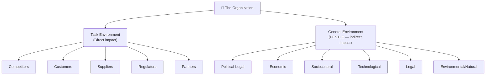

⚠️ **Exam Trap:**

- General environment affects ALL businesses equally

- Task environment affects YOUR specific business directly

- Customers = Task environment (NOT general environment)

**Past Paper:** *"Discuss global, technological, customer and social media challenges"* — Spring 2025 ✅

## **3.3 — Internal Environment**

**The Core Idea:** Internal environment = everything INSIDE the organization. Unlike external environment, managers have **significant control** over this.

**Memory Trick:** **OBEC** → *"Organizations Build Everything on Culture"*

**4 Components:**

### **① Owners**

People or entities that own the business.

|                     |                        |
|---------------------|------------------------|
| **Type**            | **Example**            |
| Sole proprietorship | Local shop owner       |
| Partnership         | Law firm               |
| Private company     | Pre-listed Engro       |
| Public company      | PTCL on stock exchange |
| Government-owned    | PIA, Pakistan Railways |

**Impact:** Set vision, provide resources, define boundaries of what managers can do.

### **② Board of Directors**

Group elected by shareholders to oversee and guide top management.

|                        |                      |
|------------------------|----------------------|
| **Board**              | **Management**       |
| Sets overall direction | Implements direction |
| Oversight role         | Operational role     |
| Meets periodically     | Works daily          |
| Asks "Right things?"   | Asks "Things right?" |

> **Example:** When Volkswagen scandal broke → Board fired CEO immediately.

### **③ Employees**

Most valuable internal resource — execute every plan and strategy.

**Key factors:**

- Skills and competencies

- Motivation and attitude

- Satisfaction (happy employees = lower turnover, higher productivity)

### **④ Organizational Culture**

The personality of the organization — covered in detail in 3.5.

**All 4 must be ALIGNED for organizational success:**

Owners set vision → Board ensures accountability

→ Employees execute → Culture shapes HOW

⚠️ **Exam Trap:**

- Board of Directors ≠ Management — board oversees management, they are different groups

- Internal environment ≠ only employees — includes ownership, board, culture

## **3.4 — Organization-Environment Relationship**

**The Core Idea:** Knowing the environment exists is not enough. Managers must actively **manage the relationship** between organization and environment through two approaches.

**MANAGING ENVIRONMENT RELATIONSHIP**

**│**

├── 1. ADAPTING (Organization changes itself)

└── 2. INFLUENCING (Organization changes environment)

### **Approach 1 — Adapting to Environment:**

|                            |                                                |                                                 |
|----------------------------|------------------------------------------------|-------------------------------------------------|
| **Strategy**               | **Meaning**                                    | **Example**                                     |
| **Information management** | Boundary spanning — collect environmental info | Market research teams, competitive intelligence |
| **Strategic response**     | Change strategy based on environment           | Netflix shifting from DVD to streaming          |
| **Mergers & Acquisitions** | Join or buy companies to gain strength         | Jazz absorbing Warid (2017)                     |
| **Flexible structures**    | Build agility into organization design         | Remote work capabilities during COVID           |

**Boundary Spanning** = people/units that connect organization to its environment by gathering external information (market researchers, PR officers, sales reps).

### **Approach 2 — Influencing Environment:**

|                           |                                                     |                                                  |
|---------------------------|-----------------------------------------------------|--------------------------------------------------|
| **Strategy**              | **Meaning**                                         | **Example**                                      |
| **Advertising & PR**      | Shape how public perceives organization             | Nestlé PR campaign after water controversy       |
| **Lobbying**              | Influence government decisions in your favor        | Textile industry lobbying for export subsidies   |
| **Trade associations**    | Companies cooperate to influence shared environment | OICCI representing foreign companies in Pakistan |
| **Strategic maneuvering** | Bold moves that reshape competitive environment     | Apple creating smartphone category with iPhone   |

⚠️ **Exam Trap:**

- Merger = two companies become ONE

- Alliance = two companies cooperate but REMAIN SEPARATE

- Organizations can BOTH adapt AND influence — not just react

## **3.5 — Organizational Culture**

**The Core Idea:** Culture = the invisible personality of an organization. It shapes how people think, decide, behave, and treat each other — more powerfully than any written rule.

> *"Culture eats strategy for breakfast"* — Peter Drucker

**Definition (Robbins):**

> *"Shared values, principles, traditions, and ways of doing things that influence how organizational members act."*

**3 Key Words:** Shared + Values/Beliefs + Behavior

### **How Culture is Created:**

Founder's values → Early practices → Success reinforces

→ Employees internalize → New employees socialized → Self-sustaining

### **7 Dimensions of Culture:**

**Memory Trick:** *"I Really Appreciate People Taking Smart Actions"* → Innovation, Risk, Attention, People, Team, Stability, Aggressiveness (+ Outcome)

|                         |                                                 |                       |                        |
|-------------------------|-------------------------------------------------|-----------------------|------------------------|
| **Dimension**           | **Meaning**                                     | **High Example**      | **Low Example**        |
| **Innovation**          | Degree employees encouraged to create new ideas | Google, Tesla         | Government offices     |
| **Risk Taking**         | Degree of risk-taking encouraged                | Startups              | Traditional banks      |
| **Attention to Detail** | Precision and exactness expected                | Toyota, Surgery       | Creative agencies      |
| **Outcome Orientation** | Focus on results vs processes                   | Amazon, Sales teams   | Government departments |
| **People Orientation**  | How much org cares about employee impact        | Google, Unilever      | Sweatshop factories    |
| **Team Orientation**    | Work organized around teams vs individuals      | Consulting firms      | Commission sales       |
| **Aggressiveness**      | How competitive and ambitious the culture is    | Investment banks      | Non-profits            |
| **Stability**           | Maintaining status quo vs pursuing change       | Government, utilities | Startups, tech         |

### **Strong vs Weak Culture:**

|              |                    |                    |
|--------------|--------------------|--------------------|
|              | **Strong Culture** | **Weak Culture**   |
| Values       | Widely shared      | Fragmented         |
| Behavior     | Consistent         | Inconsistent       |
| Rules needed | Fewer              | Many               |
| Performance  | Generally higher   | Generally lower    |
| Example      | Apple, Toyota      | Dysfunctional orgs |

> In strong culture — employees know what to do in NEW situations WITHOUT being told.

### **How Culture is Maintained:**

|                   |                                                                             |
|-------------------|-----------------------------------------------------------------------------|
| **Method**        | **Example**                                                                 |
| **Socialization** | New employees learn culture through pre-arrival → encounter → metamorphosis |
| **Stories**       | "Remember when founder worked 20 hours straight..."                         |
| **Rituals**       | Weekly meetings, annual award ceremonies                                    |
| **Symbols**       | Office layout, dress code, logos                                            |
| **Language**      | Amazon's "Day 1" mindset                                                    |

**⚠️ Exam Traps:**

- Culture ≠ company parties and free lunch — goes much deeper

- Strong culture ≠ always good culture — must also be ethical

- Culture is the SLOWEST and HARDEST thing to change in an organization

- Must know ALL 7 dimensions by name

**Past Paper:** *"Define culture and discuss various dimensions"* — Spring 2025 (10 marks) ✅✅

## **3.6 — Scientific Management Concept**

**The Core Idea:** Before scientific management, work ran on guesswork and tradition. Frederick Winslow Taylor asked: *"What if we applied scientific methods to find the ONE BEST WAY to do every job?"* This became the foundation of modern management theory.

**Scholar:** Frederick Winslow Taylor = **Father of Scientific Management** (early 1900s)

### **Taylor's 4 Principles:**

**Memory Trick:** **"Dedicated Scientists Transform Daily work"** → DSTD

|                                           |                                                            |                                                   |
|-------------------------------------------|------------------------------------------------------------|---------------------------------------------------|
| **Principle**                             | **Meaning**                                                | **Example**                                       |
| **Develop science** for each work element | Replace guesswork with scientific best method              | Studying shovel size → 300% productivity increase |
| **Scientifically select** & train workers | Match right person to right job, train properly            | Amazon warehouse selection and training process   |
| **Cooperate** with workers                | Management + workers work together, not against each other | Toyota's Kaizen suggestion system                 |
| **Divide work** equally                   | Managers plan, workers execute — clear separation          | Call center: management scripts, workers follow   |

### **Taylor's Piece-Rate Pay System:**

- Pay workers based on OUTPUT — not hours worked

- Meet standard → earn standard wage

- Exceed standard → earn HIGHER rate

- Fall below → earn lower rate

> Creates clear incentive to perform

### **Other Key Contributors:**

|                      |                                                               |
|----------------------|---------------------------------------------------------------|
| **Scholar**          | **Contribution**                                              |
| **Frank Gilbreth**   | Motion study — analyzing body movements to eliminate waste    |
| **Lillian Gilbreth** | Human/psychological factors in scientific management          |
| **Henry Gantt**      | Gantt chart — visual project planning tool (still used today) |

### **Where Scientific Management Works vs Fails:**

|                                       |                                            |
|---------------------------------------|--------------------------------------------|
| **Works Well**                        | **Fails**                                  |
| Repetitive physical tasks             | Creative and knowledge work                |
| Manufacturing, fast food, warehousing | Software development, design, research     |
| Call centers, garment factories       | Any work requiring judgment and creativity |

### **Key Criticism:**

> **"It treats workers like machines — not humans."**

- Ignores social needs, creativity, autonomy

- Creates monotony → dissatisfaction

- Assumes money = only motivator → incorrect for modern workers

**⚠️ Exam Traps:**

- Taylor's FULL name = Frederick **Winslow** Taylor — teachers expect full name

- Time study ≠ motion study → Time = how long \| Motion = physical movements

- Gantt chart = Henry Gantt, NOT Taylor

- Scientific management = OLDEST formal theory (1900s) — foundation, not current best practice

**Past Paper:** *"What is Scientific Management Concept"* — Spring 2025 ✅

## **3.7 — Going Global: How Companies Expand Internationally**

**The Core Idea:** Companies go global to access larger markets, new customers, lower costs, and resources. There are 6 strategies from lowest to highest commitment and control.

**Memory Trick:** **"Every Local Firm Seeks A Journey"** → ELFSAJ → Export, Licensing, Franchising, Strategic Alliance, Joint Venture, FDI

LOW COMMITMENT ←————————————————→ HIGH COMMITMENT

Export → License → Franchise → Alliance → JV → FDI

### **Why Companies Go Global:**

- Larger market (local market too small/saturated)

- New customers

- Lower costs (cheaper labor/materials)

- Access to resources

- Diversification (reduce risk)

- Follow competitors

### **6 Entry Strategies:**

**① Exporting/Importing**

- Selling products made at home to foreign customers (export)

- Buying foreign products to sell locally (import)

- Lowest risk, lowest control, no physical presence needed

> Example: Gul Ahmed exports fabric to UK without opening UK office

**② Licensing**

- Allow foreign company to use your intellectual property (patents, brand, technology)

- Foreign company pays **royalty** (fee for using IP)

- Low investment, limited control

> Example: Pepsi licenses formula to local bottling companies worldwide

**③ Franchising**

- Allow foreign business to operate using your COMPLETE business system

- Includes brand, processes, products, training, quality standards

- More control than licensing, extensive support provided

> Example: McDonald's, KFC, Pizza Hut, Subway in Pakistan

**④ Strategic Alliance**

- Two companies cooperate for mutual benefit

- Both remain completely **separate and independent**

- Shared costs, shared risks, access to local knowledge

> Example: PIA in Star Alliance with international airlines

**⑤ Joint Venture**

- Two companies create a **NEW, SEPARATE company TOGETHER**

- Shared ownership, costs, risks, profits

- More formal and committed than alliance

> Example: CPEC projects — Chinese + Pakistani companies creating new project companies

**⑥ Foreign Direct Investment (FDI)**

- Company directly owns operations in foreign country

- **Highest investment, highest control, highest risk**

|                 |                                          |                                                   |
|-----------------|------------------------------------------|---------------------------------------------------|
| **Form**        | **Meaning**                              | **Example**                                       |
| **Greenfield**  | Build entirely new facility from scratch | Coca-Cola building new bottling plant in Pakistan |
| **Acquisition** | Buy existing company in foreign country  | Alibaba buying Daraz Pakistan                     |

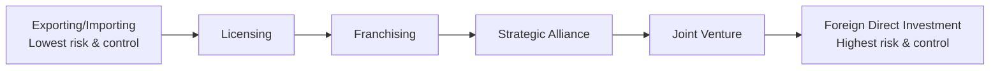
*As you move right, investment, risk, and control all increase.*

### **Licensing vs Franchising — Most Asked Comparison:**

|                   |                         |                                      |
|-------------------|-------------------------|--------------------------------------|
|                   | **Licensing**           | **Franchising**                      |
| **What's shared** | Specific IP only        | Complete business system             |
| **Control**       | Less control            | More control                         |
| **Support given** | Minimal                 | Extensive training + ongoing support |
| **Common in**     | Manufacturing, software | Services, restaurants, retail        |
| **Example**       | Pepsi formula           | McDonald's operations                |

⚠️ **Exam Traps:**

- Licensing ≠ Franchising — this is the MOST common exam trap in this topic

- Strategic Alliance ≠ Joint Venture → Alliance = stay separate \| JV = create new company

- FDI = highest commitment AND highest control AND highest risk

**Past Paper:** *"How companies can go global"* — Fall 2024 (10 marks) ✅ **Past Paper:** *"Differentiate Franchising and Licensing"* — Spring 2025 ✅✅

### 

### 

### 

### 

# **STAGE 4 — Planning & Decision Making**

## **4.1 — What is Planning & Why Managers Plan**

**Definition:**

> *"Planning is the process of setting organizational goals and deciding how best to achieve them."*

**Why Planning Exists:**

- Gives direction — everyone knows where organization is going

- Reduces uncertainty — prepares for future changes

- Minimizes waste — resources used purposefully

- Sets standards for controlling — you can't measure results without a plan

**Simple Logic:**

Without plan → No direction → Wasted resources → No goal achievement

With plan → Clear direction → Focused effort → Goal achievement

**Past Paper:** *"Write few benefits of planning"* — Spring 2025 ✅

## **4.2 — Benefits of Planning**

**Memory Trick:** **"Managers Direct Resources Carefully Every Season"** → MDRCES

|                           |                                                 |
|---------------------------|-------------------------------------------------|
| **Benefit**               | **Simple Meaning**                              |
| **Minimizes waste**       | Resources used purposefully, no duplication     |
| **Gives direction**       | Everyone knows what to do and where to go       |
| **Reduces uncertainty**   | Prepares organization for future changes        |
| **Coordination**          | Different departments work toward same goal     |
| **Establishes standards** | Basis for controlling and measuring performance |
| **Sets priorities**       | Focuses attention on most important goals first |

⚠️ **Exam Tip:** For short questions list at least 4-5 benefits with one line explanation each.

## **4.3 — Organizational Goals & Types**

**What are Goals?** Goals = desired outcomes that organization wants to achieve. They give planning its direction and purpose.

**Types of Goals by Level:**

|                           |                   |                                   |                                                 |
|---------------------------|-------------------|-----------------------------------|-------------------------------------------------|
| **Level**                 | **Type**          | **Time**                          | **Example**                                     |
| **Top management**        | Strategic goals   | Long-term (3-5 years)             | "Become market leader in Pakistan by 2027"      |
| **Middle management**     | Tactical goals    | Medium-term (1-2 years)           | "Increase Punjab region sales by 20% this year" |
| **First-line management** | Operational goals | Short-term (daily/weekly/monthly) | "Process 100 orders per day this week"          |

**Characteristics of Good Goals — SMART:**

|            |             |
|------------|-------------|
| **Letter** | **Meaning** |
| **S**      | Specific    |
| **M**      | Measurable  |
| **A**      | Achievable  |
| **R**      | Relevant    |
| **T**      | Time-bound  |

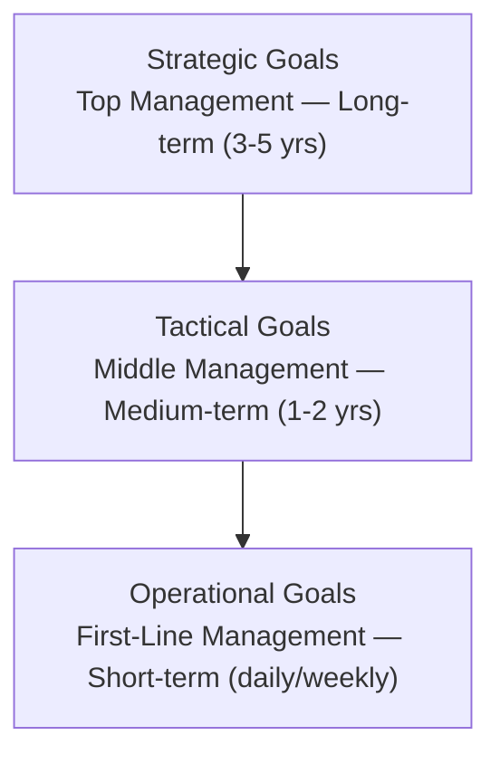

## **4.4 — Levels of Planning**

**3 Levels of Planning — match management levels:**

|                |                      |                     |             |                                    |
|----------------|----------------------|---------------------|-------------|------------------------------------|
| **Level**      | **Type**             | **Who**             | **Time**    | **Focus**                          |
| **Top**        | Strategic planning   | Top managers        | Long-term   | Overall organization direction     |
| **Middle**     | Tactical planning    | Middle managers     | Medium-term | Departmental execution of strategy |
| **First-line** | Operational planning | First-line managers | Short-term  | Day-to-day activities              |

**Two Types of Plans:**

|                     |                                               |                                              |
|---------------------|-----------------------------------------------|----------------------------------------------|
| **Type**            | **Meaning**                                   | **Example**                                  |
| **Single-use plan** | Created for ONE specific situation, used once | Project plan for launching new product       |
| **Standing plan**   | Used REPEATEDLY for recurring situations      | Company attendance policy, safety procedures |

**Standing Plans include:**

- **Policies** = general guidelines for decisions ("Always respond to customer complaints within 24 hours")

- **Procedures** = step-by-step instructions for specific situations

- **Rules** = specific statements of what must/must not be done

### **4.5 — Levels of Strategy**

**The Core Idea:** Strategy = the plan an organization uses to achieve its goals and gain competitive advantage. Strategy exists at 3 different levels — each answering a different question for a different audience.

**Memory Trick:** **"Big Companies Fight"** → BCF → Business, Corporate, Functional

#### **<u>3 Levels of Strategy:</u>**

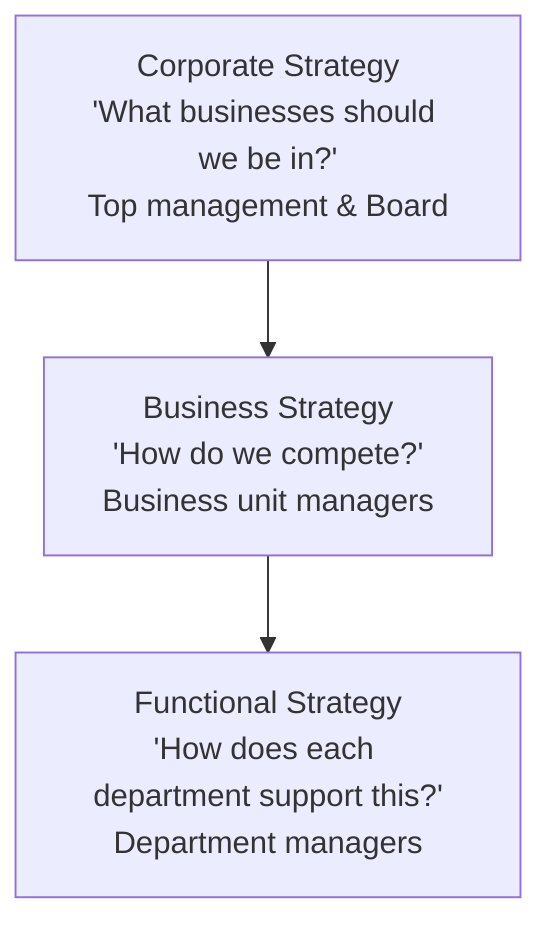

**① Corporate Strategy** The highest level. Answers: **"What businesses should we be in?"**

- Decides overall direction of the ENTIRE organization

- Decided by TOP management and Board of Directors

- Thinks about which industries, markets, or businesses to enter, stay in, or exit

**3 Types of Corporate Strategy:**

|                           |                                                                     |                                                         |                                                              |
|---------------------------|---------------------------------------------------------------------|---------------------------------------------------------|--------------------------------------------------------------|
| **Type**                  | **Meaning**                                                         | **When Used**                                           | **Example**                                                  |
| **Growth strategy**       | Expand the business — new markets, new products, more customers     | When organization wants to grow bigger                  | Daraz expanding from Pakistan to other South Asian countries |
| **Stability strategy**    | Stay where you are — maintain current position without major change | When organization is satisfied with current performance | A profitable local business choosing not to expand           |
| **Retrenchment strategy** | Cut back — reduce operations, close units, cut costs                | When organization is struggling or losing money         | PIA closing international routes to reduce losses            |

**Growth Strategy has 3 sub-types:**

|                          |                                              |                                                                                 |
|--------------------------|----------------------------------------------|---------------------------------------------------------------------------------|
| **Sub-type**             | **Meaning**                                  | **Example**                                                                     |
| **Concentration**        | Grow within same business/industry           | McDonald's opening more outlets same country                                    |
| **Vertical integration** | Expand into supplier or distributor business | Textile company buying its own cotton farm (backward) or retail store (forward) |
| **Diversification**      | Enter completely new and different business  | Engro moving from fertilizers into food products                                |

**② Business Strategy** Mid level. Answers: **"How do we COMPETE in this specific market?"**

- Focuses on how to beat competitors in a particular industry

- Decided by business unit managers

- Also called **Competitive Strategy**

**Porter's 3 Generic Competitive Strategies:** [Michael Porter = famous strategy scholar who identified these]

**Memory Trick:** **"CDF"** → Cost, Differentiation, Focus

**① Cost Leadership Strategy** Be the LOWEST COST producer in the industry — offer lowest prices and still make profit.

- How: Achieve economies of scale [cost advantages from producing large quantities], use efficient processes, minimize waste

- Target: Broad market — appeal to ALL customers who want low price

- Risk: Competitors may copy your cost reduction methods

> **Example:** Walmart — entire business model built on being cheapest. Their slogan "Save Money, Live Better" reflects cost leadership. **Pakistani Example:** Local budget airlines offering cheapest tickets by cutting every unnecessary cost.

**② Differentiation Strategy** Offer something UNIQUE that customers value and are willing to pay MORE for.

- How: Superior quality, unique features, exceptional service, strong brand image

- Target: Broad market — customers who value uniqueness over price

- Risk: Customers may decide the premium [extra price] is not worth it

> **Example:** Apple — premium prices justified by unique design, ecosystem, and brand prestige. Customers happily pay more. **Pakistani Example:** Junaid Jamshed (J.) clothing — premium price for unique traditional designs and brand prestige.

**③ Focus Strategy** Target a NARROW, SPECIFIC market segment — serve that small group better than anyone else.

- How: Concentrate all resources on one specific customer group, geography, or product type

- Two variants:

  - **Cost focus** = be cheapest within narrow segment

  - **Differentiation focus** = be most unique within narrow segment

- Risk: Focused segment may shrink or disappear

> **Example:** Rolls Royce — targets only ultra-wealthy buyers. Does not try to sell to everyone. **Pakistani Example:** A law firm specializing ONLY in corporate merger cases — deeply expert in that narrow area.

⚠️ **Stuck in the Middle:** Porter warned that trying to be BOTH cost leader AND differentiator = "stuck in the middle" = performs poorly at both = dangerous strategic position.

**③ Functional Strategy** Lowest level. Answers: **"How does each department support the business strategy?"**

- Each department (marketing, HR, finance, operations) develops its own strategy

- Must ALIGN [match and support] with business and corporate strategy

- Decided by department managers

> **Example:** If business strategy = differentiation through quality → then:

- Operations functional strategy = invest in best quality machinery

- HR functional strategy = hire and train only top-skilled workers

- Marketing functional strategy = promote quality and premium image

**⚠️ Exam Trap:**

- Corporate strategy = WHAT businesses to be in

- Business strategy = HOW to compete in those businesses

- Functional strategy = HOW each department SUPPORTS the competition

- All three must be aligned — if they conflict → organizational failure

## **4.6 — What is Decision Making?**

**Definition:**

> *"Decision making is the process of identifying and selecting a course of action to solve a specific problem or take advantage of an opportunity."*

**Decision making is the CORE of management** — every management function (POLC) requires decisions.

**Two Types of Decisions:**

|                              |                                                    |                                                           |
|------------------------------|----------------------------------------------------|-----------------------------------------------------------|
| **Type**                     | **Meaning**                                        | **Example**                                               |
| **Programmed decisions**     | Routine, repetitive, clear solution already exists | Reordering stock when inventory falls below minimum level |
| **Non-programmed decisions** | Unique, complex, no ready-made solution            | Deciding whether to enter a completely new market         |

**⚠️ Exam Trap:**

- Programmed = routine, structured, lower-level managers

- Non-programmed = unique, unstructured, top-level managers

## **4.7 — Decision Making Process (Steps)**

**Memory Trick:** **"Real Managers Evaluate All Choices Immediately"** → RMEACI

|                                     |                                               |                                        |
|-------------------------------------|-----------------------------------------------|----------------------------------------|
| **Step**                            | **Action**                                    | **Simple Meaning**                     |
| **1. Recognize** the problem        | Identify that a problem or opportunity exists | Sales dropped 20% — something is wrong |
| **2. Identify** decision criteria   | What factors matter in making this decision?  | Cost, quality, speed, customer impact  |
| **3. Allocate weights** to criteria | Which factors are MORE important than others? | Quality matters more than speed here   |
| **4. Develop alternatives**         | Generate possible solutions                   | Option A, B, C...                      |
| **5. Evaluate alternatives**        | Analyze each option against criteria          | Score each option                      |
| **6. Select best alternative**      | Choose the highest-scoring option             | Pick Option B                          |
| **7. Implement decision**           | Put chosen solution into action               | Execute Option B                       |
| **8. Evaluate effectiveness**       | Did the decision solve the problem?           | Check results, adjust if needed        |

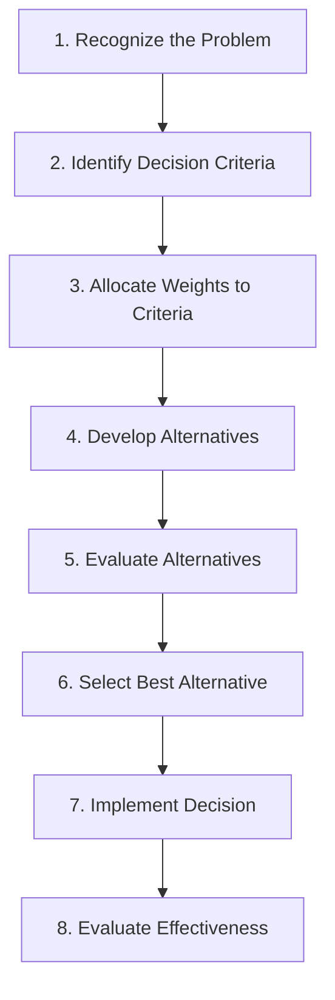

*Diagram: The 8-step decision making process.*

⚠️ **Exam Tip:** Past paper asked this as 10-mark question — write all 8 steps clearly with one example running throughout all steps.

**Past Paper:** *"Define decision and discuss Decision Making Process"* — Fall 2024 (10 marks) ✅ **Past Paper:** *"Explain decision making in details with examples"* — Fall 2025 (10 marks) ✅✅

## **4.8 — Types of Decisions**

**By Conditions/Environment:**

|                 |                                                        |                                               |
|-----------------|--------------------------------------------------------|-----------------------------------------------|
| **Condition**   | **Meaning**                                            | **Manager's Situation**                       |
| **Certainty**   | All information known, outcome predictable             | Manager knows exactly what will happen        |
| **Risk**        | Some information known, probabilities can be estimated | Manager can calculate chances of each outcome |
| **Uncertainty** | Little information, outcomes unpredictable             | Manager must guess or use judgment            |

**Memory Trick:** **CRU** → *"Certain Results are Unlikely"* in business 😄

⚠️ **Exam Trap:**

- Certainty ≠ risk ≠ uncertainty — three completely different situations

- Most real business decisions happen under **risk or uncertainty** — not certainty

- Uncertainty = hardest condition to make decisions in

**Past Paper:** *"Certainty Vs Uncertainty decision making"* — Fall 2024 ✅

### **4.9 — Classical vs Administrative Model + Rational Perspective**

**The Core Idea:** Two completely different models explain how managers SHOULD make decisions vs how they ACTUALLY make decisions in reality. This distinction is one of the most important and commonly tested concepts in decision making.

#### **Model 1 — Classical Model (Rational/Normative Model)**

**"How managers SHOULD ideally make decisions"**

**Assumptions of Classical Model:**

- Manager has **complete information** about all alternatives

- Manager is **perfectly rational** — no emotions, no bias

- Manager knows **all possible outcomes** of each choice

- Manager always selects the option that **maximizes** [produces the absolute best] outcome

- Decision making is a clean, logical, step-by-step process

**This model is called NORMATIVE** [describes what SHOULD happen — the ideal standard]

> **Example of Classical Thinking:** Manager needs to choose a supplier. Classical model says: research ALL suppliers worldwide, get ALL pricing and quality data, analyze every option perfectly, select the supplier with absolute best combination of quality and price.

**Problem with Classical Model:** In real business — complete information NEVER exists. Time is always limited. Human beings are never perfectly rational. This model describes an IMPOSSIBLE ideal.

#### **Model 2 — Administrative Model (Behavioral/Descriptive Model)**

**"How managers ACTUALLY make decisions in reality"**

**Developed by:** Herbert Simon

**Key Concepts:**

**① Bounded Rationality** Managers WANT to be rational but their rationality is **BOUNDED** [limited] by:

- Limited information available

- Limited time to gather and process information

- Limited human brain capacity to analyze everything perfectly

- Organizational constraints [budget, policies, politics]

> **Simple Analogy:** You want to buy the best laptop in the world. But you have limited budget, limited time to research, and limited ability to test every laptop. So your rational decision-making is BOUNDED by these limits.

**② Satisficing** [Satisfying + Sufficing combined into one word]

Because perfect rationality is impossible → managers don't search for the BEST possible solution. Instead they search until they find a solution that is **"good enough"** — meets minimum acceptable criteria — then STOP searching.

> **Example:** Manager needs to hire a software developer. Instead of interviewing every developer in Pakistan to find the absolute best one (impossible), they interview 8 candidates, find one who meets all requirements well, and hire that person. That's satisficing — good enough, not perfect.

**③ Intuition** Experienced managers often make quick decisions based on **gut feeling** — accumulated experience and pattern recognition built over years of similar situations.

- NOT random guessing

- IS subconscious [below conscious awareness] processing of years of experience

- Works best when manager has deep relevant experience

> **Example:** Experienced marketing manager immediately senses a new campaign will fail — based on years of seeing similar campaigns. Data might not yet confirm it — but intuition built from experience signals it clearly.

**This model is called DESCRIPTIVE** [describes what ACTUALLY happens — real behavior]

#### **Classical vs Administrative — Direct Comparison:**

|                    |                               |                              |
|--------------------|-------------------------------|------------------------------|
|                    | **Classical Model**           | **Administrative Model**     |
| **Also called**    | Rational/Normative model      | Behavioral/Descriptive model |
| **Scholar**        | Traditional economics         | Herbert Simon                |
| **Information**    | Complete and perfect          | Limited and imperfect        |
| **Decision maker** | Perfectly rational            | Bounded rational             |
| **Goal**           | Maximize — find absolute best | Satisfice — find good enough |
| **Reality**        | Ideal/theoretical             | Realistic/practical          |
| **Process**        | Clean, logical steps          | Messy, shortcuts, intuition  |
| **Used for**       | Explaining ideal decisions    | Explaining actual decisions  |

⚠️ **Exam Trap:**

- Classical model = ideal, theoretical, maximizing

- Administrative model = realistic, practical, satisficing

- Herbert Simon = Administrative model (NOT classical)

- Satisficing ≠ lazy decision making → it is the PRACTICAL response to real-world constraints

### **4.10 — Behavioral Aspects**

**The Core Idea:** Human psychology affects every decision managers make. These behavioral factors explain why even smart, experienced managers sometimes make poor decisions.

#### **Complete List of Behavioral Factors:**

**① Bounded Rationality** *(covered above)*

**② Satisficing** *(covered above)*

**③ Heuristics** [hyoo-ris-tiks] Mental shortcuts or "rules of thumb" [simple informal rules based on experience] that managers use to make quick decisions without analyzing everything from scratch.

- Saves time and mental energy

- Works well in familiar situations

- Can lead to systematic errors in new or complex situations

**3 Common Types of Heuristics:**

|                                  |                                                                   |                                                                                                             |
|----------------------------------|-------------------------------------------------------------------|-------------------------------------------------------------------------------------------------------------|
| **Type**                         | **Meaning**                                                       | **Example**                                                                                                 |
| **Availability heuristic**       | Judge probability based on how easily examples come to mind       | Manager overestimates risk of plane crash after reading news about one — because example is fresh in memory |
| **Representativeness heuristic** | Judge situation based on how similar it seems to a known category | Manager assumes new employee will be great because they remind him of a previous star employee              |
| **Anchoring heuristic**          | Over-rely on first piece of information received                  | Manager anchors salary offer at Rs. 50,000 because that was first number mentioned in negotiation           |

**④ Framing Effect** The way information is **presented** [framed] influences the decision — even when the actual facts are identical.

> **Classic Example:** Option A: "This surgery has a 90% survival rate" → Manager approves it Option B: "This surgery has a 10% death rate" → Manager hesitates **Both statements are IDENTICAL FACTS — but framing changes the decision.**
>
> **Business Example:** "Our plan succeeded in 7 out of 10 markets" vs "Our plan failed in 3 out of 10 markets" Same reality — different framing — different emotional and decision response.

⚠️ **Exam Tip:** Framing effect = same information, different presentation = different decision. Managers must recognize when framing is influencing their judgment.

**⑤ Escalation of Commitment** Continuing to invest time, money, and resources into a **failing course of action** because of the amount already invested — rather than cutting losses and moving on.

Also called: **"Throwing good money after bad"**

**Why it happens:**

- Don't want to admit the original decision was wrong

- Fear of being seen as a failure

- Hope that "just a little more investment" will turn things around

- Past investment feels like it will be "wasted" if project is abandoned

> **Example:** Pakistani company invested Rs. 50 million in a new product that is clearly failing in market. Instead of stopping → manager pushes for another Rs. 20 million saying "we've already invested so much, we can't stop now." This is escalation of commitment.
>
> **Real Example:** Many governments continue funding failing infrastructure projects for years because stopping feels like "wasting" previous investment — even when continuing wastes even more.

**Rational Response:** Past investment is a **sunk cost** [money already spent that cannot be recovered regardless of future decisions]. Future decisions should be based ONLY on future costs and benefits — not past investment.

**⑥ Risk Propensity** The willingness of a manager to take risks in decision making.

|                  |                                                      |                                                           |
|------------------|------------------------------------------------------|-----------------------------------------------------------|
| **Type**         | **Meaning**                                          | **Tendency**                                              |
| **Risk taker**   | Comfortable making decisions with uncertain outcomes | Chooses bold, high-reward options even with high risk     |
| **Risk avoider** | Prefers certainty, uncomfortable with uncertainty    | Chooses safe, conservative options even with lower reward |

> **Example:** Entrepreneur launching new startup = high risk propensity **Example:** Government department manager = typically low risk propensity — prefers established procedures

**How risk propensity affects organizations:**

- Too much risk taking → reckless decisions, potential disasters

- Too little risk taking → missed opportunities, organizational stagnation [no growth]

- Best managers calibrate [adjust] risk based on situation — not personal preference alone

### **4.11 — Group Decision Making Techniques**

**The Core Idea:** When groups make decisions, specific techniques can be used to improve quality, encourage creativity, and prevent groupthink. Each technique has a different purpose and works best in different situations.

#### **Technique 1 — Brainstorming**

**What it is:** A group technique where members generate as many ideas as possible in a free, open environment — with ZERO criticism or evaluation during the idea generation phase.

**Rules of Brainstorming:**

- No criticism of any idea during session — no matter how strange

- Quantity over quality — more ideas = better

- Build on others' ideas — combine and improve

- Every idea is welcomed and recorded

**Why it works:** Fear of criticism is the biggest killer of creative ideas. Removing judgment → people share ideas they would normally keep to themselves.

**Limitation:** Louder, more confident members dominate. Quiet members stay silent even with good ideas. Social pressure still exists even without formal criticism.

> **Example:** Marketing team brainstorming new campaign ideas — no idea judged for first 30 minutes → 50 ideas generated → then best ones selected for further development.

#### **Technique 2 — Devil's Advocacy**

**What it is:** One group member is specifically **assigned** the role of challenging and criticizing every idea and decision — even if they personally agree with it.

**Why it works:**

- Forces the group to defend their ideas with real reasoning

- Exposes weaknesses in proposals before implementation

- Directly combats groupthink — ensures critical thinking happens

- The criticism is **role-based** [part of assigned job] — not personal — so it doesn't damage relationships

> **Example:** Management team planning new product launch. One senior manager assigned as devil's advocate → systematically challenges every assumption: "What if customers don't want this? What if competitors copy it in 3 months? What if production costs are higher than estimated?" Forces team to have real answers.

#### **Technique 3 — Nominal Group Technique (NGT)**

**What it is:** A structured process where group members **first work INDIVIDUALLY** then come together as a group. Reduces social pressure and dominance by stronger personalities.

**Steps:**

1.  Each member **silently writes** their ideas individually — no discussion

2.  Each member shares ONE idea in round-robin [taking turns] fashion — no debate yet

3.  All ideas recorded visibly for everyone

4.  Group **discusses and clarifies** each idea

5.  Each member **privately ranks** ideas by voting

6.  Votes tallied — highest-ranked idea selected

**Why it works:**

- Every person contributes equally — not just the loudest

- Reduces conformity pressure [pressure to agree with majority]

- Combines individual creativity with group evaluation

> **Example:** University committee choosing new curriculum topics. Each professor silently writes top 5 suggestions → all ideas shared and listed → discussed → privately voted → highest-ranked topics adopted.

#### **Technique 4 — Delphi Technique**

**What it is:** A structured method where **experts give opinions anonymously** through questionnaires — WITHOUT any face-to-face interaction. Responses are collected, summarized, and fed back to experts who then revise their opinions. Repeated until consensus [general agreement] emerges.

**Steps:**

1.  Experts receive questionnaire about the decision/problem

2.  Each expert responds **anonymously** [identity hidden]

3.  Responses summarized and sent back to ALL experts

4.  Experts revise opinions based on group summary

5.  Process repeated until consensus reached

**Why it works:**

- No face-to-face pressure — experts give honest opinions

- Dominant personalities cannot influence others

- Geographic barriers irrelevant — experts can be worldwide

- Anonymous responses = more honest and critical thinking

**Limitation:** Very slow process. Can take weeks or months.

> **Example:** Government asking healthcare experts across Pakistan to forecast disease outbreak risks for next year — experts respond anonymously, results compiled, shared back, revised — until consensus health policy recommendation emerges.

#### **Comparison Table — All 4 Techniques:**

|                      |                   |                        |                                         |           |
|----------------------|-------------------|------------------------|-----------------------------------------|-----------|
| **Technique**        | **Face-to-face?** | **Criticism allowed?** | **Best For**                            | **Speed** |
| **Brainstorming**    | Yes               | No (during generation) | Creative idea generation                | Fast      |
| **Devil's Advocacy** | Yes               | Yes (assigned role)    | Testing and challenging plans           | Medium    |
| **Nominal Group**    | Yes (later stage) | After listing          | Equal participation, avoiding dominance | Medium    |
| **Delphi**           | NO                | Anonymous responses    | Expert consensus, no geographic limits  | Slow      |

⚠️ **Most Important Exam Trap:**

- **Delphi = NO face-to-face** — this is the defining characteristic

- **Nominal Group = starts individually, becomes group** — not purely individual

- **Brainstorming = no criticism DURING generation** — criticism comes later in evaluation

- **Devil's Advocacy = criticism is the ASSIGNED ROLE** — not personal attack

### 

### 

### 

### 

### 

# **STAGE 5 — The Organizing Process**

## **5.1 — What is Organizing & Why it Matters**

**Definition:**

> *"Organizing is the process of determining how activities and resources are to be assembled and coordinated to achieve organizational goals."*

**Simple Meaning:** After planning (deciding WHAT to do), organizing decides **WHO does WHAT, with WHAT resources, and HOW everything fits together.**

Think of it like building a cricket team — you don't just pick 11 players randomly. You assign specific roles (batsman, bowler, wicketkeeper), define who reports to the captain, and coordinate everyone's responsibilities. That's organizing.

**Why Organizing Matters:**

- Without organizing → people don't know their roles → confusion and duplication of work

- Creates clear structure → everyone knows where they fit

- Ensures resources are used where needed most

- Makes coordination between departments possible

- Turns a plan into actual action through structure

**The Organizing Process covers 5 key decisions:**

1\. Designing Jobs → What will each person do?

2\. Grouping Jobs → How do we form departments?

3\. Reporting Relationships → Who reports to whom?

4\. Distributing Authority → Who has power to decide what?

5\. Coordinating Activities → How do departments work together?

### **5.2 — Job Characteristics Model**

**The Core Idea:** Designing jobs is not just about dividing work efficiently. How a job is designed directly affects how **motivated, satisfied, and productive** the employee doing that job will be. The Job Characteristics Model explains exactly WHICH features of a job make it motivating — and which make it boring and demotivating.

**Developed by:** Hackman & Oldham

**The Model's Central Argument:**

> 5 core job characteristics → create 3 critical psychological states → produce positive work outcomes (motivation, satisfaction, performance)

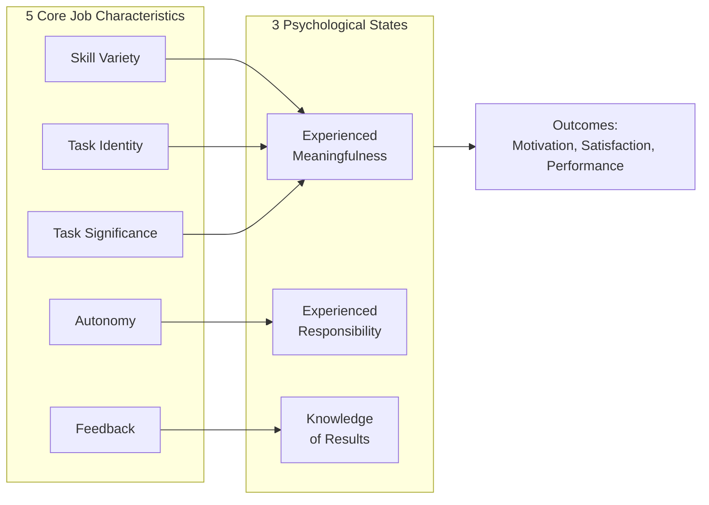

#### **5 Core Job Characteristics — Explained Properly:**

**① Skill Variety** The degree to which a job requires using **different skills, talents, and abilities.**

- High skill variety = job feels meaningful and challenging

- Low skill variety = job feels boring and repetitive

> **High example:** A manager who plans strategy, leads team meetings, analyzes data, and presents to clients — uses completely different skills throughout the day. Feels meaningful. **Low example:** A factory worker who only tightens one bolt on a production line — same single movement repeated 500 times a day. Feels meaningless.

**② Task Identity** The degree to which a job involves completing a **whole, identifiable piece of work** from beginning to end — rather than just one small piece of a larger process.

- High task identity = worker sees the complete result of their effort → feels pride and ownership

- Low task identity = worker does one small fragment → cannot connect effort to final result

> **High example:** A baker who personally makes an entire wedding cake from mixing ingredients to final decoration. Sees and owns the complete result. **Low example:** Factory worker who only adds cream filling to cakes moving on a conveyor belt — never sees or touches the complete cake. Feels disconnected from final product.

**③ Task Significance** The degree to which the job has a **meaningful impact on other people's lives** — inside or outside the organization.

- High task significance = worker feels their work genuinely matters

- Low task significance = worker feels their work is irrelevant and unimportant

> **High example:** A nurse in ICU [Intensive Care Unit] — directly saving lives. Every action has profound significance. **Low example:** Worker whose entire job is filing alphabetically sorted documents that nobody ever reads. Difficult to feel the work matters.
>
> **Important Insight:** Even simple jobs can feel significant when their impact is made clear. A janitor at NASA who said "I'm helping put a man on the moon" demonstrates high perceived task significance for a cleaning job.

**④ Autonomy** The degree to which the job gives the worker **freedom and independence** to decide HOW, WHEN, and in what order to do the work.

- High autonomy = worker feels personal responsibility for outcomes → works harder

- Low autonomy = worker feels like a machine following instructions → loses ownership

> **High example:** A freelance software developer who chooses their own work hours, decides which tools to use, and determines their own approach to solving each problem. **Low example:** Call center agent who must follow a rigid word-for-word script, cannot deviate from process, and has every second monitored. Zero autonomy.

**As a future Data Engineer:** Autonomy in choosing data architecture approaches and tools will be one of your biggest job satisfaction factors. Companies that give data engineers autonomy attract and retain better talent.

**⑤ Feedback** The degree to which the job itself provides **clear, direct information** about how well the worker is performing — not just feedback from the manager, but from the work itself.

- High feedback = worker continuously knows how they're doing → can self-correct and improve

- Low feedback = worker works in the dark — no idea if performance is good or bad until formal review

> **High example:** A salesperson whose daily dashboard shows exactly how many calls made, deals closed, and revenue generated. Knows their performance in real time. **Low example:** A researcher who submits work quarterly with no interim [in-between] feedback — works for months without knowing if they're on the right track.

#### **3 Critical Psychological States:**

The 5 characteristics create 3 specific feelings inside the worker:

|                                |                                                   |                                                      |
|--------------------------------|---------------------------------------------------|------------------------------------------------------|
| **Psychological State**        | **Created By**                                    | **Meaning**                                          |
| **Experienced meaningfulness** | Skill variety + Task identity + Task significance | "My work matters and has real value"                 |
| **Experienced responsibility** | Autonomy                                          | "I am personally responsible for how this turns out" |
| **Knowledge of results**       | Feedback                                          | "I know how well I am actually performing"           |

**When all 3 psychological states are present simultaneously:** → Worker is internally motivated → Work quality is high → Job satisfaction is high → Absenteeism and turnover are low

#### **Motivating Potential Score (MPS):**

A formula to calculate how motivating a job is overall:

**MPS = (Skill Variety + Task Identity + Task Significance) × Autonomy × Feedback**

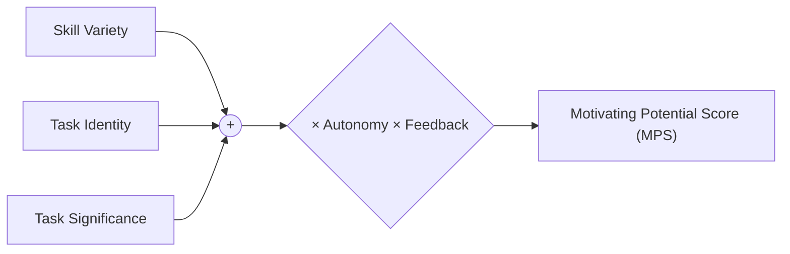

*Diagram: The Motivating Potential Score (MPS) formula.*

**Key insight from formula:**

- Autonomy and Feedback are MULTIPLIED — not just added

- If Autonomy OR Feedback = zero → entire MPS = zero regardless of other scores

- This means: A job with NO autonomy or NO feedback = zero motivating potential — even if it has high skill variety and significance

**⚠️ Exam Trap:**

- Job characteristics model = Hackman & Oldham — mention both names

- Autonomy and Feedback = most critical characteristics (multiplied in formula)

- The model explains WHY job enrichment works — it increases these 5 characteristics

- Not all employees respond equally — those with high growth need strength [strong desire for personal development] benefit most

## **5.3 — Job Description vs Job Specification**

**These two documents are created AFTER job design — extremely important for HR and exams.**

|                         |                                                                                          |                                                                                 |
|-------------------------|------------------------------------------------------------------------------------------|---------------------------------------------------------------------------------|
|                         | **Job Description**                                                                      | **Job Specification**                                                           |
| **What it defines**     | The JOB itself — duties and responsibilities                                             | The PERSON needed — qualifications and skills                                   |
| **Focus**               | Tasks, duties, working conditions                                                        | Education, experience, skills, personality                                      |
| **Question it answers** | "What will this person DO?"                                                              | "What kind of person do we NEED?"                                               |
| **Example**             | "Sales Manager will manage a team of 10, set monthly targets, prepare weekly reports..." | "Requires MBA degree, 5 years sales experience, strong communication skills..." |

⚠️ **This is one of the most commonly asked short questions — know the difference clearly.**

**Past Paper:** *"Differentiate job description and job specification"* — Fall 2025 ✅

## **5.4 — Grouping Jobs (Departmentalization)**

**The Core Idea:** After designing individual jobs, management must decide HOW to group these jobs into departments. This grouping is called departmentalization. The choice of departmentalization basis determines how the organization operates, communicates, and coordinates.

**5 Bases of Departmentalization — Each Properly Explained:**

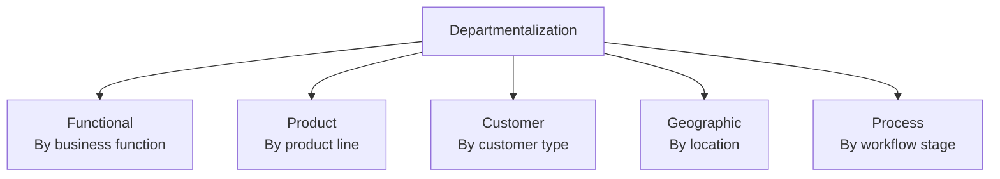

*Diagram: The 5 bases used to group jobs into departments.*

#### **① Functional Departmentalization**

**Grouping jobs by business FUNCTION — most common and traditional approach.**

All people doing similar work grouped together:

- All marketing people → Marketing Department

- All finance people → Finance Department

- All HR people → HR Department

- All operations people → Operations Department

**How it works:** Each function becomes a specialized center of expertise. The Marketing department handles ALL marketing for entire company. Finance handles ALL financial matters.

> **Example:** Standard Pakistani company structure — separate Marketing, Finance, HR, Operations, IT departments each headed by a functional manager.

|                                                |                                                                |
|------------------------------------------------|----------------------------------------------------------------|
| **✅ Advantages**                              | **❌ Disadvantages**                                           |
| Deep expertise develops within each function   | Departments become siloed [isolated, don't communicate well] |
| Efficient use of specialized talent            | Poor coordination between departments                          |
| Clear career path within function              | Slow response to market changes                                |
| Easy supervision of similar work               | Departments focus on own goals, not organization's goals       |
| Cost-effective — no duplication of specialists | Difficult to identify which department caused a problem        |

#### **② Product Departmentalization**

**Grouping jobs by PRODUCT LINE — each product has its own complete department.**

Each product division has its own marketing, finance, operations, and HR — fully self-contained.

**How it works:** Instead of one company-wide marketing department → each product line has its own dedicated marketing team focused exclusively on that product.

> **Example:** Unilever Pakistan has separate divisions for:

- Food products division (Knorr, Rafhan)

- Home care division (Surf Excel, Comfort)

- Personal care division (Dove, Vaseline, Sunsilk) Each division operates almost like a separate mini-company.

|                                                     |                                                              |
|-----------------------------------------------------|--------------------------------------------------------------|
| **✅ Advantages**                                   | **❌ Disadvantages**                                         |
| Full focus on specific product needs                | Duplication of resources across divisions                    |
| Faster response to product-specific problems        | Expensive — each division needs complete functional team     |
| Clear accountability — which product is performing  | Rivalry [unhealthy competition] between divisions possible |
| Easy to add or remove product lines                 | Loss of functional specialization depth                      |
| Division manager develops general management skills | Coordination between divisions becomes complex               |

#### **③ Customer Departmentalization**

**Grouping jobs by TYPE OF CUSTOMER served.**

Different customer groups have completely different needs — so separate departments serve each group with specialized knowledge.

**How it works:** Organization identifies its major customer segments and builds dedicated departments to serve each one deeply.

> **Example:** HBL Bank:

- Corporate Banking Department (large businesses)

- Retail Banking Department (individual customers)

- Islamic Banking Department (Sharia-compliant customers)

- Agricultural Banking Department (farmers) Each department deeply understands its specific customer type.

|                                                |                                                           |
|------------------------------------------------|-----------------------------------------------------------|
| **✅ Advantages**                              | **❌ Disadvantages**                                      |
| Deep understanding of specific customer needs  | Duplication of functions across customer departments      |
| Highly responsive to customer-specific demands | Difficult when same customer needs multiple departments   |
| Strong customer relationships and loyalty      | Coordination problems when customers overlap              |
| Customers feel understood and specially served | Risk of over-specialization in declining customer segment |

#### **④ Geographic Departmentalization**

**Grouping jobs by LOCATION or REGION.**

Organization serves different geographic areas — each region has unique market conditions, culture, regulations, and customer preferences.

**How it works:** Each geographic region gets its own management team with authority to adapt to local conditions.

> **Example:** Daraz Pakistan with regional operations:

- Punjab Region (Lahore headquarters)

- Sindh Region (Karachi)

- KPK Region (Peshawar)

- Balochistan Region (Quetta) Each region understands local market, logistics, and customer preferences better than central management.

> **Global Example:** McDonald's geographic divisions — each country adapts menu to local culture (McAloo Tikki in India, McArabia in Middle East).

|                                                |                                                           |
|------------------------------------------------|-----------------------------------------------------------|
| **✅ Advantages**                              | **❌ Disadvantages**                                      |
| Responds quickly to local market needs         | Duplication of functions in each region                   |
| Cultural and geographic sensitivity            | Difficult to maintain consistent standards across regions |
| Faster local decision making                   | Coordination between regions challenging                  |
| Local talent utilization                       | Risk of regions becoming too independent                  |
| Reduces transportation and communication costs | Top management loses direct control                       |

#### **⑤ Process Departmentalization**

**Grouping jobs by PRODUCTION PROCESS or WORKFLOW STAGE.**

Work flows through sequential [one after another in order] departments — each handling a different stage of production.

**How it works:** Product moves from one department to next — each department specializes in one specific stage of the process.

> **Example:** Garment manufacturing company:

- Cutting Department (fabric cut to patterns)

- Stitching Department (pieces sewn together)

- Quality Control Department (defects checked)

- Finishing Department (buttons, labels, ironing)

- Packaging Department (folded, tagged, boxed) Each department masters one specific production stage.

|                                               |                                                                  |
|-----------------------------------------------|------------------------------------------------------------------|
| **✅ Advantages**                             | **❌ Disadvantages**                                             |
| Highly efficient within each process stage    | Coordination between stages is challenging                       |
| Deep expertise in specific process            | Bottleneck [slowdown] in one stage stops entire production     |
| Clear workflow and accountability per stage   | Inflexible — hard to change process layout                       |
| Easy to identify where quality problems occur | Poor customer focus — departments focus on process, not customer |

#### **Choosing the Right Departmentalization — Decision Logic:**

|                                           |                              |
|-------------------------------------------|------------------------------|
| **If organization prioritizes...**        | **Best departmentalization** |
| Functional expertise and efficiency       | Functional                   |
| Specific product focus and accountability | Product                      |
| Customer relationship and service         | Customer                     |
| Local market responsiveness               | Geographic                   |
| Production efficiency and workflow        | Process                      |

⚠️ **Exam Trap:**

- Real organizations often use COMBINATIONS of departmentalization — not just one pure type

- No single basis is universally best — depends on organizational goals and environment

- Functional = most common in Pakistani organizations

- Geographic = most common in multinational organizations

## **5.5 — Establishing Reporting Relationships**

**The Core Idea:** After grouping jobs, the organization must define **who reports to whom.** This creates the chain of command — the clear line of authority from top to bottom.

**Two Key Concepts:**

### **① Chain of Command**

The unbroken line of authority that connects every person in the organization from top to bottom.

- Everyone has ONE clear supervisor they report to

- Everyone knows who their boss is

- Communication and authority flow through this chain

> **Example:** Worker → Supervisor → Department Manager → Regional Manager → CEO Each level reports to the level directly above it.

### **② Span of Control**

The number of employees a manager directly supervises and is responsible for.

|                       |                                         |                                          |
|-----------------------|-----------------------------------------|------------------------------------------|
|                       | **Narrow Span**                         | **Wide Span**                            |
| **Meaning**           | Manager supervises FEW people           | Manager supervises MANY people           |
| **Result**            | More management levels (tall structure) | Fewer management levels (flat structure) |
| **Supervision style** | Close, detailed supervision             | More employee autonomy                   |
| **Cost**              | More expensive (more managers needed)   | Less expensive                           |
| **Best for**          | Complex, specialized work               | Routine, standardized work               |

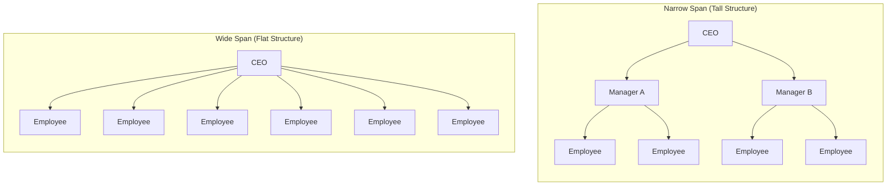

*Diagram: Narrow span (tall structure) vs Wide span (flat structure).*


**Factors affecting ideal span of control:**

- Complexity of work (complex = narrow span)

- Worker skill level (highly skilled = wider span)

- Manager's ability (strong manager = wider span)

- Geographic dispersion (spread out workers = narrow span)

## **5.6 — Centralization vs Decentralization**

**The Core Idea:** Every organization must decide: **"Who gets to make the decisions?"** Should decision-making authority be concentrated at the top — or distributed throughout the organization?

**Centralization** = decision-making authority kept at TOP management levels. **Decentralization** = decision-making authority pushed DOWN to lower management levels.

|                        |                                                    |                                                            |
|------------------------|----------------------------------------------------|------------------------------------------------------------|
|                        | **Centralization**                                 | **Decentralization**                                       |
| **Who decides**        | Top management only                                | Managers at all levels                                     |
| **Speed of decisions** | Slower (must go up the chain)                      | Faster (decided locally)                                   |
| **Consistency**        | High — uniform decisions                           | Lower — decisions vary by location                         |
| **Employee autonomy**  | Low                                                | High                                                       |
| **Best for**           | Crisis situations, small orgs, sensitive decisions | Large orgs, diverse markets, rapidly changing environments |
| **Example**            | Military command structure                         | McDonald's allowing local menu variations                  |

**When to Centralize:**

- Organization is small

- Crisis requiring unified response

- Decisions are sensitive or strategic

- Consistency is critical

**When to Decentralize:**

- Organization is large and spread out

- Local managers understand local market better

- Speed of response is important

- Employee empowerment and motivation needed

⚠️ **Exam Trap:** Neither centralization nor decentralization is universally better — depends on organizational context and situation.

**Past Paper:** *"What is the difference between centralization and decentralization"* — Fall 2024 ✅

## **5.7 — Distributing Authority & Delegation**

**The Core Idea:** When organizing work, three concepts must be clearly understood and properly balanced — Authority, Responsibility, and Accountability. These three are related but completely different — and confusing them is one of the most common exam mistakes.

#### **The Three Concepts — Properly Explained:**

**① Authority** The **formal, legitimate RIGHT** that comes with a managerial POSITION to:

- Make decisions within a defined area

- Give orders and instructions to subordinates

- Expect those orders to be followed

- Use organizational resources

**Critical Points:**

- Authority belongs to the **POSITION** — not the person

- When you leave the job → authority stays with the position, not you

- Authority flows **DOWNWARD** through the organizational hierarchy

- Without authority → manager cannot effectively organize or direct work

> **Example:** A branch manager at a bank has authority to approve loans up to Rs. 5 million. This authority comes from their position — a different person in that same position would have the same authority.

**② Responsibility** The **OBLIGATION** of an employee to perform the tasks and duties assigned to them.

**Critical Points:**

- When a manager assigns work → employee becomes responsible for completing it

- Responsibility flows **UPWARD** — employees are responsible TO their managers

- **Authority and responsibility must be EQUAL** — a fundamental principle of organizing

  - Give authority WITHOUT responsibility → person abuses power with no obligation

  - Give responsibility WITHOUT authority → person cannot accomplish what they're obligated to do

> **Example:** Sales manager given authority to hire 5 new sales staff → automatically becomes responsible for those staff's performance and results. Authority and responsibility came together.
>
> **Imbalance Example:** If company makes a department manager responsible for achieving sales targets BUT gives them no authority to hire, fire, or motivate their team → responsibility without authority → impossible situation → manager will fail through no fault of their own.

**③ Accountability** The **obligation to REPORT AND EXPLAIN** results to a superior — answering for whether responsibilities were fulfilled successfully or not.

**Critical Points:**

- Accountability = the answerability aspect of responsibility

- You cannot delegate [pass on] accountability — even if you delegate work, you remain accountable for the outcome

- Creates the control mechanism that ensures people take responsibility seriously

- Accountability flows **UPWARD** — you account to the person above you

> **Example:** A project manager delegates website development to a web developer. Developer is responsible for the work. But project manager remains ACCOUNTABLE to the CEO for whether the project succeeds — even though they didn't do the coding themselves.

#### **The Relationship Between All Three:**

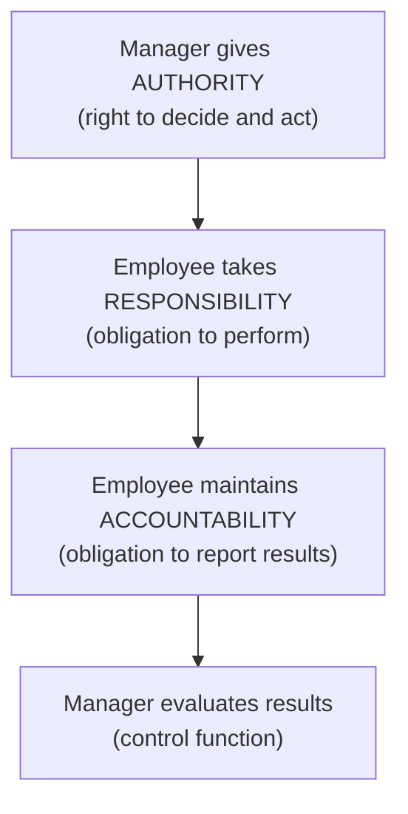

**Golden Rule of Organizing:**

> **Authority = Responsibility = Accountability** All three must be balanced. Imbalance at any point creates organizational problems.

#### **Delegation — Properly Explained:**

**What is Delegation?** The process by which a manager **assigns part of their work, authority, and responsibility** to a subordinate — while retaining overall accountability for the outcome.

**Why Delegation is Essential:**

- Manager cannot do everything personally → organizational scale requires delegation

- Frees manager to focus on higher-level strategic work

- Develops subordinates' skills, confidence, and career growth

- Speeds up decision making — decisions made closer to where work happens

- Motivates employees through trust and responsibility

**The Delegation Process — 3 Steps:**

|          |                       |                                                                |
|----------|-----------------------|----------------------------------------------------------------|
| **Step** | **Action**            | **Meaning**                                                    |
| **1**    | Assign responsibility | Tell subordinate what task they are responsible for            |
| **2**    | Grant authority       | Give subordinate the power and resources needed to do the task |
| **3**    | Create accountability | Make clear that subordinate must report results back           |

**Why Managers FAIL to Delegate:**

|                                        |                                                             |
|----------------------------------------|-------------------------------------------------------------|
| **Reason**                             | **Explanation**                                             |
| **"I can do it better myself"**        | Manager doesn't trust subordinate's ability                 |
| **Fear of losing control**             | Delegation feels like losing power                          |
| **Fear of being outperformed**         | Subordinate might do it better → threatens manager's status |
| **Lack of confidence in subordinates** | Manager doesn't believe team is capable                     |
| **No time to explain**                 | "It takes longer to explain than to just do it myself"      |

**All these reasons for NOT delegating are self-defeating** — the manager ends up overloaded, subordinates remain underdeveloped, and organization suffers.

#### **Line vs Staff Authority:**

**Line Authority:**

- Direct authority over subordinates

- Manager gives orders → subordinate must follow

- Creates the chain of command

- Found in core operational departments (production, sales)

> **Example:** Production manager directly directing factory workers = line authority.

**Staff Authority:**

- Advisory authority only — gives advice, recommendations, and expertise

- CANNOT give direct orders to line departments

- Supports and advises line managers

- Found in support departments (HR, Legal, IT)

> **Example:** HR manager advising production manager on legal hiring requirements — HR cannot ORDER production manager, only advise.

**Functional Authority:**

- Special case where a staff department is given LIMITED authority to give orders in their specific area of expertise across the organization

> **Example:** Safety officer given authority to shut down ANY department's operations if safety violation found — even though safety is normally a staff function.

|             |                               |                       |                                                |
|-------------|-------------------------------|-----------------------|------------------------------------------------|
|             | **Line**                      | **Staff**             | **Functional**                                 |
| **Type**    | Direct command                | Advisory              | Limited command in specialty area              |
| **Power**   | High                          | Low                   | Medium — limited to specific area              |
| **Example** | Production manager to workers | HR advising on hiring | Safety officer shutting down unsafe operations |

## **5.8 — Coordinating Activities**

**The Core Idea:** Even after jobs are designed, departments formed, and authority distributed — departments can still work in isolation and pull in different directions. **Coordination** ensures all departments work together toward the same organizational goals.

**Why Coordination is Needed:**

- Departments become specialized → naturally focus on their own goals

- Without coordination → marketing promises something operations can't deliver

- Large organizations have hundreds of interdependent [mutually dependent] activities

**3 Main Coordination Techniques:**

### **① Managerial Hierarchy**

Using the chain of command to coordinate — when two departments disagree, they escalate [send upward] to a common superior who resolves it.

- Simple and clear

- Becomes slow in large organizations

### **② Rules and Procedures**

Standard rules that automatically coordinate recurring situations without needing a manager's involvement every time.

> Example: Standard procedure for processing customer orders coordinates sales, warehouse, and delivery automatically.

### **③ Liaison Roles**

Assigning specific people or departments to coordinate between other departments.

- **Liaison person** = individual who coordinates between two departments

- **Task force** = temporary group from multiple departments created to solve a specific coordination problem

- **Integrating department** = permanent department whose sole job is coordination

### **Organic vs Mechanistic Structure (OPTIONAL BUT INFORMATIVE)**

**The Core Idea:** Organizations don't all have the same structure. The design of an organization's structure — how formal, how centralized, how specialized — depends heavily on the environment it operates in. Two extreme structural types represent opposite ends of the spectrum.

**Memory Trick:**

- **Mechanistic** = like a MACHINE → rigid, fixed, predictable

- **Organic** = like a living ORGANISM → flexible, adaptable, constantly changing

#### **Mechanistic Structure — Fully Explained:**

**Definition:** A highly formal, centralized organizational structure with clear hierarchy, strict rules, and high specialization. Every person has a very specific defined role and follows established procedures.

**Characteristics:**

- High specialization — each person does one narrow job

- Clear, strict chain of command

- Formal rules and procedures govern everything

- Centralized decision making — authority at top

- Narrow span of control — close supervision

- Vertical communication — top down

- Rigid job definitions — "that's not my job"

**Why organizations choose mechanistic structure:**

- Operating in a **stable, predictable environment** — not much changes

- Work is routine and standardized — same tasks repeated consistently

- Quality and consistency are most important

- Large scale operations requiring coordination across many people

> **Example:** Pakistan Army — extremely mechanistic. Clear ranks, strict hierarchy, defined procedures, centralized command, every soldier knows exact role. Works perfectly because military operations require absolute consistency and coordination.
>
> **Pakistani Business Example:** Traditional commercial banks (HBL, NBP) — formal approval hierarchies, strict procedures, centralized decisions, clear departmental boundaries. Works because banking requires consistency, compliance, and risk control.

**When mechanistic works best:**

- Stable environment with slow, predictable change

- Routine, standardized work processes

- Large organizations needing coordination and consistency

- Work where errors are very costly (banking, aviation, surgery)

#### **Organic Structure — Fully Explained:**

**Definition:** A highly flexible, decentralized organizational structure with minimal hierarchy, loose rules, and broad job roles. People work collaboratively across functions and adapt roles based on what the situation requires.

**Characteristics:**

- Low specialization — people handle multiple types of work

- Flat hierarchy — few management levels

- Minimal formal rules — judgment and values guide behavior

- Decentralized decision making — authority distributed

- Wide span of control — high employee autonomy

- Multi-directional communication — anyone talks to anyone

- Flexible job definitions — "I'll help wherever needed"

**Why organizations choose organic structure:**

- Operating in a **dynamic, rapidly changing environment**

- Work requires creativity, innovation, and quick adaptation

- Speed of response is more important than consistency

- Employee expertise and judgment are central to success

> **Example:** Technology startups — flat structure, everyone does multiple roles, decisions made quickly by whoever has relevant knowledge, minimal formal procedures, constant adaptation. Works because tech environment changes every few months.
>
> **Pakistani Example:** Creative advertising agencies — copywriters, designers, account managers all collaborate fluidly, roles overlap, structure adapts to each client project, decisions made by project teams not top management.

**When organic works best:**

- Dynamic, rapidly changing environment

- Complex, non-routine, creative work

- Innovation and speed more important than consistency

- Highly skilled, self-motivated employees

#### **Direct Comparison Table:**

|                          |                                         |                                             |
|--------------------------|-----------------------------------------|---------------------------------------------|
| **Dimension**            | **Mechanistic**                         | **Organic**                                 |
| **Specialization**       | High — narrow specific roles            | Low — broad flexible roles                  |
| **Hierarchy**            | Tall — many levels                      | Flat — few levels                           |
| **Rules and procedures** | Extensive formal rules                  | Minimal — judgment guided                   |
| **Decision making**      | Centralized — top management            | Decentralized — throughout                  |
| **Communication**        | Vertical — top down                     | Horizontal and multi-directional            |
| **Job definitions**      | Rigid and specific                      | Flexible and broad                          |
| **Coordination**         | Through hierarchy and rules             | Through mutual adjustment and culture       |
| **Best environment**     | Stable and simple                       | Dynamic and complex                         |
| **Example**              | Military, traditional banks, government | Tech startups, creative agencies, R&D firms |

#### **Why Does Structure Need to Match Environment?**

**The Contingency View of Structure:** There is NO single best organizational structure. The best structure **DEPENDS ON** [is contingent on] the environment the organization faces.

**STABLE ENVIRONMENT →** MECHANISTIC STRUCTURE → Efficiency and consistency

**DYNAMIC ENVIRONMENT →** ORGANIC STRUCTURE → Flexibility and innovation

MISMATCH → POOR PERFORMANCE

> **Classic Mismatch Example:** Kodak — mechanistic structure in a dynamically changing photography industry. Structure prevented quick adaptation to digital revolution → bankruptcy.
>
> **Success Example:** Google — deliberately maintains organic structure despite being massive company → enables continuous innovation in rapidly changing tech environment.

**⚠️ Exam Traps:**

- Mechanistic ≠ always bad — works excellently in stable environments

- Organic ≠ always best — creates chaos in environments needing consistency

- Most real organizations fall SOMEWHERE between pure mechanistic and pure organic

- Structure must FIT environment — mismatch = organizational failure

## **⭐ STAGE 5 — MASTER QUICK REFERENCE TABLE**

|                                        |                                             |                                                    |                                |
|----------------------------------------|---------------------------------------------|----------------------------------------------------|--------------------------------|
| **Topic**                              | **Key Concept**                             | **Memory Trick**                                   | **Past Paper**                 |
| **What is organizing**                 | Assembling resources to achieve goals       | 5 key decisions                                    | —                              |
| **Job design**                         | Specialization + solutions                  | Job rotation, enlargement, enrichment              | —                              |
| **Job description vs specification**   | Job vs Person                               | Description = duties                               | Specification = qualifications |
| **Departmentalization**                | 5 bases of grouping                         | Functional, Product, Customer, Geographic, Process | —                              |
| **Reporting relationships**            | Chain of command + Span of control          | Narrow = tall                                      | Wide = flat                    |
| **Centralization vs Decentralization** | Where decisions are made                    | Top only vs All levels                             | Fall 2024 ✅                   |
| **Authority & Delegation**             | Authority + Responsibility + Accountability | Line vs Staff                                      | —                              |
| **Coordination**                       | Making departments work together            | Hierarchy, Rules, Liaison                          | —                              |

### 

# **STAGE 6 — Leadership & Influence**

## **6.1 — What is Leadership? (vs Management)**

**Definition:**

> *"Leadership is the process of influencing others to work willingly toward the achievement of organizational goals."*

**Why Leadership Exists:** Plans and structures alone don't make people perform. People need to be **inspired, motivated, and guided** — that's what leadership does. A manager who only plans and organizes but cannot lead = an engine without fuel.

**Leadership vs Management — Important Distinction:**

|                     |                                            |                                                  |
|---------------------|--------------------------------------------|--------------------------------------------------|
|                     | **Management**                             | **Leadership**                                   |
| **Focus**           | Systems, processes, structures             | People, inspiration, vision                      |
| **Source of power** | Formal authority (position)                | Personal influence (trust, respect)              |
| **Question**        | "How do we do this right?"                 | "What should we be doing?"                       |
| **Creates**         | Order and consistency                      | Change and movement                              |
| **Example**         | Manager ensuring reports submitted on time | Leader inspiring team to believe in a new vision |

**Key Reality:**

- Not every manager is a good leader

- Not every leader is a manager

- The BEST managers are also strong leaders

- Organizations need BOTH management AND leadership

**⚠️ Exam Trap:** Leadership ≠ Management. Leadership is about influence and inspiration — management is about systems and control.

## **6.2 — Key Characteristics of a Leader**

**The Core Idea:** What makes someone a great leader? Researchers identified specific traits and characteristics that effective leaders commonly possess.

**5 Key Characteristics of an Effective Leader:**

**Memory Trick:** **"Confident Intelligent Leaders Communicate Decisively"** → CILCD

|                           |                                                                                         |                                                                                |
|---------------------------|-----------------------------------------------------------------------------------------|--------------------------------------------------------------------------------|
| **Characteristic**        | **Meaning**                                                                             | **Example**                                                                    |
| **Drive**                 | High energy, ambition, strong desire to achieve                                         | Leader works tirelessly, sets high targets and pursues them relentlessly       |
| **Motivation to lead**    | Genuine desire to influence and lead others — not forced into leadership                | Leader who actively seeks leadership roles and responsibilities                |
| **Honesty & Integrity**   | Truthful, consistent, trustworthy — actions match words                                 | Leader admits mistakes, keeps promises, never deceives team                    |
| **Self-confidence**       | Belief in own abilities and judgment — projects certainty to others                     | Leader stays calm under pressure, makes decisions without constant reassurance |
| **Intelligence**          | Strong cognitive ability — processes information, solves problems, thinks strategically | Leader quickly analyzes complex situations and identifies best path forward    |
| **Knowledge of business** | Deep understanding of industry, market, and organizational operations                   | Leader understands technical realities, not just abstract strategy             |

**Additional Important Traits:**

- **Emotional intelligence** = ability to understand and manage own emotions and others' emotions

- **Charisma** = natural ability to attract, inspire, and influence people

- **Adaptability** = adjusting leadership style to different situations and people

⚠️ **Past Paper Direct Hit:** *"Write five key characteristics of a leader"* — Fall 2025 ✅ For this question — name 5 characteristics + explain each in 2-3 lines + give an example.

## **6.3 — Trait Approach to Leadership**

**The Core Idea:** The oldest leadership theory. It assumes leaders are **BORN** with certain natural traits that make them effective. Simply identify these traits → find leaders.

**Key Traits Identified:**

- Intelligence, self-confidence, determination

- Integrity, sociability [ability to interact well with people]

- Physical energy and drive

**Limitation:**

- Thousands of traits identified — no clear agreement on which matter most

- Same traits don't predict leadership success in ALL situations

- Ignores followers — leadership is a relationship, not just individual traits

- **Born leader idea is largely rejected today** — leadership can be learned and developed

> **Conclusion:** Traits matter but they don't fully explain leadership effectiveness. This led to behavioral approaches.

## **6.4 — Behavioral Approaches to Leadership**

**The Core Idea:** Instead of asking "what traits do leaders HAVE?" — behavioral approach asks "what do effective leaders ACTUALLY DO?" Focus shifts from personality to **observable behaviors.**

**Two Most Important Behavioral Studies:**

### **① University of Iowa Studies (Kurt Lewin)**

Identified **3 leadership styles:**

|                                                  |                                                                   |                                                     |
|--------------------------------------------------|-------------------------------------------------------------------|-----------------------------------------------------|
| **Style**                                        | **Meaning**                                                       | **Best When**                                       |
| **Autocratic**                                   | Leader makes all decisions alone, gives orders, expects obedience | Crisis situations, unskilled workers, military      |
| **Democratic**                                   | Leader involves team in decisions, encourages participation       | Skilled workers, creative work, building commitment |
| **Laissez-faire** [leh-say-fair = "let it be"] | Leader gives complete freedom — minimal involvement               | Highly expert, self-motivated professionals         |

> **Example:** Steve Jobs = Autocratic (extremely controlling over product decisions) **Example:** Google's management culture = Democratic (employees involved in decisions) **Example:** University research professors = Laissez-faire (researchers given complete academic freedom)

### **② Ohio State Studies**

Identified **2 independent dimensions** of leadership behavior:

|                          |                                                                                           |                          |
|--------------------------|-------------------------------------------------------------------------------------------|--------------------------|
| **Dimension**            | **Meaning**                                                                               | **Focus**                |
| **Initiating Structure** | Leader defines roles, assigns tasks, establishes procedures, focuses on GETTING WORK DONE | Task-oriented behavior   |
| **Consideration**        | Leader builds trust, shows respect, cares about employee wellbeing and feelings           | People-oriented behavior |

**Key Insight:** These are INDEPENDENT — a leader can be HIGH on both, low on both, or high on one and low on the other.

> Best leaders = HIGH initiating structure + HIGH consideration

### **③ University of Michigan Studies**

Similar to Ohio State — identified same two dimensions with different names:

|                       |                           |
|-----------------------|---------------------------|
| **Michigan Term**     | **Ohio State Equivalent** |
| **Job-centered**      | Initiating Structure      |
| **Employee-centered** | Consideration             |

### **④ Managerial Grid (Blake & Mouton)**

A visual model plotting leadership style on two dimensions:

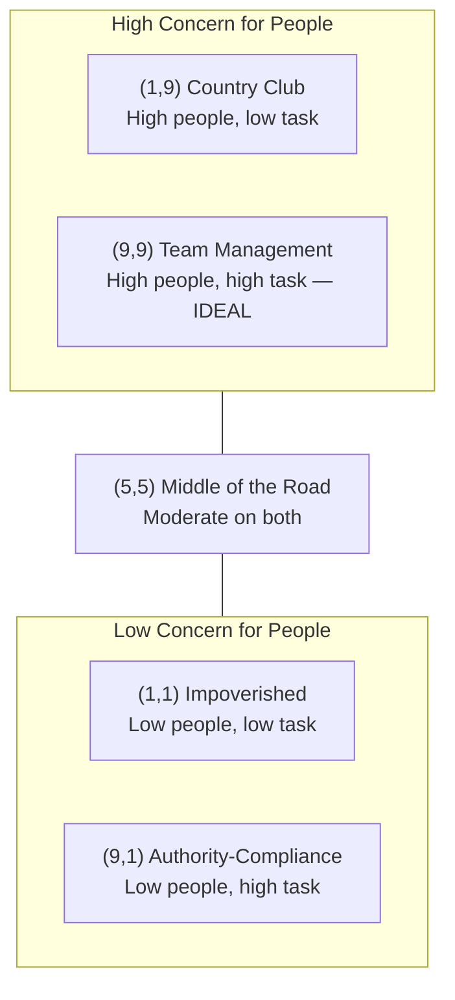

|                   |                      |                                            |
|-------------------|----------------------|--------------------------------------------|
| **Grid Position** | **Style Name**       | **Meaning**                                |
| **(1,1)**         | Impoverished         | Low concern for both — minimum effort      |
| **(9,1)**         | Authority-Compliance | Maximum task focus, minimum people concern |
| **(1,9)**         | Country Club         | Maximum people concern, minimum task focus |
| **(5,5)**         | Middle of Road       | Moderate concern for both — compromise     |
| **(9,9)**         | Team Management      | Maximum concern for both — IDEAL style     |

⚠️ **Exam Tip:** The (9,9) Team Management style = best leadership style according to Blake & Mouton.

## **6.5 — Situational/Contingency Approaches**

**The Core Idea:** No single leadership style works in ALL situations. Effective leaders **adapt their style** based on the situation, followers, and task. This is the most realistic approach to leadership.

**3 Major Contingency Theories:**

### **① Fiedler's Contingency Model**

**Scholar:** Fred Fiedler **Core idea:** Leadership effectiveness depends on match between leader's style and situational favorableness.

**Two leadership styles:**

- **Task-oriented** = focuses on getting work done

- **Relationship-oriented** = focuses on maintaining good relationships

**Situational Favorableness** determined by 3 factors:

1.  **Leader-member relations** — how much do followers trust and respect the leader?

2.  **Task structure** — how clear and defined is the task?

3.  **Position power** — how much formal authority does leader have?

**Key Finding:**

- Task-oriented leaders perform best in **very favorable** OR **very unfavorable** situations

- Relationship-oriented leaders perform best in **moderately favorable** situations

### **② Path-Goal Theory (Robert House)**

**Core idea:** Leader's job is to **clear the path** for followers — removing obstacles and providing support so employees can achieve their goals.

**4 Leadership Behaviors:**

|                          |                                                  |                                        |
|--------------------------|--------------------------------------------------|----------------------------------------|
| **Behavior**             | **Meaning**                                      | **Best When**                          |
| **Directive**            | Clear instructions, specific guidance            | Ambiguous tasks, inexperienced workers |
| **Supportive**           | Friendly, shows concern for employee wellbeing   | Stressful, boring, or difficult tasks  |
| **Participative**        | Involves employees in decisions                  | Skilled workers who want involvement   |
| **Achievement-oriented** | Sets challenging goals, expects high performance | Motivated, capable employees           |

### **③ Hersey & Blanchard's Situational Leadership Model**

**Core idea:** Leaders should adjust style based on **follower readiness** [maturity and ability of subordinates].

**4 Leadership Styles matched to follower readiness:**

|                                         |                       |                              |
|-----------------------------------------|-----------------------|------------------------------|
| **Follower Readiness**                  | **Leadership Style**  | **Approach**                 |
| **R1** — Low ability, low willingness   | **Telling/Directing** | High task, low relationship  |
| **R2** — Low ability, high willingness  | **Selling/Coaching**  | High task, high relationship |
| **R3** — High ability, low willingness  | **Participating**     | Low task, high relationship  |
| **R4** — High ability, high willingness | **Delegating**        | Low task, low relationship   |

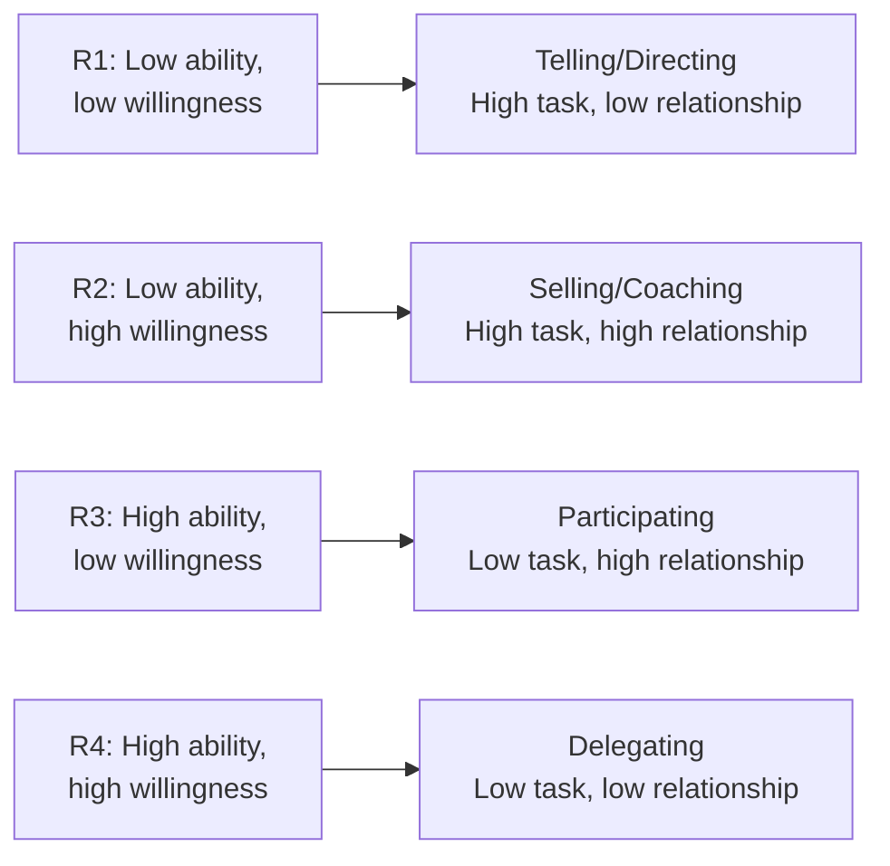

> **Example:** New employee (R1) → Tell them exactly what to do step by step. Expert, motivated employee (R4) → Delegate completely, trust them fully.

## **6.6 — Transformational vs Transactional Leadership**

**The Core Idea:** Two fundamentally different philosophies of leadership — one based on exchange, one based on inspiration.

|                       |                                                 |                                                            |
|-----------------------|-------------------------------------------------|------------------------------------------------------------|
|                       | **Transactional Leadership**                    | **Transformational Leadership**                            |
| **Core basis**        | Exchange — reward for performance               | Inspiration — belief in a vision                           |
| **Motivation method** | "Do this → get that" (reward/punishment)        | Inspire people to go beyond self-interest                  |
| **Focus**             | Maintaining current systems                     | Creating fundamental change                                |
| **Leader's role**     | Manager of existing processes                   | Agent of change and vision                                 |
| **Employee response** | Compliance [following rules for reward]       | Commitment [genuine belief and dedication]               |
| **Example**           | Sales manager offering bonus for hitting target | Steve Jobs inspiring Apple employees to "change the world" |

**4 Components of Transformational Leadership (Bass):**

|                                    |                                                                              |
|------------------------------------|------------------------------------------------------------------------------|
| **Component**                      | **Meaning**                                                                  |
| **Idealized influence** (Charisma) | Leader becomes a role model — earns deep respect and trust                   |
| **Inspirational motivation**       | Leader articulates [clearly expresses] compelling vision that motivates    |
| **Intellectual stimulation**       | Leader encourages creativity, new thinking, challenges assumptions           |
| **Individualized consideration**   | Leader treats each follower as individual — mentors and develops each person |

**⚠️ Exam Trap:**

- Transactional ≠ bad leadership — it's effective for maintaining stable performance

- Transformational ≠ only for famous CEOs — any manager can be transformational

- Best organizations need BOTH — transactional for daily management + transformational for change and growth

## **6.7 — Political Behavior in Organizations**

**The Core Idea:** Organizations are not just rational, goal-focused machines. They are also **political environments** where people use influence, power, and tactics to advance their personal interests or agendas. This is called organizational politics.

**Definition:**

> *"Political behavior refers to activities that are not required as part of one's formal role but that influence, or attempt to influence, the distribution of advantages and disadvantages within the organization."*

**Simple Meaning:** Using informal power and influence — beyond your official job — to get what you want inside the organization.

**Why Political Behavior Exists:**

- Limited resources → people compete for budget, promotions, recognition

- Ambiguous goals → different people interpret organizational goals differently

- Subjective performance evaluations → room for personal bias and influence

- Career advancement → people want promotions, visibility, power

**Types of Political Behavior:**

|                                          |                                                          |                                                                 |
|------------------------------------------|----------------------------------------------------------|-----------------------------------------------------------------|
| **Type**                                 | **Meaning**                                              | **Example**                                                     |
| **Networking**                           | Building relationships with influential people           | Regularly having coffee with senior managers                    |
| **Image building**                       | Managing how others perceive you                         | Always being visible at important meetings                      |
| **Ingratiation** [in-gray-she-ay-shun] | Flattering and pleasing superiors to gain favor          | Praising boss's ideas publicly, volunteering for their projects |
| **Coalition building**                   | Forming alliances with others to increase combined power | Two department heads supporting each other's proposals          |
| **Information control**                  | Strategically sharing or withholding information         | Sharing good news widely, hiding bad news                       |
| **Scapegoating**                         | Blaming others for failures                              | Deflecting blame onto another department when project fails     |

**Is Political Behavior Always Bad?**

- **Negative politics** = self-serving, hurts others, damages organization → harmful

- **Positive politics** = networking, building relationships, influencing for good outcomes → can be beneficial

**How Managers Reduce Negative Political Behavior:**

- Clear, transparent resource allocation [no room for political maneuvering]

- Objective performance evaluation systems

- Open communication culture

- Clear organizational goals that reduce ambiguity

## **6.8 — How a Manager Ensures Good Management Practices**

**The Core Idea:** This is a practical integration question — combining everything from leadership, ethics, planning, organizing, and controlling into how a real manager operates daily.

**Past Paper Direct Hit:** *"As a manager, discuss how you would ensure good management practices in your organization"* — Fall 2024 AND Spring 2025 ✅✅ (appeared in BOTH papers)

**How to Answer This Question — Complete Framework:**

**① Apply the 4 Management Functions (POLC):**

- **Plan** clearly — set SMART goals, develop strategies

- **Organize** effectively — right people in right roles, clear structure

- **Lead** with inspiration — motivate, communicate, develop people

- **Control** consistently — measure performance, give feedback, correct gaps

**② Build Strong Organizational Culture:**

- Model ethical behavior personally — "walk the talk"

- Create environment of trust, transparency, and respect

- Reward good performance and ethical behavior

**③ Develop People:**

- Invest in employee training and development

- Delegate meaningfully — give responsibility with authority

- Provide regular, constructive feedback

**④ Communicate Effectively:**

- Keep all stakeholders informed

- Listen actively — not just speak

- Resolve conflicts quickly and fairly

**⑤ Maintain Ethical Standards:**

- Apply newspaper test to every major decision

- Create safe channels for reporting wrongdoing

- Zero tolerance for discrimination and harassment

**⑥ Manage Environment:**

- Continuously scan external environment for changes

- Adapt plans when environment shifts

- Build flexible, responsive organizational structure

## **⭐ STAGE 6 — MASTER QUICK REFERENCE TABLE**

|                                   |                                             |                                                         |                             |
|-----------------------------------|---------------------------------------------|---------------------------------------------------------|-----------------------------|
| **Topic**                         | **Key Scholar**                             | **Memory Trick**                                        | **Past Paper**              |
| Leadership vs Management          | —                                           | Influence vs Authority                                  | —                           |
| Leader characteristics            | —                                           | CILCD                                                   | Fall 2025 ✅                |
| Trait approach                    | —                                           | Born leaders — largely rejected                         | —                           |
| Behavioral approaches             | Lewin, Ohio State, Michigan, Blake & Mouton | Autocratic, Democratic, Laissez-faire                   | —                           |
| Managerial Grid                   | Blake & Mouton                              | (9,9) = best style                                      | —                           |
| Fiedler's model                   | Fred Fiedler                                | Task vs Relationship oriented                           | —                           |
| Path-Goal theory                  | Robert House                                | Clear path for followers                                | —                           |
| Situational leadership            | Hersey & Blanchard                          | R1→Telling, R2→Selling, R3→Participating, R4→Delegating | —                           |
| Transformational vs Transactional | Bass                                        | Exchange vs Inspiration                                 | —                           |
| Political behavior                | —                                           | Networking, coalitions, ingratiation                    | —                           |
| Good management practices         | —                                           | POLC + Ethics + People + Communication                  | Fall 2024 ✅ Spring 2025 ✅ |

# **STAGE 7 — Managing Change & Innovation**

## **7.1 — Why Change Happens in Organizations**

**The Core Idea:** Change is not optional for organizations — it is inevitable. The environment constantly shifts, and organizations that refuse to change eventually die. The manager's job is not to prevent change but to **understand it, plan for it, and lead people through it successfully.**

**Simple Reality:**

> Kodak refused to embrace digital photography → bankrupt. Nokia ignored smartphone revolution → collapsed. Blockbuster ignored streaming → dead. All three had strong management — but failed to manage change.

**Change affects every part of the organization:**

- Strategy must change when environment changes

- Structure must change when strategy changes

- People must change when structure changes

- Culture must change when everything else changes

**Two Types of Change:**

|                     |                                                     |                                                           |
|---------------------|-----------------------------------------------------|-----------------------------------------------------------|
| **Type**            | **Meaning**                                         | **Example**                                               |
| **Planned change**  | Deliberately designed and implemented by management | Company decides to restructure departments for efficiency |
| **Reactive change** | Response to unexpected events or pressures          | Company rapidly shifts to online delivery during COVID    |

**Best managers plan for change BEFORE it is forced upon them.**

## **7.2 — Forces for Change**

**The Core Idea:** Change doesn't happen randomly — it is driven by specific forces. These forces come from BOTH inside and outside the organization. Understanding these forces helps managers anticipate and prepare for change.

**Memory Trick:** **"External Tigers Always Push Clever Workers"** → ETAPCW → External environment, Technology, Aging workforce, Political forces, Competition, Workforce changes

**Past Paper:** *"Name and shortly explain forces of change"* — Fall 2025 ✅

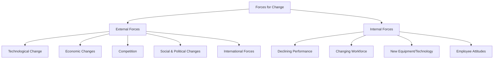

### **External Forces for Change:**

**① Technological Change** New technology constantly makes old methods obsolete [outdated and no longer useful].

- Organizations must adopt new technology or lose competitive advantage

- Creates both opportunity (new capabilities) and threat (old skills become irrelevant)

> **Example:** E-commerce technology forced traditional retailers to build online presence. Companies like Daraz changed how all Pakistani retail businesses operate.

**② Economic Changes** Shifts in economic conditions force organizational adaptation.

- Recession → companies must cut costs, restructure

- Economic growth → companies expand, hire more

- Inflation → pricing strategies must change

> **Example:** Pakistan's 38% inflation in 2023 forced every business to restructure costs, revise pricing, and renegotiate supplier contracts.

**③ Competition** New competitors or aggressive moves by existing competitors force change.

- New market entrants disrupt existing players

- Global competitors entering local markets

> **Example:** When Kia and Hyundai aggressively entered Pakistan's car market → Pak Suzuki forced to improve quality, add features, and revise pricing strategy.

**④ Social and Political Changes** Shifts in social values, cultural expectations, and government policies.

- New laws create compliance requirements

- Changing customer values affect demand patterns

- Political instability forces contingency planning

> **Example:** Growing environmental awareness globally forced companies to adopt sustainable packaging and reduce carbon emissions.

**⑤ International Forces** Globalization creates pressure to meet international standards.

- Global supply chain disruptions force local sourcing

- International trade agreements open or close markets

> **Example:** COVID-19 global supply chain disruption forced Pakistani manufacturers to find local alternatives for previously imported raw materials.

### **Internal Forces for Change:**

**① Declining Performance** Falling sales, profits, or productivity signals need for change.

- Management cannot ignore performance data

- Must identify root cause and change what isn't working

> **Example:** A company notices customer satisfaction scores dropping for 3 consecutive quarters → forced to change service delivery processes.

**② Changing Workforce** New employees bring different expectations, skills, and values.

- Younger generations expect flexibility, purpose, digital tools

- Skills gaps emerge as technology evolves

> **Example:** Gen Z employees demanding remote work options → companies restructuring work policies.

**③ New Equipment and Technology** Adopting new internal technology requires organizational adaptation.

- New software changes workflows and job roles

- Automation changes which jobs exist

> **Example:** Company implementing new ERP [Enterprise Resource Planning — integrated software managing all business processes] system → changes how every department operates.

**④ Employee Attitudes** Rising dissatisfaction, low morale, or high turnover signals need for cultural change.

> **Example:** High employee turnover rate signals culture or compensation problems → management must change policies.

## **7.3 — Steps in the Change Process**

**The Core Idea:** Change doesn't happen effectively by accident. Managers must follow a systematic process to implement change successfully. Two key models explain this process.

### **Model 1 — Lewin's Three-Step Model (Kurt Lewin)**

**The simplest and most fundamental model of change.**

**Memory Trick:** **"UFR"** → Unfreeze, Change, Refreeze

**UNFREEZE → CHANGE → REFREEZE**

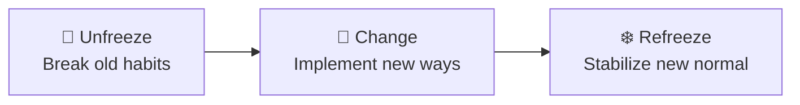

*Diagram: Lewin's Three-Step Change Model.*

**① Unfreeze** Break down the existing mindset, habits, and attitudes that resist change. People must understand WHY change is necessary before they will accept it.

- Create awareness of the problem

- Show people the current situation is unsatisfactory

- Build motivation to change

> **Example:** Management presents data showing competitors gaining market share → employees realize status quo is dangerous → they become open to change.

**② Change (Movement)** Actually implement the change — introduce new behaviors, processes, structures, or systems.

- Provide training for new skills

- Communicate new processes clearly

- Support people through the transition

- Expect confusion and mistakes — this is normal during change

> **Example:** Company rolls out new digital management system, trains all employees, and shifts all operations to new platform.

**③ Refreeze** Stabilize the change — make new behaviors the new normal so people don't slip back to old ways.

- Reinforce new behaviors through rewards and recognition

- Update policies and procedures to reflect new way of working

- Celebrate successful adoption of change

> **Example:** Company makes new digital system mandatory, removes old paper processes, and rewards departments that fully adopted the new system.

### **Model 2 — Kotter's 8-Step Model (John Kotter)**

**More detailed and practical model for large-scale organizational change.**

**Memory Trick:** **"Urgent Coalitions Clearly Communicate, Empower Actions, Win Anchors"** → UCCCEWA

|          |                                 |                                                    |
|----------|---------------------------------|----------------------------------------------------|
| **Step** | **Action**                      | **Simple Meaning**                                 |
| **1**    | **Create urgency**              | Make people feel change is necessary NOW           |
| **2**    | **Build guiding coalition**     | Assemble team of influential people to lead change |
| **3**    | **Develop vision and strategy** | Create clear picture of where change leads         |
| **4**    | **Communicate the vision**      | Share vision repeatedly through every channel      |
| **5**    | **Empower broad-based action**  | Remove obstacles that block people from changing   |
| **6**    | **Generate short-term wins**    | Create visible early successes to build momentum   |
| **7**    | **Consolidate gains**           | Use early wins to drive deeper change              |
| **8**    | **Anchor changes in culture**   | Make new approaches permanent in culture           |

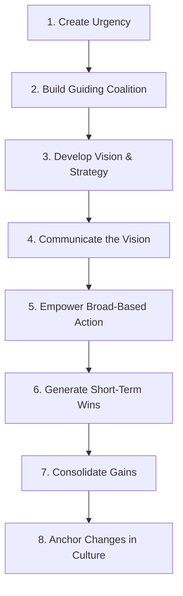

*Diagram: Kotter's 8-Step Change Model.*

> **Why short-term wins (Step 6) matter:** Change is exhausting. People need to see progress early or they give up and return to old ways. Small visible victories keep momentum alive.

## **7.4 — Resistance to Change — Why People Resist**

**The Core Idea:** Even when change is clearly necessary and beneficial, people resist it. This is one of the most consistent and frustrating realities of management. Understanding WHY people resist helps managers overcome resistance more effectively.

**Resistance is NORMAL — not a sign of failure. Every change effort faces some resistance.**

**Individual Reasons for Resistance:**

|                                      |                                                                                             |                                                                                 |
|--------------------------------------|---------------------------------------------------------------------------------------------|---------------------------------------------------------------------------------|
| **Reason**                           | **Explanation**                                                                             | **Example**                                                                     |
| **Fear of unknown**                  | Change creates uncertainty about future roles, status, and security                         | "Will I still have a job after this restructuring?"                             |
| **Habit**                            | People are comfortable with existing routines and methods                                   | "We've always done it this way — why change?"                                   |
| **Loss of security**                 | Change threatens job security, status, or power                                             | Senior manager fears new system reduces their importance                        |
| **Economic concerns**                | Fear that change will reduce income or benefits                                             | "Will this new pay system reduce my salary?"                                    |
| **Selective information processing** | People hear only what confirms their existing beliefs, ignore change-supporting information | Employee focuses on negative rumors, ignores management's positive explanations |

**Organizational Reasons for Resistance:**

|                                                                        |                                                                                                                            |
|------------------------------------------------------------------------|----------------------------------------------------------------------------------------------------------------------------|
| **Reason**                                                             | **Explanation**                                                                                                            |
| **Structural inertia** [inertia = tendency to stay in current state] | Organizations have built-in mechanisms that maintain stability — selection, training, policies all reinforce existing ways |
| **Group inertia**                                                      | Even if individual wants to change, group norms pressure them to conform to old behavior                                   |
| **Threat to expertise**                                                | Change may make existing specialized skills irrelevant → experts resist                                                    |
| **Threat to established power**                                        | Change redistributes power → those losing power resist strongly                                                            |
| **Resource limitations**                                               | Organization lacks budget or capacity to implement change properly                                                         |

## **7.5 — Overcoming Resistance to Change**

**The Core Idea:** Since resistance is inevitable, managers need proven strategies to reduce and overcome it. The key insight is that **different types of resistance need different strategies.**

**6 Key Strategies (Kotter & Schlesinger):**

**① Education and Communication** Explain WHY change is happening — share information openly and honestly.

- **Best when:** Resistance comes from lack of information or misinformation

- **Works because:** People who understand the reason for change are more willing to accept it

> **Example:** Management holds town hall meetings explaining why new software system is needed and how it benefits employees.

**② Participation and Involvement** Involve resistant people in designing and implementing the change.

- **Best when:** Resistors have important information or significant power

- **Works because:** People support what they help create — "I helped design this, so I'm committed to making it work"

> **Example:** Including union representatives in designing new work processes → they become advocates instead of opponents.

**③ Facilitation and Support** Provide training, counseling, and resources to help people cope with change.

- **Best when:** Resistance comes from fear or adjustment difficulties

- **Works because:** Reduces anxiety and builds confidence in new way of working

> **Example:** Company provides extensive training program and one-on-one coaching during software transition.

**④ Negotiation and Agreement** Offer incentives to resistant individuals or groups.

- **Best when:** Resistors have power and clear self-interest to lose

- **Works because:** Compensates people for what they give up

> **Example:** Offering early retirement packages to senior employees who resist new technology → both sides benefit.

**⑤ Manipulation and Co-optation** [Co-optation = bringing resistant leaders INTO the change process to neutralize their opposition] Selectively sharing information or giving resistant leaders a role in change implementation.

- **Best when:** Other tactics have failed and speed is essential

- **Risk:** If people discover manipulation → trust destroyed permanently

> **Example:** Giving the most vocal critic of a new policy a seat on the implementation committee → they feel included and reduce opposition.

**⑥ Coercion** [koh-ur-shun = forcing compliance through threats] Explicitly or implicitly threatening resistors with job loss, transfers, or other negative consequences.

- **Best when:** Speed is critical and change leaders have significant power

- **Risk:** Creates resentment, destroys morale, causes long-term damage

- **Last resort only**

> **Example:** Manager telling resistant employees "Adapt to the new system or face performance review consequences."

**⚠️ Exam Tip:** Arrange strategies from most positive to most negative — Education → Participation → Facilitation → Negotiation → Manipulation → Coercion. Coercion = last resort, most damaging.

## **7.6 — The Innovation Process**

**The Core Idea:** Innovation = creating something new that adds value. It is the highest form of organizational change — not just adapting to environment but **creating new competitive advantage** through new ideas, products, processes, or business models.

**Definition:**

> *"Innovation is the process of creating and doing new things that are introduced into the marketplace as products, processes, or services."*

**Types of Innovation:**

|                               |                                                     |                                                            |
|-------------------------------|-----------------------------------------------------|------------------------------------------------------------|
| **Type**                      | **Meaning**                                         | **Example**                                                |
| **Product innovation**        | New or improved products/services                   | iPhone revolutionizing mobile phones                       |
| **Process innovation**        | New or better ways of doing things                  | Toyota's lean manufacturing process                        |
| **Business model innovation** | Completely new way of creating and delivering value | Netflix shifting from DVD rental to streaming subscription |
| **Radical innovation**        | Completely new, game-changing breakthrough          | Internet, smartphones, electric vehicles                   |
| **Incremental innovation**    | Small continuous improvements to existing things    | Annual iPhone updates, improved battery life               |

**The Innovation Process — Steps:**

```mermaid
flowchart LR
    D[Development] --> A[Application] --> L[Launch] --> G[Growth] --> M[Maturity] --> DE[Decline]
```

|                 |                                     |
|-----------------|-------------------------------------|
| **Stage**       | **Meaning**                         |
| **Development** | Creating and refining the new idea  |
| **Application** | Testing the idea in real conditions |
| **Launch**      | Introducing to market               |
| **Growth**      | Rapid adoption by customers         |
| **Maturity**    | Wide adoption, growth slows         |
| **Decline**     | Replaced by newer innovation        |

**How Organizations Foster [encourage and support] Innovation:**

|                                                  |                                                                                      |
|--------------------------------------------------|--------------------------------------------------------------------------------------|
| **Factor**                                       | **How It Helps Innovation**                                                          |
| **Creative organizational culture**              | Psychological safety to try new ideas without fear of punishment for failure         |
| **Slack resources**                              | Extra time, budget, and people available for experimentation                         |
| **Internal entrepreneurship** (Intrapreneurship) | Employees act like entrepreneurs inside the organization                             |
| **Diverse teams**                                | Different perspectives generate more creative combinations of ideas                  |
| **Reward systems**                               | Recognizing and rewarding both successful AND failed experiments that taught lessons |
| **Leadership support**                           | Top management actively championing [supporting] innovation initiatives            |

**Intrapreneurship** [intra = inside] = encouraging employees to think and act like entrepreneurs within the organization — taking initiative, experimenting, and developing new ideas using company resources.

> **Examples of Intrapreneurship:**

- Gmail was created by a Google employee during personal project time

- Post-it Notes created by 3M employee during allocated free time

- Sony PlayStation originated from an employee's personal project

## **⭐ STAGE 7 — MASTER QUICK REFERENCE TABLE**

|                       |                      |                                                                                  |                |
|-----------------------|----------------------|----------------------------------------------------------------------------------|----------------|
| **Topic**             | **Key Scholar**      | **Memory Trick**                                                                 | **Past Paper** |
| Why change happens    | —                    | Planned vs Reactive                                                              | —              |
| Forces for change     | —                    | External + Internal forces                                                       | Fall 2025 ✅   |
| Lewin's change model  | Kurt Lewin           | UFR = Unfreeze, Change, Refreeze                                                 | —              |
| Kotter's 8-step model | John Kotter          | UCCCEWA                                                                          | —              |
| Resistance to change  | —                    | Individual + Organizational reasons                                              | —              |
| Overcoming resistance | Kotter & Schlesinger | Education → Participation → Facilitation → Negotiation → Manipulation → Coercion | —              |
| Innovation process    | —                    | Radical vs Incremental                                                           | —              |
| Fostering innovation  | —                    | Intrapreneurship, slack resources, culture                                       | —              |

### 


# **STAGE 8 — The Controlling Process**

## **8.1 — What is Control & Its Purpose**

**The Core Idea:** After planning, organizing, and leading — how does a manager know if everything is actually working? That's what **controlling** answers. Control is the final function of management that **monitors performance, compares it with goals, and fixes problems.**

Without control → plans become wishes. Goals become dreams. Nobody knows if the organization is on track or heading toward disaster.

**Definition (Griffin):**

> *"Control is the regulation of organizational activities so that some targeted element of performance remains within acceptable limits."*

**Simple Meaning:** Set a target → Measure actual performance → Compare → Fix the gap if needed.

**Why Control is Necessary:**

|                               |                                                                            |
|-------------------------------|----------------------------------------------------------------------------|
| **Reason**                    | **Explanation**                                                            |
| **Plans change**              | Environment shifts — control detects when plans need adjustment            |
| **People make mistakes**      | Errors happen — control catches them before they become disasters          |
| **Organizations are complex** | Many people, departments, activities — control keeps everything aligned    |
| **Resources are limited**     | Control ensures resources are used efficiently, not wasted                 |
| **Accountability**            | Control creates responsibility — people know their performance is measured |

**⚠️ Critical Point:** Control is NOT about punishing people. It is about **measuring, monitoring, and correcting** to ensure organizational goals are achieved.

## **8.2 — Steps in the Control Process**

**The Core Idea:** Control follows a systematic 4-step process. Every control system — whether in a factory, a hospital, or a data team — follows this same logic.

**Memory Trick:** **"Every Manager Compares And Fixes"** → EMCAF → Establish standards, Measure performance, Compare, Act/Fix

```mermaid
flowchart LR
    E["1. Establish Standards"] --> M["2. Measure Performance"]
    M --> C["3. Compare with Standards"]
    C --> A["4. Take Corrective Action"]
    A -.->|"feedback"| E
```

*Diagram: The 4-step control process cycle.*

### **Step 1 — Establish Standards**

Standards = specific targets against which performance will be measured.

Standards come from **goals set during planning** — this is why planning and controlling are deeply connected.

**Types of standards:**

- **Quantitative standards** [measurable numbers] → "Achieve 95% customer satisfaction score"

- **Qualitative standards** [descriptive] → "Maintain professional communication with all clients"

- **Time standards** → "Deliver all orders within 24 hours"

- **Cost standards** → "Keep production cost below Rs. 500 per unit"

> **Example:** A call center sets standards: Answer calls within 30 seconds, resolve 80% of issues in first call, maintain customer satisfaction above 4.2/5.

### **Step 2 — Measure Actual Performance**

Collect data on what is actually happening in the organization.

**Methods of measurement:**

- Personal observation [manager directly watches work]

- Statistical reports [data-based performance reports]

- Written reports [formal documentation]

- Electronic monitoring [software tracking systems]

**Key Principle:** Measurement must be **consistent, objective, and timely** — late information is often useless for corrective action.

> **Example:** Call center manager reviews daily dashboard showing average call answer time, resolution rates, and customer satisfaction scores for each agent.

### **Step 3 — Compare Performance with Standards**

Determine if actual performance matches established standards.

**Two key questions:**

1.  Is there a gap between actual and standard?

2.  Is the gap significant enough to require action?

**The Range of Variation** [acceptable deviation from standard — not every small difference requires action]:

- Small normal variations → acceptable, no action needed

- Significant deviation → requires corrective action

- Manager must judge what constitutes a significant deviation

> **Example:** If standard is 95% customer satisfaction and actual is 94.8% → within acceptable range, no immediate action. If actual drops to 87% → significant deviation → immediate corrective action required.

### **Step 4 — Take Corrective Action**

Based on comparison, manager decides what to do next.

**3 possible responses:**

|                           |                                                |                                                                      |
|---------------------------|------------------------------------------------|----------------------------------------------------------------------|
| **Response**              | **When Used**                                  | **Example**                                                          |
| **Do nothing**            | Performance within acceptable range            | Satisfaction at 94.8% — monitor and continue                         |
| **Correct the deviation** | Performance below standard — fix the problem   | Provide additional training to underperforming agents                |
| **Revise the standard**   | Standard was unrealistic or conditions changed | Revise satisfaction target after discovering industry average is 88% |

⚠️ **Important:** Sometimes the standard itself is wrong — not the performance. Good managers distinguish between performance problems and standard problems.

## **8.3 — Types of Control**

**The Core Idea:** Control doesn't only happen AFTER work is done. Smart managers control BEFORE, DURING, and AFTER work. These three timing-based types of control are the most important classification.

**Memory Trick:** **"Feed Forward, Current, Feedback"** → FCF Or simply: **Before → During → After**

```mermaid
flowchart LR
    A["Feedforward Control<br/>BEFORE work<br/>Focus: Inputs"] --> B["Concurrent Control<br/>DURING work<br/>Focus: Process"]
    B --> C["Feedback Control<br/>AFTER work<br/>Focus: Outputs"]
```

### **① Feedforward Control (Preliminary Control)**

**BEFORE** work begins — prevents problems from occurring. Focuses on **inputs** [resources going INTO the work process].

> **Goal:** Prevent problems before they start.

**Examples:**

- Carefully screening job applicants before hiring (preventing a bad hire)

- Inspecting raw materials before production begins

- Requiring engineers to review software design before coding starts

- Pre-flight checks before airplane takes off

> **Pakistani Example:** Pakistan Standards and Quality Control Authority (PSQCA) inspecting food products BEFORE they reach market shelves.

### **② Concurrent Control (Screening Control)**

**DURING** work — detects and corrects problems while work is in progress. Real-time monitoring and adjustment.

> **Goal:** Catch and fix problems while they're happening — before they become bigger.

**Examples:**

- Supervisor watching employees work and correcting technique immediately

- Software automatically flagging errors during data entry

- Assembly line quality check at each production stage

- Manager monitoring live customer calls and coaching agent in real time

> **Example:** McDonald's kitchen supervisor checking burger assembly process as it happens — not after customer receives wrong order.

### **③ Feedback Control (Postaction Control)**

**AFTER** work is done — evaluates completed work results. Most common type — but least effective for preventing problems.

> **Goal:** Learn from results to improve future performance.

**Examples:**

- Monthly sales performance review

- Customer satisfaction survey after service delivery

- Annual employee performance appraisal

- Financial statements reviewed at end of quarter

> **Limitation:** Problem already happened — damage already done. But feedback control is essential for learning and improvement.

**Comparison Table:**

|                   |                  |                          |                          |
|-------------------|------------------|--------------------------|--------------------------|
|                   | **Feedforward**  | **Concurrent**           | **Feedback**             |
| **Timing**        | Before work      | During work              | After work               |
| **Focus**         | Inputs           | Process                  | Outputs                  |
| **Goal**          | Prevent problems | Fix problems immediately | Learn and improve        |
| **Effectiveness** | Most preventive  | Most responsive          | Most common but reactive |

## **8.3B — Operational, Structural, and Strategic Control**

**The Core Idea:** Control also operates at THREE organizational levels — matching the three levels of management and planning. Each level controls different aspects of organizational performance.

### **① Operational Control**

Controls **day-to-day operations** — the work being done right now. Focuses on individual tasks, processes, and immediate outputs.

> **Who uses it:** First-line managers, supervisors **Time frame:** Daily, weekly **Example:** Shift supervisor checking that production quota is met today. Call center manager reviewing today's call handling times.

**Common operational control tools:**

- Production schedules

- Quality control checklists

- Daily performance dashboards

- Inventory tracking systems

### **② Structural Control**

Controls how well the **organizational structure itself** is working — are people behaving consistently with organizational values, rules, and expectations?

Two approaches to structural control:

|                          |                                                                      |                                                                                                |
|--------------------------|----------------------------------------------------------------------|------------------------------------------------------------------------------------------------|
| **Approach**             | **Meaning**                                                          | **Example**                                                                                    |
| **Bureaucratic control** | Heavy reliance on rules, regulations, policies, and formal authority | Strict attendance policies, detailed procedure manuals, formal approval hierarchies            |
| **Clan control**         | Relies on shared values, traditions, and culture rather than rules   | Google employees behaving innovatively because culture rewards it — not because a rule says so |

> **Bureaucratic control** = external rules tell people what to do **Clan control** = internal values guide people's behavior naturally

### **③ Strategic Control**

Controls whether the organization's **overall strategy is working** — is the big picture direction correct?

Focuses on long-term performance and strategic goals.

> **Who uses it:** Top management, Board of Directors **Time frame:** Quarterly, annually, multi-year

**Strategic control asks:**

- Is our competitive strategy still relevant?

- Are we achieving our long-term goals?

- Do we need to change strategic direction?

**Common strategic control tools:**

- Balanced Scorecard [comprehensive performance measurement system tracking financial, customer, internal process, and learning metrics simultaneously]

- Annual strategic reviews

- Market share analysis

- Competitive benchmarking [comparing performance against industry best]

## **8.4 — Total Quality Management (TQM)**

**The Core Idea:** TQM is a comprehensive management philosophy that makes **quality the responsibility of EVERYONE** in the organization — not just the quality control department. The goal is to continuously improve every process, product, and service to meet or exceed customer expectations.

**Definition:**

> *"Total Quality Management is an organization-wide commitment to continuous improvement, with the goal of delivering high-quality products and services that satisfy customers."*

**Past Paper:** *"Briefly explain the concept of total quality management"* — Fall 2024 ✅

```mermaid
flowchart TD
    TQM["Total Quality Management"] --> P1["Customer Focus"]
    TQM --> P2["Continuous Improvement<br/>(Kaizen)"]
    TQM --> P3["Employee Involvement"]
    TQM --> P4["Process Focus"]
```

**4 Core Principles of TQM:**

**① Customer Focus** Quality is defined by the CUSTOMER — not by internal standards. If the customer is not satisfied, quality has not been achieved.

> "The customer is always the judge of quality."

**② Continuous Improvement (Kaizen)** [Kaizen = Japanese word meaning "change for better" — continuous small improvements]

- Never accept current performance as good enough

- Small improvements every day add up to massive gains over time

- Every employee is responsible for finding and implementing improvements

> **Example:** Toyota workers make an average of 1 million improvement suggestions annually — most are implemented.

**③ Employee Involvement** Quality cannot be achieved by management alone. Every single employee — from CEO to factory floor worker — must be committed to quality.

- Train all employees in quality methods

- Empower employees to stop production when quality problem detected

- Create quality circles [small groups of employees who meet regularly to identify and solve quality problems]

**④ Process Focus** Problems come from bad PROCESSES — not bad people. Fix the process, not the person.

- Map and analyze every process

- Identify where errors occur in the process

- Redesign process to eliminate error opportunities

**Key TQM Tools:**

|                                       |                                                                                              |
|---------------------------------------|----------------------------------------------------------------------------------------------|
| **Tool**                              | **Meaning**                                                                                  |
| **Benchmarking**                      | Comparing your processes against best-in-class organizations                                 |
| **Statistical Process Control (SPC)** | Using statistical methods to monitor and control quality during production                   |
| **Six Sigma**                         | Quality methodology targeting near-perfect quality (only 3.4 defects per million operations) |
| **ISO 9000**                          | International quality management standards that organizations can certify against            |

**Benefits of TQM:**

- Higher customer satisfaction and loyalty

- Reduced waste and rework costs

- Improved employee morale (people take pride in quality work)

- Stronger competitive position

- Long-term cost reduction

**⚠️ Exam Trap:**

- TQM ≠ just quality control department's job → it is EVERYONE's responsibility

- TQM ≠ one-time project → it is a continuous, never-ending commitment

- Quality is defined by CUSTOMER — not by internal management standards

## **8.5 — Managing Productivity**

**The Core Idea:** Productivity = the relationship between outputs (what you produce) and inputs (what you use to produce it). Managing productivity means getting MORE output from the SAME or LESS input — or maintaining output while using fewer resources.

**Formula:**

**PRODUCTIVITY = OUTPUTS / INPUTS**

> Higher productivity = more output per unit of input = better organizational performance

**Types of Productivity:**

|                               |                                               |                                                  |
|-------------------------------|-----------------------------------------------|--------------------------------------------------|
| **Type**                      | **Meaning**                                   | **Example**                                      |
| **Labor productivity**        | Output per worker or per work hour            | 50 units produced per worker per day             |
| **Capital productivity**      | Output relative to capital/equipment invested | Revenue generated per Rs. 1 million of machinery |
| **Total factor productivity** | Overall productivity considering all inputs   | Overall organizational efficiency measure        |

**How Managers Improve Productivity:**

|                           |                                                                            |
|---------------------------|----------------------------------------------------------------------------|
| **Strategy**              | **Meaning**                                                                |
| **Technology investment** | Better tools produce more with less human effort                           |
| **Employee training**     | Skilled workers are more productive                                        |
| **Process improvement**   | Eliminating waste and inefficiency from workflows                          |
| **Motivation**            | Motivated employees produce more and better quality                        |
| **Better management**     | Clear goals, good organization, strong leadership all improve productivity |

**Productivity vs Quality:** Common misconception: faster production = lower quality. Modern management has proven that improving QUALITY actually INCREASES productivity by reducing rework, waste, and errors.

> **Toyota example:** By obsessing over quality, Toyota reduced defects → less rework → less waste → HIGHER productivity, not lower.

## **8.6 — Performance Appraisal**

**The Core Idea:** Performance appraisal = formal, systematic process of evaluating an employee's job performance against established standards. It is a critical control tool that connects employee behavior to organizational goals.

**Definition:**

> *"Performance appraisal is the process by which a manager evaluates an employee's work behavior by comparison with established standards, documents the results, and communicates the results to the employee."*

**Why Performance Appraisal is Important:**

|                              |                                                                           |
|------------------------------|---------------------------------------------------------------------------|
| **Purpose**                  | **Explanation**                                                           |
| **Administrative decisions** | Basis for salary increases, promotions, transfers, terminations           |
| **Development**              | Identifies training needs and career development opportunities            |
| **Motivation**               | Employees work harder when they know performance is measured and rewarded |
| **Feedback**                 | Employees learn where they stand and what to improve                      |
| **Legal protection**         | Documented evidence of performance for HR decisions                       |
| **Goal alignment**           | Ensures individual employee goals align with organizational goals         |

**Past Paper:** *"Why appraisal is important for employees"* — Spring 2025 ✅

**Common Appraisal Methods:**

|                                               |                                                                                          |                                                                 |
|-----------------------------------------------|------------------------------------------------------------------------------------------|-----------------------------------------------------------------|
| **Method**                                    | **Meaning**                                                                              | **Example**                                                     |
| **Rating scales**                             | Rate employee on various dimensions using numerical scale                                | Rate communication skills 1-10                                  |
| **360-degree feedback**                       | Feedback collected from supervisor, peers, subordinates, AND self                        | Complete picture from all directions                            |
| **Management by Objectives (MBO)**            | Employee and manager jointly set goals — performance measured against those agreed goals | Salesperson agrees to close 20 deals per month                  |
| **Behaviorally Anchored Rating Scale (BARS)** | Specific behavioral examples define each performance level                               | "Consistently resolves customer complaints independently" = 5/5 |

**Common Appraisal Problems:**

|                      |                                                                                                               |
|----------------------|---------------------------------------------------------------------------------------------------------------|
| **Problem**          | **Meaning**                                                                                                   |
| **Halo effect**      | One positive trait influences rating of all other traits — "He's so friendly, he must be great at everything" |
| **Horn effect**      | One negative trait negatively colors all other ratings                                                        |
| **Recency bias**     | Recent events influence rating more than full-year performance                                                |
| **Central tendency** | Manager rates everyone as average to avoid conflict                                                           |
| **Leniency bias**    | Manager rates everyone too high to avoid uncomfortable conversations                                          |

**⚠️ Exam Trap:**

- Performance appraisal ≠ only about identifying poor performers → it also develops good performers and rewards excellence

- 360-degree feedback ≠ only feedback from boss → comes from ALL directions including peers and subordinates

## **⭐ STAGE 8 — MASTER QUICK REFERENCE TABLE**

|                                        |                                   |                                                             |                |
|----------------------------------------|-----------------------------------|-------------------------------------------------------------|----------------|
| **Topic**                              | **Key Concept**                   | **Memory Trick**                                            | **Past Paper** |
| **What is control**                    | Monitor, compare, correct         | EMCAF                                                       | —              |
| **Control process steps**              | 4 steps                           | Establish → Measure → Compare → Act                         | —              |
| **Types of control (timing)**          | Feedforward, Concurrent, Feedback | Before → During → After                                     | —              |
| **Operational, Structural, Strategic** | 3 levels of control               | Match management levels                                     | —              |
| **Bureaucratic vs Clan control**       | Rules vs Culture                  | External vs Internal                                        | —              |
| **TQM**                                | Quality = everyone's job          | Customer focus, Kaizen, Employee involvement, Process focus | Fall 2024 ✅   |
| **Productivity**                       | Output/Input ratio                | Technology + Training + Process + Motivation                | —              |
| **Performance appraisal**              | Evaluate employee performance     | 360-degree, MBO, Rating scales                              | Spring 2025 ✅ |
