# Introduction to Management — Complete Beginner-Friendly Notes
### BSIT · 4th Semester

**How to use this file:** Every topic starts with a one-line "In Simple Words" explanation, then the proper definition, then a full explanation in easy language, then a diagram (where it helps), then a fresh example, then exam tips. Nothing assumes you already know management — read top to bottom and you will understand everything, even if this is your first time studying this subject.

**Legend:** 🔑 = In Simple Words | 📖 = Definition | 💡 = Explanation | 📊 = Diagram | ✏️ = Example | ⚠️ = Exam Trap | ⭐ = Past Paper

---

# STAGE 1 — Managing & The Manager's Job

## 1.1 What is Management?

🔑 **In Simple Words:** Management means using people, money, and other resources in the smartest way possible to reach a goal.

📖 **Definition (Griffin):** *"Management is a set of activities directed at an organization's resources, with the aim of achieving organizational goals in an efficient and effective manner."*

💡 **Explanation:** Think about any organization — a school, a shop, a hospital, or a software company. Each one has **resources**: people who work there, money to spend, machines or tools, and information. On their own, these resources do nothing. Someone has to decide what to do with them, guide people, and make sure the money and tools are used properly. That "someone" is the manager, and what they do is called management.

There are two words you must fully understand, because exams love testing the difference between them:

| Word | Meaning | Example |
|---|---|---|
| **Efficient** | Doing the work with the **least waste** of time, money, or resources | A tailor who stitches a shirt in 20 minutes using minimum cloth |
| **Effective** | Doing the work that **actually reaches the goal** | A tailor who stitches the shirt the customer actually wanted, in the size they asked for |

⚠️ **Exam Trap:** You can be efficient without being effective. Imagine a factory that produces 10,000 phone covers a day with zero wasted material (very efficient) — but the covers don't fit any phone model people actually own (not effective). All that efficient work is wasted because the real goal wasn't met. **Remember: being effective (doing the right thing) always matters more than just being efficient (doing things fast/cheap).**

**The 4 types of resources every manager works with:**
- **Human** — the employees and their skills
- **Financial** — the money/budget available
- **Physical** — machines, buildings, raw materials
- **Information** — data, market research, reports

📊 **Diagram — How management works:**
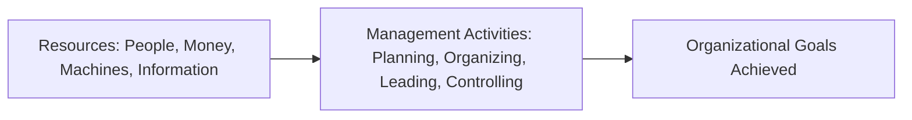

✏️ **Example:** A small tuck-shop owner has a little money (financial), one helper (human), a fridge and counter (physical), and knowledge of which snacks sell best (information). Managing the shop well means using all four together — buying the right stock, paying the helper on time, keeping the fridge running, and using sales data to restock smartly.

**Keywords to remember for exams:** Efficient, Effective, Organizational goals, Coordination, Resources.

---

## 1.2 The Management Process — 4 Functions (POLC)

🔑 **In Simple Words:** Every manager, in every organization, constantly does four things: plans, organizes, leads, and controls. This never really stops — it just keeps repeating.

📖 **Definition:** Management is a **continuous process** made of four connected functions performed by every manager at every level.

💡 **Explanation:** Imagine you are asked to run a small event, like a college function. You don't just do one thing — you first **plan** (decide what the event will be about and when it will happen), then you **organize** (assign people to different tasks, arrange the hall, book the sound system), then you **lead** (motivate your team, give instructions, keep everyone's spirits up on the day), and finally you **control** (check whether things went as planned, and note what to fix next time). Once the event is over, the lessons from "control" feed back into planning the next event. That is exactly what management is — just repeated forever, in every company.

| Function | What it Really Means | Everyday Example |
|---|---|---|
| **Planning** | Deciding *what* to do, *how*, and *when* | Deciding to open a new branch of a shop next year |
| **Organizing** | Arranging people and resources to carry out the plan | Hiring staff for the new branch, dividing duties |
| **Leading** | Motivating, guiding, and communicating with people | Manager encouraging staff during a busy sale |
| **Controlling** | Checking if results match the plan, and fixing gaps | Checking if the new branch hit its monthly sales target |

📊 **Diagram — The Never-Ending Cycle:**
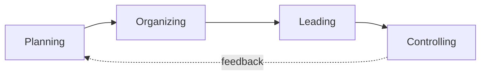

⚠️ **Exam Trap:** These 4 functions happen **at the same time**, not one after another like separate steps in a queue. Also, some textbooks use the word "Directing" instead of "Leading" — they mean exactly the same thing, so don't get confused if you see either word.

⭐ *Past paper: "List down the functions of management" — asked directly.*

---

## 1.3 Kinds of Managers

🔑 **In Simple Words:** Not every manager does the same job — some think about the whole company's future, some manage departments, and some manage the daily work of ordinary employees.

📖 **Definition:** Managers can be classified in two ways — by their **level** in the organization, and by the **area/department** they manage.

💡 **Explanation — Classification by Level:**

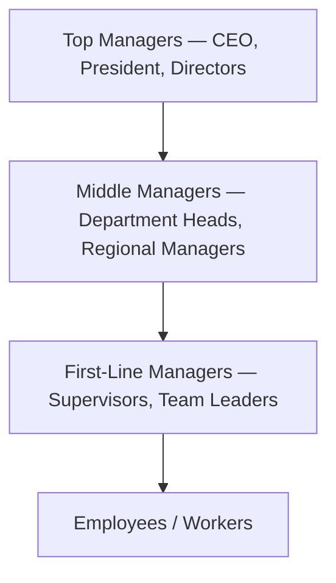

| Level | Focus | Type of Decisions | Time Horizon |
|---|---|---|---|
| **Top Managers** | The entire organization | Strategic (big picture) | Years |
| **Middle Managers** | One department or region | Tactical (medium plans) | Months |
| **First-Line Managers** | A specific team or unit | Operational (daily tasks) | Days/Weeks |

⚠️ **Exam Trap:** Middle managers manage **other managers**, not ordinary workers. First-line managers are the ones who manage the actual workers directly.

💡 **Explanation — Classification by Area (Functional Managers):** Instead of level, a manager can also be classified by which department they run — for example, a **Marketing Manager** looks after advertising and sales, a **Finance Manager** looks after budgets and accounts, an **HR Manager** looks after hiring and training, and an **Operations Manager** looks after production and quality. A **General Manager** is different from all of these — they oversee *all* departments together rather than specializing in just one.

✏️ **Example:** In a clothing brand: the CEO (Top) decides to expand into two new cities next year. The Regional Manager (Middle) plans how the new stores in Lahore will be run. The Store Supervisor (First-line) makes sure the staff show up on time and handle customers well every single day.

⭐ *Past paper: "Explain in detail kinds of managers with examples."*

---

## 1.4 Mintzberg's 10 Managerial Roles

🔑 **In Simple Words:** A manager's day isn't just "planning and organizing" — researcher Henry Mintzberg found that in real life, managers constantly switch between 10 different "hats" (roles) depending on the situation.

📖 **Definition:** A **role** is a specific behavior pattern that people expect from a manager in a given situation. Mintzberg grouped 10 such roles into 3 categories.

💡 **Explanation:** Picture a single school principal's morning. At 9 AM she cuts the ribbon at a new library opening (that's ceremonial). At 9:30 she reads an email about a rival school's new policy (gathering information). At 10 she tells her teachers about a new exam schedule (sharing information). At 11 she negotiates with a supplier about book prices (making a deal). All of this happened within two hours — that's exactly what Mintzberg discovered: managers are constantly jumping between roles.

**Category 1 — Interpersonal Roles** (about people and relationships)
| Role | What it Means | Example |
|---|---|---|
| Figurehead | Ceremonial/symbolic duties | Principal cutting the ribbon at a school event |
| Leader | Motivating and guiding staff | Coaching an underperforming teacher |
| Liaison | Building relationships outside your own team | Meeting with another school's admin for a joint event |

**Category 2 — Informational Roles** (about handling information)
| Role | What it Means | Example |
|---|---|---|
| Monitor | Scanning for useful information | Reading news about competitor schools |
| Disseminator | Sharing information **inside** the organization | Telling teachers about the new exam policy |
| Spokesperson | Speaking on behalf of the organization to **outsiders** | Principal talking to a newspaper reporter |

**Category 3 — Decisional Roles** (about making decisions)
| Role | What it Means | Example |
|---|---|---|
| Entrepreneur | Starting new initiatives | Proposing a new online learning portal |
| Disturbance Handler | Solving unexpected problems | Managing a sudden electricity breakdown during exams |
| Resource Allocator | Deciding who gets budget/resources | Deciding which department gets new computers |
| Negotiator | Representing the organization in formal deals | Negotiating a lower fee with a bus supplier |

📊 **Diagram:**
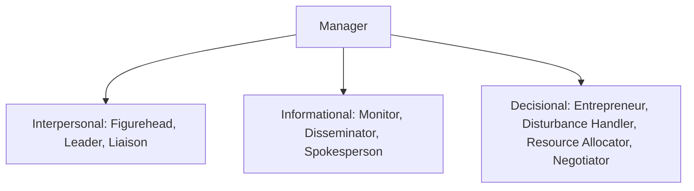

⚠️ **Exam Trap:** Don't mix up similar-sounding roles — **Disseminator** shares info *inside* the organization, while **Spokesperson** shares info to *outsiders*. **Liaison** builds informal relationships, while **Negotiator** makes formal deals.

---

## 1.5 Managerial Skills — Katz's Model

🔑 **In Simple Words:** To be a good manager you need three kinds of skills, but which skill matters most depends on how high up you are in the organization.

📖 **Definition:** Robert Katz identified 3 core managerial skills — **Technical**, **Human**, and **Conceptual** — and showed that their importance changes depending on management level.

💡 **Explanation:** This is why a brilliant computer programmer doesn't always make a great IT manager — being good at coding (technical skill) is not the same as being good at leading a team (human skill) or planning the company's five-year IT strategy (conceptual skill).

- **Technical Skills** — knowledge of specific tools, processes, and methods of a field. Example: a software team lead who understands coding.
- **Human Skills** — the ability to work with, motivate, and communicate with people. Example: a manager who resolves a conflict between two team members calmly.
- **Conceptual Skills** — the ability to see the big picture and understand how all parts of the organization connect. Example: a CEO deciding to enter a new market after seeing how it fits the company's overall strategy.

📊 **Diagram — How the mix changes by level:**
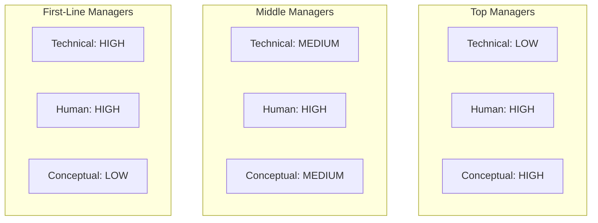

**The pattern to remember:**
- Technical skill **decreases** as you go up the ladder
- Conceptual skill **increases** as you go up the ladder
- Human skill **stays equally important at every single level** — it never decreases

⚠️ **Exam Trap:** Never write that human skills become "less important" at the top — that is the single most common mistake students make on this topic. Many people get promoted because of strong technical skill, but then fail as managers because they lack human and conceptual skill.

⭐ *Past paper: "Explain basic managerial skills."*

---

## 1.6 Omnipotent vs Symbolic View of Management

🔑 **In Simple Words:** This topic asks one question: when a company succeeds or fails, is it really because of the manager, or because of outside forces the manager can't control?

📖 **Definition:**
- **Omnipotent View** — the belief that managers are fully, directly responsible for an organization's success or failure.
- **Symbolic View** — the belief that a manager's real control is very limited, and outside forces (economy, competition, luck) matter more.

💡 **Explanation:** These are two opposite extremes, and the truth in real life is usually somewhere in between them.

| | Omnipotent View | Symbolic View |
|---|---|---|
| Core belief | Manager is fully responsible | Manager has limited real control |
| When company succeeds | Manager gets full credit | Favorable outside conditions get the credit |
| When company fails | Manager gets full blame | Bad outside forces get the blame |
| Also called | Rational view | External constraint view |

✏️ **Example:** When a company's phone-selling business collapses because of a sudden government import ban on foreign phones, that's the **Symbolic view** in action — no manager, however skilled, could have prevented it. But when a company's CEO makes a bad decision to launch a product nobody wants, and it fails, that leans toward the **Omnipotent view** — the manager's own choice caused the failure.

📊 **Diagram:**
```
SYMBOLIC  <------------------ REALITY sits here ------------------>  OMNIPOTENT
(no real control)                                                    (full control)
```

⚠️ **Exam Trap:** Neither view is 100% correct on its own. Always mention in your answer that "reality lies in the middle" — managers have real, but limited, influence.

⭐ *Past paper: "Omnipotent vs Symbolic view."*

---

## 1.7 The Real Nature of Managerial Work

🔑 **In Simple Words:** Most people imagine managers calmly sitting and planning all day — real research shows the opposite: a manager's day is fast, messy, and full of interruptions.

📖 **Definition:** Based on research by Mintzberg and Kotter, managerial work has 6 real characteristics that describe what a manager's day actually looks like.

💡 **Explanation & the 6 characteristics:**

1. **Fast-paced and relentless** — problems keep coming; there's no moment where the work is "finished."
2. **Highly varied** — a manager jumps between totally different topics (finance, people issues, strategy) sometimes within the same hour.
3. **Fragmented** — most managerial activities last **less than 9 minutes** before being interrupted.
4. **Primarily verbal** — managers spend 70–90% of their time talking (meetings, calls) rather than writing reports.
5. **Networking is central** — managers rely on a wide web of contacts, both inside and outside the organization, to get things done.
6. **More reactive than proactive** — despite planning ahead, most of a manager's time is spent responding to unexpected problems.

✏️ **Example:** A bank branch manager's morning: handles a customer complaint about a delayed cheque, approves a loan application, resolves a dispute between two cashiers, attends a quick call from head office, and reviews the day's cash position — all before lunch, with no single task lasting very long.

⚠️ **Exam Trap:** This chaotic, fragmented style of work is completely **normal** — it is not a sign that a manager is failing or disorganized.

---

## 1.8 Workforce Diversity

🔑 **In Simple Words:** Workforce diversity means the employees in a company come from different backgrounds — different ages, genders, religions, and ways of thinking — and a manager's job is to turn these differences into a strength.

📖 **Definition (Robbins):** *"Workforce diversity refers to the ways in which people in an organization are different from and similar to one another."*

💡 **Explanation:** There are two levels of diversity:

| Level | Type | Examples |
|---|---|---|
| **Surface-level** | Visible, easy to notice | Age, gender, race, physical ability |
| **Deep-level** | Hidden, not immediately visible | Personal values, personality, beliefs, work style |

⚠️ Deep-level differences are actually often **more** troublesome than surface-level ones, because they cause hidden conflicts that are harder to spot and resolve — for example, two employees who look similar but have completely different work ethics may clash without anyone realizing why.

**Age diversity — 4 generations commonly found at work today:** Baby Boomers (loyal, formal), Generation X (independent, skeptical), Millennials (tech-savvy, collaborative), Gen Z (digital natives, fast-paced).

**Benefits of managing diversity well:** more creative solutions, better understanding of diverse customers, stronger problem-solving, higher morale.
**Challenges:** communication barriers, stereotyping, unfair treatment, resistance from existing staff.

**Three concepts people often mix up:**
- **Diversity** = simply having different kinds of people present
- **Equality** = treating everyone fairly
- **Inclusion** = making everyone genuinely *feel* valued and respected

⚠️ **Exam Trap:** These are three completely different ideas — do not use them interchangeably in an exam answer. Also remember: a diverse team does **not** automatically perform better on its own — without good management, diversity can create friction instead of strength.

⭐ *Past paper: "Workforce Diversity" / "Concept of workforce diversity" — appeared more than once.*

---

# STAGE 2 — Ethical & Social Environment

## 2.1 What is Ethics, and Why Does it Matter in Business?

🔑 **In Simple Words:** Ethics means the rules of right and wrong that guide how people should behave — and in business, following the law is not always the same as being ethical.

📖 **Definition (Robbins):** *"Ethics refers to the rules and principles that define right and wrong conduct in an organizational setting."*

💡 **Explanation:** A very important idea here is: **legal does not always mean ethical.** For example, a factory might legally pay the minimum wage allowed by law, but if it forces employees to work in humiliating or unsafe conditions, that is still deeply unethical — even though nothing illegal was technically done.

Ethics operates at three levels, moving from the individual outward:
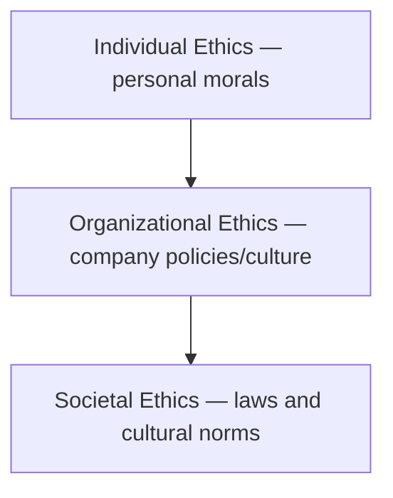

**4 approaches used to judge whether a decision is ethical:**

| Approach | Core Logic |
|---|---|
| **Utilitarian** | Choose whatever creates the greatest good for the greatest number of people |
| **Rights** | Always respect basic human rights — privacy, safety, dignity |
| **Justice** | Treat everyone fairly and consistently |
| **Integrative** | Combine universal moral principles with local community norms |

**The Newspaper Test:** A simple everyday check — *"Would I be comfortable if this decision appeared on the front page of tomorrow's newspaper?"* If the answer is no, the decision is probably unethical.

⚠️ **Exam Trap:** Ethics is not only about religion — it includes universal principles that apply regardless of any particular belief system. Also, ethical companies are proven to perform **better** in the long run — being ethical is not a business disadvantage.

**Keywords:** Right and wrong conduct, Moral standards, Newspaper test.

---

## 2.2 Individual Ethics in Organizations

🔑 **In Simple Words:** Two employees can face the exact same situation and make totally different ethical choices — this topic explains why that happens.

📖 **Definition:** An individual's ethical behavior at work is shaped by three main factors: their stage of moral development, their personal values/personality, and organizational pressures around them.

💡 **Factor 1 — Kohlberg's Stages of Moral Development**

Psychologist Lawrence Kohlberg proposed that people's moral reasoning develops through 3 levels, each containing 2 stages:

| Level | Stage | The Person's Logic |
|---|---|---|
| **Pre-conventional** (self-focused) | 1 — Obedience | "I won't do wrong because I'll be punished." |
| | 2 — Self-interest | "I'll do whatever benefits me the most." |
| **Conventional** (society-focused) | 3 — Relationships | "I want people around me to see me as good." |
| | 4 — Law & Order | "Rules exist for a reason; it's my duty to follow them." |
| **Post-conventional** (principle-focused) | 5 — Social Contract | "Unjust rules should be challenged." |
| | 6 — Universal Principles | "I follow my own conscience, even against the rules." |

Most adults operate mainly at the **Conventional** level (stages 3–4). Very few consistently reach the Post-conventional level.

✏️ **Example:** An employee who only follows the office dress code when the manager is physically present is showing Stage 1 (Obedience) thinking.

💡 **Factor 2 — Personal Values & Personality**
- **Ego strength** — how strongly a person can stick to their ethical beliefs even under pressure.
- **Locus of control** — whether a person believes they control their own actions (**Internal locus**, tends to be more ethical and accountable) or believes outside forces control them (**External locus**, tends to blame others more easily).

💡 **Factor 3 — Organizational Factors** — even someone with strong personal ethics can be pushed toward unethical behavior by:
- **Organizational culture** (if shortcuts are tolerated, people follow along)
- **Authority pressure** (people often follow orders from superiors even when it feels wrong — this was famously shown in the Milgram Experiment)
- **Peer/group norms** ("everyone here does it this way")
- **Ethical climate** — whether the shared culture leans Instrumental (self-interest/profit), Caring (employee wellbeing), or Rules-based (strict compliance)

⚠️ **Exam Trap:** Always mention Kohlberg's name — examiners specifically look for it. Also remember: Ego strength and Locus of control are two completely different concepts, don't confuse them.

---

## 2.3 Emerging Ethical Issues

🔑 **In Simple Words:** As technology and society change, businesses face brand-new ethical challenges that didn't exist a few decades ago.

📖 **Definition:** Emerging ethical issues are new moral challenges created by changing technology, work styles, and social expectations.

💡 **Explanation of each issue:**

**1) Employee Privacy & Surveillance** — companies want to monitor productivity (email tracking, CCTV, GPS on delivery riders), but employees have a right to privacy. The ethical question is: how much monitoring is reasonable before it becomes an invasion of privacy?

**2) Technology & AI Ethics** — includes data privacy (is user consent to data collection really informed?), algorithmic bias (an AI trained on biased past data can make unfair decisions — for example an automated hiring tool that unfairly rejects certain candidates because it learned from biased historical hiring data), job losses from automation, and deepfakes.

**3) Whistleblowing** — reporting wrongdoing inside an organization (**internal**) or to outside authorities/media (**external**). This is considered the *highest form of organizational loyalty* — loyalty to the truth over personal safety, even though whistleblowers often face job loss or social isolation. Managers must never retaliate against a whistleblower.

**4) Sexual Harassment** — two types must be known:
| Type | Meaning |
|---|---|
| **Quid pro quo** ("something for something") | A job benefit is offered or withheld in exchange for sexual favors |
| **Hostile work environment** | Ongoing inappropriate behavior that creates discomfort (jokes, unwanted touching, comments) |

**5) Workplace Discrimination** — unfair treatment based on age, gender, race, religion, or disability, unrelated to actual job performance. Newer forms include appearance-based discrimination and rejecting candidates based on their social media posts.

**6) Environmental Ethics** — a business's moral responsibility toward the environment. Key terms: **carbon footprint** (a company's total environmental impact), **greenwashing** (falsely claiming to be eco-friendly for marketing purposes), and **sustainability** (operating without damaging future generations' ability to meet their own needs).

⚠️ **Exam Trap:** Quid pro quo and hostile work environment are two *different* types of harassment — don't merge them into one answer. Greenwashing means fake environmental claims, not genuine environmental action.

⭐ *Past paper: "Emerging ethical issues in context of organization" — a very frequently asked 10-mark question.*

---

## 2.4 Social Responsibility of Organizations (CSR)

🔑 **In Simple Words:** Should a company only care about making profit, or does it also owe something back to society? This is the central debate of Corporate Social Responsibility.

📖 **Definition:** *"The obligation of an organization to act in ways that serve both its own interests and the interests of society."*

💡 **Explanation — Two opposing scholarly views:**

| | Classical View (Milton Friedman) | Socioeconomic View (Keith Davis) |
|---|---|---|
| Core belief | Business exists **only** to maximize profit | Business has responsibilities **beyond** profit |
| Who should solve social problems | Government's job | Business should help solve them too |

**The "License to Operate":** Society allows businesses to exist and function. If a business consistently ignores its responsibility to society, society can withdraw that permission through boycotts, stricter regulation, or public backlash.

**4 Stances on Social Responsibility (from least to most responsible):**
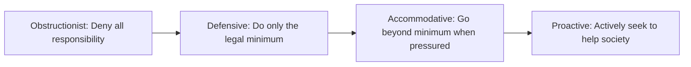

✏️ **Example:** A factory that denies polluting a river despite clear evidence = **Obstructionist**. A factory that installs only the legally required safety equipment and nothing more = **Defensive**. A factory that starts a recycling program only after repeated customer complaints = **Accommodative**. A factory that voluntarily donates part of its profit to environmental causes every year without being pressured = **Proactive**.

**Arguments for CSR:** builds a good public image, avoids the need for strict government regulation, builds long-term customer loyalty.
**Arguments against CSR:** reduces profit for shareholders, managers aren't trained social experts, creates unfair cost disadvantages compared to less responsible competitors.

**Shared Value (Michael Porter):** the idea of creating profit for the business *and* real value for society at the same time — for example, a food company training local farmers to grow better crops: the farmers earn more, and the company gets better-quality ingredients. Both sides win.

⚠️ **Exam Trap:** CSR is not just about charity/donations — it also covers environment, labor practices, and governance. Also, socially responsible companies are **not** automatically less profitable — many outperform others long-term.

---

# STAGE 3 — Environment & Culture of Management

## 3.1 Why the Environment Matters for Managers

🔑 **In Simple Words:** No business exists in isolation — everything around it (economy, competitors, technology, laws) constantly creates new chances to grow and new dangers to watch out for.

📖 **Definition:** Organizations are **open systems** — they constantly take in resources from, and give outputs back to, their surrounding environment.

💡 **Explanation:** A manager who ignores what's happening in the environment is like a driver who ignores the road conditions ahead — eventually, something goes wrong. Two factors decide how uncertain (unpredictable) an environment is:

| | Simple | Complex |
|---|---|---|
| **Stable** | Low uncertainty (e.g., a small local bakery) | Moderate uncertainty |
| **Dynamic** | Moderate uncertainty | High uncertainty (e.g., a global tech company) |

📊 **Diagram:**
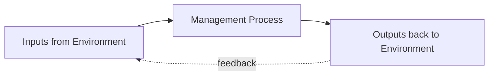

**Keywords:** Open system, Opportunities, Threats, Environmental uncertainty.

---

## 3.2 The External Environment

🔑 **In Simple Words:** The external environment is everything happening outside the organization that it cannot fully control, but must still respond to.

📖 **Definition:** There are two layers of external environment — the **General Environment** (affects every business) and the **Task Environment** (affects your specific business directly).

💡 **Layer 1 — General Environment (PESTLE):**

| Force | What it Covers |
|---|---|
| **P**olitical-Legal | Government stability, tax policy, trade laws |
| **E**conomic | Inflation, GDP, interest rates |
| **S**ociocultural | Population values, lifestyle trends, demographics |
| **T**echnological | New tools, automation, digital transformation |
| **L**egal | Labor laws, compliance requirements |
| **E**nvironmental | Climate, natural disasters, availability of natural resources |

💡 **Layer 2 — Task Environment (directly affects your business):** Competitors, Customers (the most critical force of all), Suppliers, Regulators, Partners.

⚠️ **Exam Trap:** Customers belong to the **Task environment**, not the general environment. General environment affects *all* businesses equally, task environment affects *your* business specifically.

---

## 3.3 The Internal Environment

🔑 **In Simple Words:** The internal environment is everything happening inside the organization — and unlike the external environment, managers actually have real control over this part.

📖 **Definition:** The internal environment has 4 components: Owners, Board of Directors, Employees, and Organizational Culture.

💡 **Explanation:**
- **Owners** — set the vision, provide resources, and define what managers are allowed to do.
- **Board of Directors** — a group elected by shareholders to oversee top management. The board asks *"are we doing the right things?"* while management asks *"are we doing things right?"*
- **Employees** — the organization's most valuable resource; their skills, motivation, and satisfaction directly determine performance.
- **Organizational Culture** — covered in detail in section 3.5.

📊 **Diagram:**
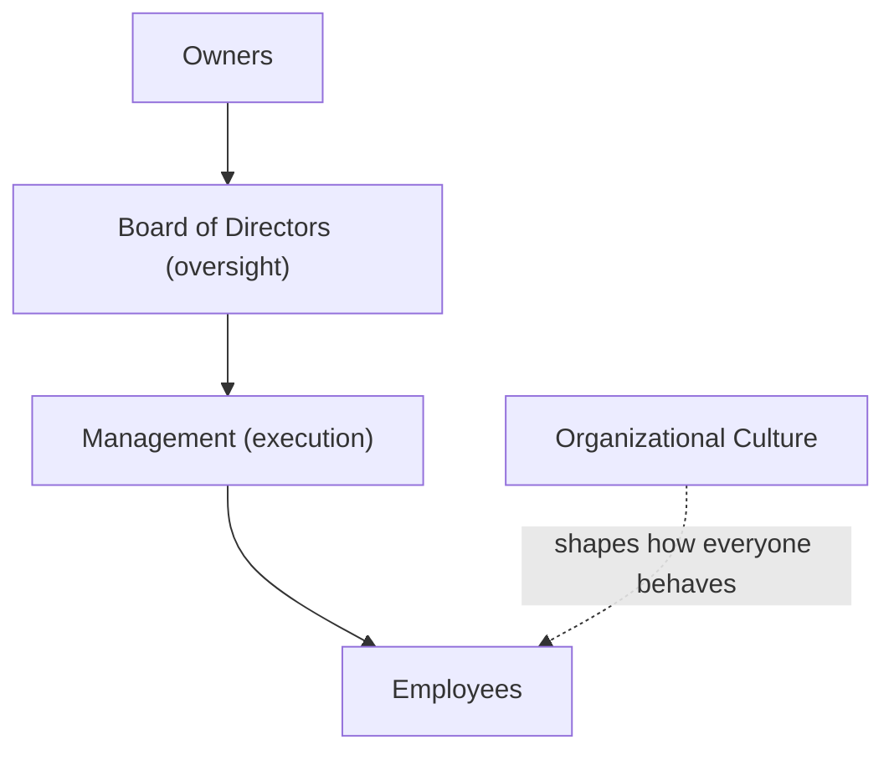

⚠️ **Exam Trap:** The Board of Directors is **not** the same as Management — the board oversees management, they are two separate groups.

---

## 3.4 The Organization–Environment Relationship

🔑 **In Simple Words:** Smart organizations don't just passively accept whatever the environment throws at them — they either adjust themselves to fit it, or actively try to shape it in their favor.

📖 **Definition:** Two approaches exist: **Adapting** (the organization changes itself) and **Influencing** (the organization changes the environment).

💡 **Adapting strategies:** gathering market information (boundary spanning), changing strategy in response to change (e.g., a DVD rental company shifting entirely to streaming), mergers & acquisitions, and building flexible structures (like remote-work capability).

💡 **Influencing strategies:** advertising/PR to shape public perception, lobbying government for favorable policy, joining trade associations, and bold strategic moves that reshape the whole market (like a company creating an entirely new product category).

⚠️ **Exam Trap:** A **Merger** means two companies become one single company, while a **Strategic Alliance** means two companies cooperate but remain completely separate.

---

## 3.5 Organizational Culture

🔑 **In Simple Words:** Culture is the invisible "personality" of a company — the shared way people think, behave, and treat each other, often more powerful than any official rule book.

📖 **Definition (Robbins):** *"Shared values, principles, traditions, and ways of doing things that influence how organizational members act."*

💡 **Explanation:** As management thinker Peter Drucker famously said — *"Culture eats strategy for breakfast."* You can have the best written strategy in the world, but if the everyday culture doesn't support it, it will fail.

**7 Dimensions of Culture:**

| Dimension | Meaning |
|---|---|
| Innovation | How much employees are encouraged to try new ideas |
| Risk Taking | How much risk-taking is encouraged |
| Attention to Detail | How much precision is expected |
| Outcome Orientation | Focus on results vs. focus on process |
| People Orientation | How much the organization cares about its people |
| Team Orientation | Work organized around teams vs individuals |
| Aggressiveness / Stability | How competitive vs. how steady the culture is |

**Strong Culture** (widely shared values, consistent behavior, generally higher performance) vs **Weak Culture** (fragmented values, inconsistent behavior). In a strong culture, employees instinctively know the right thing to do in a brand-new situation, without being told.

**How culture is maintained:** through **stories** (retelling how the founder overcame struggles), **rituals** (weekly meetings, annual events), **symbols** (office layout, dress code), and **language** (special company phrases).

⚠️ **Exam Trap:** Culture is not just "free snacks and fun parties" — it goes far deeper than perks. Also, culture is usually the **slowest and hardest** thing to change inside any organization.

⭐ *Past paper: "Define culture and discuss various dimensions" — a 10-mark question.*

---

## 3.6 Scientific Management (Frederick Taylor)

🔑 **In Simple Words:** Before the 1900s, work was mostly done by guesswork and tradition. Taylor asked a simple but powerful question: what if we studied work scientifically to find the single best way to do every job?

📖 **Definition:** Scientific Management is the earliest formal management theory, founded by **Frederick Winslow Taylor**, based on studying and standardizing work methods scientifically.

💡 **Taylor's 4 Principles:**

1. **Develop a science for each job element** — replace guesswork with careful scientific study (e.g., studying the ideal shovel size increased worker output dramatically).
2. **Scientifically select and train workers** — match the right person to the right job, and train them properly.
3. **Cooperate with workers** — management and workers should work together, not against each other.
4. **Divide work fairly** — managers plan the work, workers execute it, with a clear separation of roles.

Taylor also introduced the **piece-rate pay system** — workers were paid based on the number of units they produced, not just the hours they worked, creating a direct incentive to perform well.

**Other contributors:** Frank Gilbreth (motion study — reducing wasted body movements), Lillian Gilbreth (human/psychological factors), Henry Gantt (the Gantt chart — a visual project-planning tool still used today).

**Where it works well:** repetitive physical tasks (manufacturing, fast food). **Where it fails:** creative or knowledge-based work (software design, research), because it treats workers almost like machines and ignores creativity and social needs.

⚠️ **Exam Trap:** Taylor's full name (Frederick **Winslow** Taylor) is often specifically expected in answers. The Gantt chart belongs to Henry Gantt, not Taylor. Scientific Management is the *oldest* formal theory, not a modern best practice.

---

## 3.7 Going Global — How Companies Expand Internationally

🔑 **In Simple Words:** When a company wants to sell or operate in other countries, it has several strategies to choose from, ranging from very safe/low-effort to very risky/high-control.

📖 **Definition:** There are 6 international entry strategies, arranged from lowest to highest commitment and control.

📊 **Diagram:**
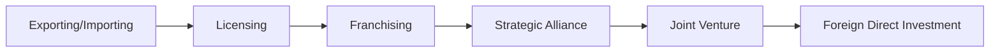

💡 **Explanation of each:**

1. **Exporting/Importing** — selling products made at home to customers abroad, with no physical presence needed. Lowest risk, lowest control.
2. **Licensing** — allowing a foreign company to use your intellectual property (brand, formula, patent) in exchange for a **royalty** fee. Low investment, but very limited control over how it's used.
3. **Franchising** — allowing a foreign business to operate using your *entire* business system (brand, processes, training, quality standards) — much more control and support than licensing.
4. **Strategic Alliance** — two companies cooperate for mutual benefit while remaining fully separate and independent organizations.
5. **Joint Venture** — two companies come together to create a **brand new, separate company**, sharing ownership, costs, and profits.
6. **Foreign Direct Investment (FDI)** — the company directly owns and operates in the foreign country, either by building new facilities (**Greenfield**) or buying an existing company (**Acquisition**). Highest investment, control, and risk.

⚠️ **Exam Trap (most common one in this whole topic):** Licensing shares only specific intellectual property, while Franchising shares the *complete* business system with ongoing support. Similarly, a Strategic Alliance keeps the two companies separate, while a Joint Venture creates a brand-new shared company.

⭐ *Past paper: "Differentiate Franchising and Licensing" — appeared multiple times.*

---

# STAGE 4 — Planning & Decision Making

## 4.1 What is Planning, and Why Do Managers Plan?

🔑 **In Simple Words:** Planning simply means figuring out your destination (the goal) and mapping out the route to get there, before you start moving.

📖 **Definition:** *"Planning is the process of setting organizational goals and deciding how best to achieve them."*

💡 **Why it matters:** Without a plan, an organization wastes resources and has no clear direction. With a plan, effort is focused and resources are used with purpose.

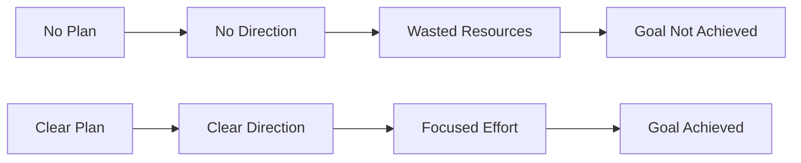

## 4.2 Benefits of Planning

- Minimizes waste of resources
- Gives everyone clear direction
- Reduces uncertainty about the future
- Improves coordination between departments
- Establishes standards used later for controlling
- Helps set priorities

⭐ *Past paper: "Write few benefits of planning."*

---

## 4.3 Organizational Goals & SMART Goals

🔑 **In Simple Words:** Goals are the specific outcomes an organization wants to reach — and good goals follow a simple checklist called SMART.

📖 **Definition:** Goals are desired outcomes, set at three different management levels.

| Level | Goal Type | Time Frame | Example |
|---|---|---|---|
| Top Management | Strategic | 3–5 years | "Become the market leader by 2028" |
| Middle Management | Tactical | 1–2 years | "Increase regional sales by 20% this year" |
| First-Line Management | Operational | Daily/Weekly | "Process 100 orders per day" |

**SMART Goals:** **S**pecific, **M**easurable, **A**chievable, **R**elevant, **T**ime-bound.

---

## 4.4 Levels of Planning & Types of Plans

Planning happens at 3 matching levels: **Strategic** (top, long-term direction), **Tactical** (middle, department execution), and **Operational** (first-line, day-to-day activities).

**Two types of plans:**
- **Single-use plan** — created for one specific situation, used once (e.g., a project plan for launching a new product).
- **Standing plan** — used repeatedly for recurring situations. Standing plans include: **Policies** (general guidelines, e.g. "respond to complaints within 24 hours"), **Procedures** (step-by-step instructions), and **Rules** (specific must/must-not statements).

---

## 4.5 Levels of Strategy

🔑 **In Simple Words:** A company's strategy isn't one single plan — it actually works at three different levels, from the biggest picture down to a single department.

📖 **Definition:** Strategy is the plan an organization uses to achieve its goals and beat its competition, existing at 3 levels.

📊 **Diagram:**
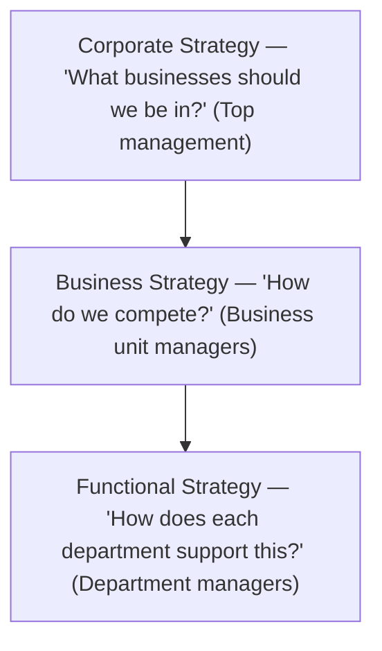

💡 **Corporate Strategy has 3 types:**
- **Growth strategy** — expanding into new markets or products (through Concentration = growing in the same industry, Vertical Integration = buying a supplier or distributor, or Diversification = entering a completely new business).
- **Stability strategy** — staying at the current size and performance level, no major change.
- **Retrenchment strategy** — cutting back operations or costs when the organization is struggling.

💡 **Business Strategy — Porter's 3 Generic Competitive Strategies:**

| Strategy | Meaning | Example |
|---|---|---|
| **Cost Leadership** | Be the lowest-cost producer, target the broad market | A budget airline that keeps every cost as low as possible |
| **Differentiation** | Offer something genuinely unique, target the broad market | A premium phone brand known for its unique design |
| **Focus** | Serve one narrow, specific market segment better than anyone | A boutique law firm specializing only in one type of legal case |

⚠️ **Exam Trap:** Porter warned that a company trying to be **both** cost leader and differentiator at once becomes "stuck in the middle" — performing poorly at both, a dangerous position to be in.

💡 **Functional Strategy** — each department's own plan (marketing, HR, operations) must align with and support the business strategy above it.

---

## 4.6 What is Decision Making?

🔑 **In Simple Words:** Decision making means picking one path of action out of several possible options, to solve a problem or grab an opportunity.

📖 **Definition:** *"Decision making is the process of identifying and selecting a course of action to solve a specific problem or take advantage of an opportunity."* Every single management function (POLC) requires decisions — decision making is genuinely at the *core* of management.

**Two types of decisions:**
| Type | Meaning | Example |
|---|---|---|
| **Programmed** | Routine, repetitive, a ready-made solution already exists | Reordering stock automatically when it runs low |
| **Non-programmed** | Unique, complex, no ready-made solution | Deciding whether to enter a completely new market |

---

## 4.7 The Decision-Making Process (8 Steps)

🔑 **In Simple Words:** Good decisions don't just happen — they follow a logical, step-by-step process.

📊 **Diagram:**
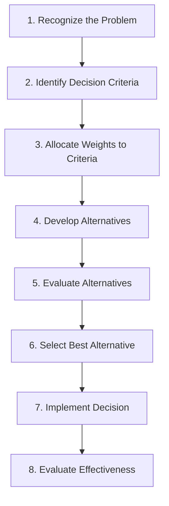

✏️ **Example (running through all 8 steps):** A restaurant notices sales have dropped 15% this month (1 — recognize the problem). It decides that price, food quality, and delivery speed matter most (2 — criteria). It decides food quality matters most, then price, then speed (3 — weighting). It considers changing the menu, hiring a new chef, or offering discounts (4 — alternatives). It weighs the cost and benefit of each option (5 — evaluate). It picks "hire a new chef" as the best option (6 — select). It hires the new chef and updates the menu (7 — implement). A month later it checks whether sales recovered (8 — evaluate effectiveness).

⭐ *Past paper: "Explain decision making in detail with examples" — a 10-mark question; write all 8 steps with one running example.*

---

## 4.8 Types of Decisions (by Condition)

| Condition | Meaning |
|---|---|
| **Certainty** | All information is known, the outcome is fully predictable |
| **Risk** | Some information known, probabilities of each outcome can be estimated |
| **Uncertainty** | Very little information available, outcomes are unpredictable |

⚠️ **Exam Trap:** Most real business decisions actually happen under **Risk or Uncertainty**, not Certainty — true certainty is rare in real business life.

---

## 4.9 Classical vs Administrative Decision-Making Models

🔑 **In Simple Words:** One model describes how managers *should* ideally make decisions (in a perfect world), and the other describes how managers *actually* make decisions in real life.

📖 **Definition:**
- **Classical Model (Normative/Rational)** — assumes a manager has complete information, is perfectly rational, and always picks the absolute best option (**maximizing**).
- **Administrative Model (Descriptive/Behavioral)**, developed by **Herbert Simon** — recognizes that real managers have limited time, limited information, and limited mental capacity, a concept called **Bounded Rationality**. Because of this, they don't search for the perfect answer — they practice **Satisficing**: stopping once they find an option that is simply "good enough."

Simon's model also highlights **Intuition** — experienced managers often make fast decisions based on gut feeling built from years of pattern recognition, which is genuine expertise, not random guessing.

| | Classical Model | Administrative Model |
|---|---|---|
| Information | Complete and perfect | Limited and imperfect |
| Goal | Maximize (find the absolute best) | Satisfice (find good enough) |
| Reality | Ideal/theoretical | Realistic/practical |

⚠️ **Exam Trap:** Herbert Simon belongs to the Administrative model, not the Classical one. Satisficing is not "lazy" decision-making — it is the practical, realistic response to the limits every real manager faces.

---

## 4.10 Behavioral Aspects of Decision Making

🔑 **In Simple Words:** Human psychology quietly influences every decision a manager makes — this explains why even smart, experienced managers sometimes make poor choices.

💡 **Heuristics** (mental shortcuts, or "rules of thumb"):
- **Availability heuristic** — judging how likely something is based on how easily an example comes to mind (e.g. overestimating plane-crash risk right after seeing news of one).
- **Representativeness heuristic** — judging a new situation based on how similar it seems to something familiar (e.g. assuming a new hire will be great because they remind you of a past star employee).
- **Anchoring heuristic** — relying too heavily on the very first piece of information received (e.g. a salary negotiation getting anchored to the first number mentioned).

💡 **Framing Effect** — the same facts can lead to different decisions depending on how they are worded. Example: "This plan succeeded in 7 out of 10 markets" sounds far more encouraging than "This plan failed in 3 out of 10 markets," even though both statements describe exactly the same result.

💡 **Escalation of Commitment** — continuing to pour money and time into a clearly failing project simply because so much has already been invested (also called "throwing good money after bad"). The rational response is to treat past investment as a **sunk cost** [money already spent that cannot be recovered] and base future decisions only on future costs and benefits.

💡 **Risk Propensity** — a manager's willingness to take risks. **Risk takers** prefer bold, high-reward options even with uncertainty; **Risk avoiders** prefer safe, predictable options even if the reward is smaller.

---

## 4.11 Group Decision-Making Techniques

🔑 **In Simple Words:** When a group needs to make a decision together, specific structured techniques can help generate better ideas and stop the loudest person from dominating the discussion.

| Technique | How it Works | Best Feature |
|---|---|---|
| **Brainstorming** | Members freely share ideas with zero criticism allowed during the session | Encourages quantity of ideas |
| **Devil's Advocacy** | One member is officially assigned to challenge and criticize every idea | Forces the group to defend its logic |
| **Nominal Group Technique (NGT)** | Members first write ideas silently and individually, then share, discuss, and privately vote | Gives quiet members an equal voice |
| **Delphi Technique** | Experts respond to questionnaires **anonymously**, with no face-to-face contact, repeated until agreement is reached | Removes social pressure entirely; works across long distances |

⚠️ **Exam Trap:** Delphi's single defining feature is that there is **no face-to-face contact at all**. NGT starts individually but becomes a group activity later. In Brainstorming, criticism is banned only *during* idea generation, not during the later evaluation stage.

---

# STAGE 5 — The Organizing Process

## 5.1 What is Organizing?

🔑 **In Simple Words:** After deciding *what* to do (planning), organizing decides *who* will do it, with *what* resources, and how everyone's work fits together.

📖 **Definition:** *"Organizing is the process of determining how activities and resources are to be assembled and coordinated to achieve organizational goals."*

💡 **Explanation:** Think of building a cricket team — you don't just pick 11 random players. You assign specific roles (batsman, bowler, wicketkeeper), decide who reports to the captain, and coordinate everyone's responsibilities. That is exactly what organizing means for a company.

**5 key decisions inside organizing:**
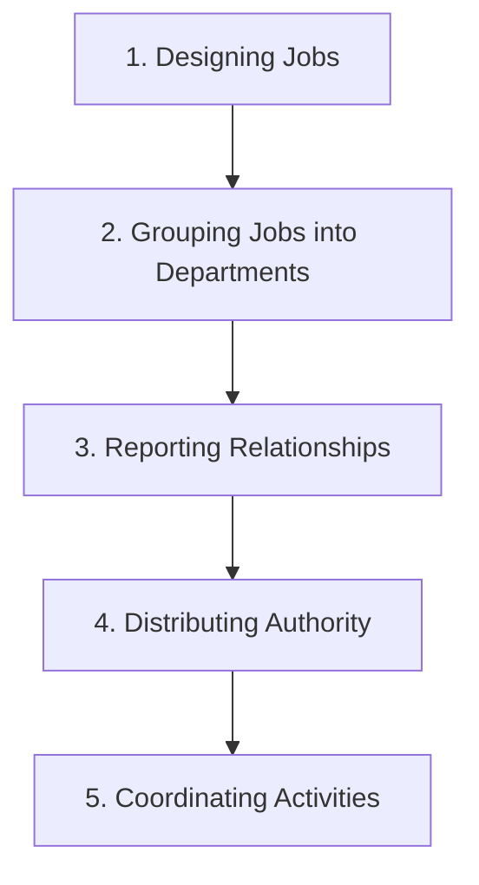

---

## 5.2 Job Characteristics Model (Hackman & Oldham)

🔑 **In Simple Words:** How a job is *designed* directly affects whether the person doing it feels motivated or bored — this model explains exactly which features make a job motivating.

📖 **Definition:** 5 core job characteristics create 3 psychological states in the worker, which then produce motivation, satisfaction, and performance.

| Characteristic | Meaning | High Example | Low Example |
|---|---|---|---|
| **Skill Variety** | Uses different skills and talents | A manager who plans, presents, and analyzes data daily | A worker tightening the same one bolt all day |
| **Task Identity** | Completes a whole, identifiable piece of work | A baker who makes an entire wedding cake start to finish | A worker who only adds filling on an assembly line |
| **Task Significance** | Impacts other people's lives meaningfully | A nurse in an ICU directly saving lives | Filing documents nobody ever reads |
| **Autonomy** | Freedom to decide how/when to do the work | A freelancer choosing their own hours and methods | A call center agent forced to follow a rigid script |
| **Feedback** | The job itself shows how well you're doing | A salesperson with a live dashboard of results | A researcher who gets feedback only once a year |

**Motivating Potential Score (MPS) Formula:**
```
MPS = [(Skill Variety + Task Identity + Task Significance) ÷ 3] × Autonomy × Feedback
```

📊 **Diagram:**
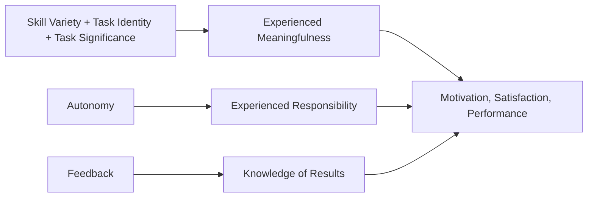

⚠️ **Exam Trap:** Because Autonomy and Feedback are *multiplied* in the formula, if either one is zero, the entire MPS becomes **zero** — even if the job scores perfectly on everything else. This shows why giving employees no freedom or no feedback destroys motivation completely.

---

## 5.3 Job Description vs Job Specification

🔑 **In Simple Words:** One document describes the *job itself*, and the other describes the *kind of person* needed to do it.

| Job Description | Job Specification |
|---|---|
| Describes the job's duties and responsibilities | Describes the required qualifications and skills |
| Answers: "What will this person DO?" | Answers: "What kind of person do we NEED?" |
| Example: "Manage a sales team of 10, prepare weekly reports" | Example: "Requires a Bachelor's degree, 3 years of sales experience" |

⭐ *Past paper: "Differentiate job description and job specification" — a very frequently asked short question.*

---

## 5.4 Grouping Jobs — Departmentalization

🔑 **In Simple Words:** Once individual jobs are designed, a company must decide how to group them into departments — and there are 5 common ways to do it.

📊 **Diagram:**
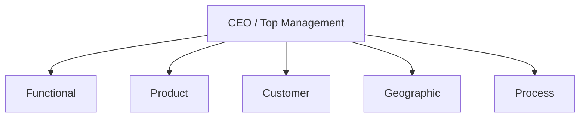

| Basis | Groups Jobs By | Example | Main Advantage | Main Disadvantage |
|---|---|---|---|---|
| **Functional** | Business function | Separate Marketing, Finance, HR departments | Deep expertise builds within each function | Departments become siloed and slow to coordinate |
| **Product** | Product line | A company with separate divisions for food, home care, and personal care products | Full focus on each product's specific needs | Expensive — duplicated resources across divisions |
| **Customer** | Type of customer served | A bank with separate Corporate, Retail, and Islamic banking departments | Deep understanding of each customer group | Duplication of functions across customer groups |
| **Geographic** | Region/location | Separate regional teams for each province | Fast response to local market needs | Harder to maintain consistent standards everywhere |
| **Process** | Workflow stage | Cutting → Stitching → Quality Check → Packaging in a garment factory | Very efficient within each specific stage | A slowdown in one stage stops the whole production line |

⚠️ **Exam Trap:** Real organizations often combine more than one basis at the same time — there is no single "best" basis; it depends on the organization's goals.

---

## 5.5 Establishing Reporting Relationships

🔑 **In Simple Words:** After forming departments, a company must decide clearly who reports to whom, and how many people each manager should directly supervise.

📖 **Definition:**
- **Chain of Command** — the unbroken line of authority connecting every person from the top of the organization to the bottom; everyone has exactly one clear supervisor.
- **Span of Control** — the number of employees a single manager directly supervises.

| | Narrow Span | Wide Span |
|---|---|---|
| People per manager | Few | Many |
| Structure shape | Tall (many levels) | Flat (few levels) |
| Supervision style | Close, detailed | More employee autonomy |
| Cost | More expensive (more managers needed) | Less expensive |
| Best suited for | Complex, specialized work | Routine, standardized work |

📊 **Diagram:**
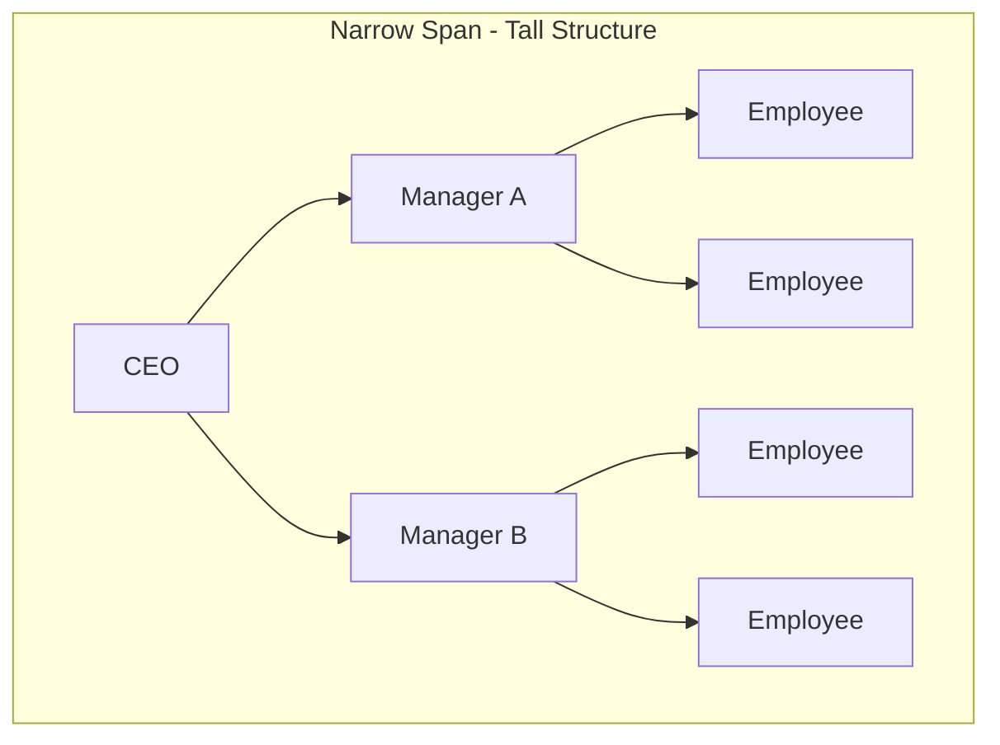
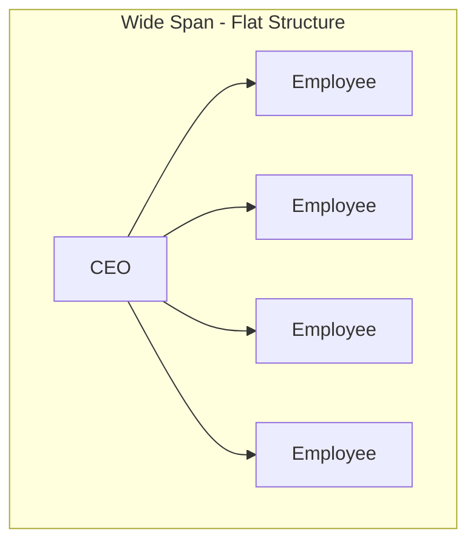

---

## 5.6 Centralization vs Decentralization

🔑 **In Simple Words:** This is about one question: who actually gets to make the decisions — only the people at the top, or people at every level?

| | Centralization | Decentralization |
|---|---|---|
| Who decides | Only top management | Managers at all levels |
| Speed of decisions | Slower (must go up the chain) | Faster (decided locally) |
| Consistency | High, uniform | Lower, varies by location |
| Best for | Small organizations, crisis situations | Large organizations, fast-changing markets |

⚠️ **Exam Trap:** Neither approach is universally "better" — the right choice always depends on the organization's size and situation.

⭐ *Past paper: "What is the difference between centralization and decentralization?"*

---

## 5.7 Authority, Responsibility, Accountability & Delegation

🔑 **In Simple Words:** These three words sound similar but mean very different things, and mixing them up is one of the most common mistakes students make.

| Concept | Meaning | Flows |
|---|---|---|
| **Authority** | The formal right that comes with a *position* to make decisions and give instructions | Downward (top to bottom) |
| **Responsibility** | The obligation of an employee to actually perform assigned tasks | Upward (employee to manager) |
| **Accountability** | The obligation to *report and explain* results — this can never be handed off to someone else | Upward |

📊 **Diagram:**
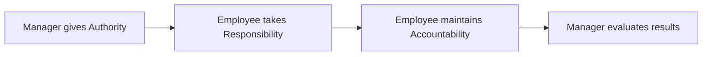

**Golden Rule:** Authority = Responsibility = Accountability. If any one of these is out of balance with the others, problems follow — giving someone responsibility without the authority to act sets them up to fail through no fault of their own.

**Delegation** — the process of a manager assigning part of their work, authority, and responsibility to a subordinate, while still remaining accountable for the final outcome. It happens in 3 steps: **Assign responsibility → Grant authority → Create accountability.**

**Why managers often avoid delegating:** "I can do it better myself," fear of losing control, fear of being outperformed, lack of trust in the team, or simply "it's faster to just do it myself."

**Line vs Staff vs Functional Authority:**
| Type | Power | Example |
|---|---|---|
| **Line** | Direct command over subordinates | A production manager directly instructing factory workers |
| **Staff** | Advisory only, cannot give direct orders | HR advising a department on hiring rules |
| **Functional** | Limited command power in one specialty area, across the whole company | A safety officer who can pause any department's work over a safety violation |

---

## 5.8 Coordinating Activities

🔑 **In Simple Words:** Even after jobs, departments, and authority are all set up, departments can still drift apart and work against each other — coordination keeps everyone pulling in the same direction.

**3 coordination techniques:**
1. **Managerial Hierarchy** — disagreements are escalated up to a common manager who resolves them.
2. **Rules and Procedures** — standard rules automatically coordinate routine, recurring situations.
3. **Liaison Roles** — a dedicated person, task force, or department whose job is purely to coordinate between others.

**Organic vs Mechanistic Structure:**

| | Mechanistic (like a machine) | Organic (like a living thing) |
|---|---|---|
| Best environment | Stable, predictable | Dynamic, fast-changing |
| Hierarchy | Tall, rigid | Flat, flexible |
| Decision making | Centralized | Decentralized |
| Rules | Strict, formal | Minimal, judgment-based |
| Example | Military, traditional banks | Tech startups, creative agencies |

⚠️ **Exam Trap:** Mismatch between structure and environment causes failure — a company that keeps a rigid mechanistic structure inside a fast-changing industry risks the same fate as companies that failed to adapt to major industry shifts. Neither structure is "always better" — the right one depends entirely on fitting the environment.

---

# STAGE 6 — Leadership & Influence

## 6.1 What is Leadership? (vs Management)

🔑 **In Simple Words:** Management keeps a system running properly, while leadership inspires people to actually want to follow a direction.

📖 **Definition:** *"Leadership is the process of influencing others to work willingly toward the achievement of organizational goals."*

| | Management | Leadership |
|---|---|---|
| Focus | Systems, processes, structure | People, inspiration, vision |
| Source of power | Formal authority (the position) | Personal influence (trust, respect) |
| Core question | "How do we do this right?" | "What should we be doing?" |

⚠️ **Exam Trap:** Not every manager is a good leader, and not every leader holds a management title — but the strongest managers are also strong leaders, and organizations need both.

---

## 6.2 Key Characteristics of an Effective Leader

Drive (high energy and ambition), Motivation to lead (genuinely wants the responsibility), Honesty & Integrity (actions match words), Self-confidence (stays calm under pressure), Intelligence (analyzes complex situations well), Knowledge of the business (understands real operational details, not just abstract strategy) — plus emotional intelligence, charisma, and adaptability.

⭐ *Past paper: "Write five key characteristics of a leader" — for full marks, name 5, explain each briefly, and give one example each.*

---

## 6.3 The Trait Approach to Leadership

🔑 **In Simple Words:** The oldest leadership theory — the idea that leaders are simply *born* with certain natural qualities.

💡 **Explanation:** This theory identified traits like intelligence, self-confidence, integrity, and sociability. However, it is largely rejected today because it ignores followers entirely (leadership is a relationship, not just a personality) and doesn't reliably predict success across different situations. This limitation is exactly what led researchers toward the **Behavioral Approach** next.

---

## 6.4 Behavioral Approaches to Leadership

🔑 **In Simple Words:** Instead of asking "what traits does a leader HAVE," this approach asks "what does an effective leader actually DO."

**University of Iowa Studies (Kurt Lewin) — 3 leadership styles:**
| Style | Meaning | Best When |
|---|---|---|
| **Autocratic** | Leader decides alone, expects obedience | Crisis situations, unskilled workers |
| **Democratic** | Leader involves the team in decisions | Skilled, creative teams |
| **Laissez-faire** | Leader gives almost complete freedom | Highly expert, self-motivated professionals |

**Ohio State & Michigan Studies — 2 independent dimensions:**
- **Initiating Structure / Job-centered** — task-focused behavior (defining roles, assigning tasks)
- **Consideration / Employee-centered** — people-focused behavior (trust, respect, wellbeing)

These two dimensions are independent — a leader can score high or low on each one separately. The best leaders score high on **both**.

**Managerial Grid (Blake & Mouton):**
```
9 |  Country Club (1,9)         Team Management (9,9) ★ IDEAL
  |
5 |            Middle of Road (5,5)
  |
1 |  Impoverished (1,1)          Authority-Compliance (9,1)
  |________________________________________________
     1                5                9
              Concern for Task/Production
```

---

## 6.5 Situational / Contingency Approaches to Leadership

🔑 **In Simple Words:** No single leadership style works for every situation — the best leaders adapt their style to fit the moment.

**Fiedler's Contingency Model** — matches a leader's style (task-oriented or relationship-oriented) to how favorable the situation is, based on 3 factors: leader-member relations, task structure, and position power.

**Path-Goal Theory (Robert House)** — the leader's job is to clear the path for followers, choosing between 4 behaviors depending on the situation:
| Behavior | Best When |
|---|---|
| Directive | Task is unclear, workers are inexperienced |
| Supportive | Task is stressful or boring |
| Participative | Workers are skilled and want involvement |
| Achievement-oriented | Workers are capable and motivated |

**Hersey & Blanchard's Situational Leadership Model** — style should match the follower's readiness level:
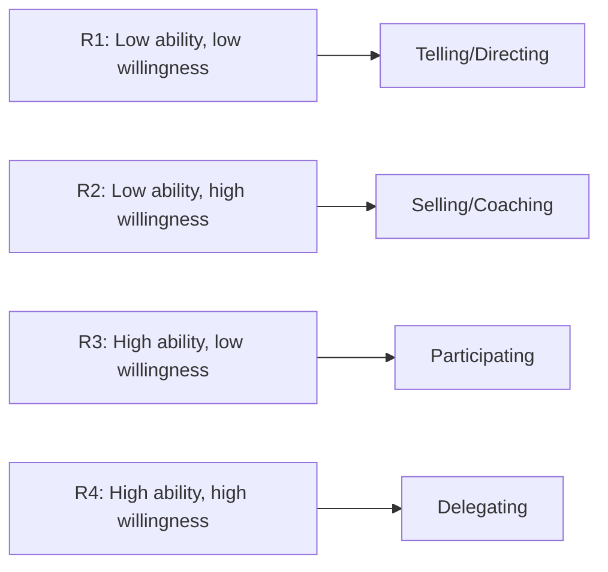

---

## 6.6 Transformational vs Transactional Leadership

🔑 **In Simple Words:** One style motivates people through a fair exchange (reward for performance), and the other motivates people by inspiring genuine belief in a bigger vision.

| | Transactional | Transformational |
|---|---|---|
| Core basis | Exchange — "do this, get that" | Inspiration — belief in a vision |
| Focus | Maintaining current systems | Creating fundamental change |

**4 Components of Transformational Leadership (Bass):** Idealized influence (charisma/role model), Inspirational motivation (compelling vision), Intellectual stimulation (encourages new thinking), Individualized consideration (mentors each person personally).

⚠️ **Exam Trap:** Transactional leadership is not "bad" — it's effective for stable, day-to-day management. Great organizations actually need **both** styles together.

---

## 6.7 Political Behavior in Organizations

🔑 **In Simple Words:** Organizations aren't purely logical machines — people also use informal influence to advance their own interests, and this is called organizational politics.

📖 **Definition:** *"Activities not required as part of one's formal role, that attempt to influence the distribution of advantages and disadvantages within the organization."*

**Common types:** Networking (building relationships with influential people), Image building (managing how others perceive you), Ingratiation [flattering superiors to gain favor], Coalition building (forming alliances for combined power), Information control (strategically sharing or hiding information), Scapegoating (blaming others for failures).

Political behavior isn't always bad — networking and relationship-building for good outcomes can genuinely help an organization; the harmful version is self-serving behavior that damages others or the organization.

---

## 6.8 How a Manager Ensures Good Management Practices

⭐ *Past paper: this exact practical question has appeared in more than one paper — use the framework below to answer it fully.*

1. **Apply POLC** — plan clearly with SMART goals, organize effectively, lead with inspiration, control consistently.
2. **Build a strong ethical culture** — model ethical behavior personally ("walk the talk").
3. **Develop people** — invest in training, delegate meaningfully, give regular feedback.
4. **Communicate effectively** — keep everyone informed, listen actively, resolve conflicts fairly.
5. **Maintain ethical standards** — apply the newspaper test, create safe channels to report wrongdoing.
6. **Manage the environment** — continuously scan for external changes and adapt plans and structure accordingly.

---

# STAGE 7 — Managing Change & Innovation

## 7.1 Why Change Happens in Organizations

🔑 **In Simple Words:** Change is not optional for a business — the environment around it never stops shifting, and organizations that refuse to change eventually get left behind.

**Planned change** (deliberately designed by management) vs **Reactive change** (a rapid response to unexpected pressure, like shifting to online sales during a sudden crisis).

---

## 7.2 Forces for Change

**External forces:** Technological change, Economic shifts, Competition, Social/Political changes, International forces.
**Internal forces:** Declining performance, a changing workforce, new equipment/technology, shifting employee attitudes.

⭐ *Past paper: "Name and shortly explain forces of change."*

---

## 7.3 Steps in the Change Process

**Lewin's Three-Step Model:**
```mermaid
flowchart LR
    A["Unfreeze — build awareness that change is needed"] --> B["Change — implement new processes, train people"]
    B --> C["Refreeze — make the new way the permanent normal"]
```

**Kotter's 8-Step Model** (for larger, organization-wide change):
```mermaid
flowchart TD
    S1["1. Create Urgency"] --> S2["2. Build a Guiding Coalition"]
    S2 --> S3["3. Develop Vision & Strategy"]
    S3 --> S4["4. Communicate the Vision"]
    S4 --> S5["5. Empower Broad-Based Action"]
    S5 --> S6["6. Generate Short-Term Wins"]
    S6 --> S7["7. Consolidate Gains"]
    S7 --> S8["8. Anchor Changes in Culture"]
```

💡 Short-term wins (Step 6) matter because change is exhausting — if people don't see quick, visible progress, they lose motivation and slide back to old habits.

---

## 7.4 Resistance to Change

🔑 **In Simple Words:** Even when a change is clearly good for everyone, people often resist it anyway — and this is completely normal, not a sign of failure.

**Individual reasons:** fear of the unknown, comfort with existing habits, fear of losing job security, economic concerns, and only paying attention to information that confirms existing beliefs.
**Organizational reasons:** structural inertia [built-in tendency to stay the same], group pressure to conform, threat to people's expertise, threat to established power, limited resources to implement change properly.

---

## 7.5 Overcoming Resistance to Change (Kotter & Schlesinger)

From gentlest to harshest:
```mermaid
flowchart LR
    A[Education & Communication] --> B[Participation & Involvement]
    B --> C[Facilitation & Support]
    C --> D[Negotiation & Agreement]
    D --> E[Manipulation & Co-optation]
    E --> F[Coercion — last resort only]
```

⚠️ **Exam Trap:** Coercion should only ever be used as a last resort — it creates resentment and long-term damage to trust and morale.

---

## 7.6 The Innovation Process

🔑 **In Simple Words:** Innovation means creating something genuinely new that adds real value — it's the highest form of organizational change.

**Types:** Product innovation, Process innovation, Business model innovation, and Radical (breakthrough) vs Incremental (small, ongoing improvements).

**Stages:** Development → Application → Launch → Growth → Maturity → Decline.

**What helps innovation thrive:** a psychologically safe, creative culture; slack resources [spare time and budget for experimentation]; **intrapreneurship** [employees acting like entrepreneurs inside the company using company resources]; diverse teams; rewarding even failed experiments for the lessons they teach; strong leadership support.

---

# STAGE 8 — The Controlling Process

## 8.1 What is Control, and Its Purpose

🔑 **In Simple Words:** Control is how a manager checks whether everything is actually working as planned, and fixes it if it isn't.

📖 **Definition (Griffin):** *"Control is the regulation of organizational activities so that some targeted element of performance remains within acceptable limits."*

**Simple logic:** Set a target → Measure the actual result → Compare the two → Fix the gap if needed.

⚠️ **Exam Trap:** Control is not about punishing people — it is about measuring, monitoring, and correcting to keep the organization on track.

---

## 8.2 Steps in the Control Process

📊 **Diagram:**
```mermaid
flowchart LR
    A["1. Establish Standards"] --> B["2. Measure Actual Performance"]
    B --> C["3. Compare Performance with Standards"]
    C --> D["4. Take Corrective Action"]
    D -.feedback.-> A
```

💡 **Step 4 has 3 possible outcomes:**
- **Do nothing** — performance is within an acceptable range.
- **Correct the deviation** — performance is genuinely below standard, so the problem must be fixed.
- **Revise the standard** — sometimes the *standard itself* was unrealistic, not the actual performance.

⚠️ Good managers know the difference between a performance problem and a standard-setting problem.

---

## 8.3 Types of Control (by Timing)

| Type | Timing | Focus | Example |
|---|---|---|---|
| **Feedforward** | Before work begins | Inputs | Carefully screening job applicants before hiring |
| **Concurrent** | During the work | The process itself | A supervisor correcting technique while work happens |
| **Feedback** | After the work is done | Outputs/results | An annual performance review |

⚠️ Feedback control is the most common type, but it is also the least effective at *preventing* problems, since the damage is often already done by the time it's discovered.

### Control by Organizational Level
- **Operational control** — daily, first-line level (production schedules, quality checklists)
- **Structural control** — via **Bureaucratic control** (rules and formal procedures) or **Clan control** (shared culture and values guide behavior)
- **Strategic control** — top management level, checking whether the overall long-term strategy is still working (using tools like the Balanced Scorecard and competitive benchmarking)

---

## 8.4 Total Quality Management (TQM)

🔑 **In Simple Words:** TQM means quality is not just one department's job — it is *everyone's* responsibility, all the time.

📖 **Definition:** *"An organization-wide commitment to continuous improvement, with the goal of delivering high-quality products and services that satisfy customers."*

**4 Core Principles:**
1. **Customer Focus** — the customer defines what quality actually means.
2. **Continuous Improvement (Kaizen)** — never accept "good enough"; make small improvements constantly.
3. **Employee Involvement** — every employee, from top to bottom, is responsible for quality.
4. **Process Focus** — problems usually come from bad processes, not bad people — fix the process.

**Key tools:** Benchmarking, Statistical Process Control, Six Sigma, ISO 9000.

⚠️ **Exam Trap:** TQM is a continuous, never-ending commitment — not a one-time project.

---

## 8.5 Managing Productivity

🔑 **In Simple Words:** Productivity means getting the most output out of the resources you put in.

```
Productivity = Outputs ÷ Inputs
```

**Ways to improve it:** investing in technology, training employees, improving processes, boosting motivation, and better overall management.

⚠️ **Exam Trap:** A common myth is that faster production means lower quality — in reality, improving *quality* often *increases* productivity, because it reduces rework and wasted material.

---

## 8.6 Performance Appraisal

🔑 **In Simple Words:** Performance appraisal is the formal process of checking how well an employee is doing their job, and telling them the results.

📖 **Definition:** *"The process by which a manager evaluates an employee's work behavior by comparison with established standards, documents the results, and communicates the results to the employee."*

**Why it matters:** basis for promotions/raises, identifies training needs, motivates employees, gives useful feedback, provides legal documentation, and aligns individual goals with company goals.

**Common Methods:** Rating scales, **360-degree feedback** (input from supervisor, peers, subordinates, and self), **MBO** [Management by Objectives — employee and manager jointly set goals], **BARS** [Behaviorally Anchored Rating Scale — specific behavior examples define each score].

**Common rating problems:** Halo effect (one good trait makes everything else look good), Horn effect (one bad trait makes everything else look bad), Recency bias (recent events matter more than the whole year), Central tendency (rating everyone as "average" to avoid conflict), Leniency bias (rating everyone too high).

⚠️ **Exam Trap:** 360-degree feedback comes from *all* directions, not just the boss.

---

# 📌 Full Course Recall Map

```mermaid
flowchart TD
    S1[Stage 1: Manager's Job] --> S2[Stage 2: Ethics]
    S2 --> S3[Stage 3: Environment & Culture]
    S3 --> S4[Stage 4: Planning & Decisions]
    S4 --> S5[Stage 5: Organizing]
    S5 --> S6[Stage 6: Leadership]
    S6 --> S7[Stage 7: Change & Innovation]
    S7 --> S8[Stage 8: Controlling]
    S8 -.feeds back into.-> S1
```

This mirrors the POLC cycle itself: Stages 4–5 are **Planning & Organizing**, Stage 6 is **Leading**, and Stage 8 is **Controlling** — the whole course is really just POLC explained in full detail, plus the ethical and environmental context (Stages 2–3) that surrounds every decision a manager makes.

**A final beginner's tip:** don't try to memorize this word-for-word. Instead, in your own words, explain each topic out loud to yourself (or to a friend) using the "In Simple Words" line as your starting point — if you can explain it simply, you understand it, and that's exactly what exams are testing.
